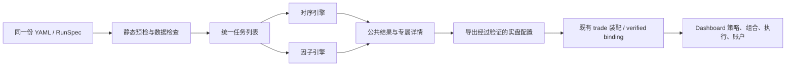

# WebUI 与 DashboardUI 双引擎接入改造计划

日期：2026-10-05。依据当前工作树的文档、源码和测试制定；本文只规划改造，不表示下述新增接口、页面或实盘能力已经实现。

## 1. 建议与改造边界

建议以“策略配置 → 数据预检 → 运行任务 → 结果 → 实盘观察”为统一入口，保留两种引擎各自的决策方式：

- `time_series`：按标的和周期运行策略，重点观察信号、进出场、订单和持仓。
- `factor`：按一个决策轮次冻结资产池，计算因子、截面分数和目标组合，重点观察数据覆盖、因子有效性、组合与调仓。

**截面和多因子不是两个额外的 engine。** 多因子是 `factor` 内多个命名输出的组合方式；混合运行是同一 `run_policy[]` 中同时包含两种引擎。界面可以显示“截面 / 多因子”能力标签，但配置仍只使用 `time_series/factor`。

本次规划的核心取舍：

1. 继续使用现有 YAML、RunSpec、普通 `backtest/trade` 装配链路，不建立一套独立的因子 Web 执行器。
2. 两个 UI 共享配置、数据、结果组件和字段含义；WebUI 管理研究任务，DashboardUI 管理已启动机器人。
3. 公共配置是策略身份、账户、资产范围、数据、时间、资金与成本；专属配置通过选择引擎后逐步展开。
4. 回测列表和详情先支持当前统一报告，再补可查询的截面、净值和执行产物。已有原始 JSON 展示保留为排障入口。
5. Dashboard 接入必须包括因子实盘入口启动 API、运行状态投影及共享账户观察，不能只添加前端菜单。
6. 先完整实现研究、weights、events 和只读实盘观察，再逐项开放有明确语义的实盘控制。
7. 当前没有证据证明任意真实交易所的因子实盘已就绪。页面按照实际 provider 能力显示状态，不通过改 YAML 把缺能力的会话包装成可用实盘。
8. 不扩展为机器学习平台；训练集、模型训练、自动寻优、容量估计和行业归因不作为本轮默认能力。

第一版成功标准：旧时序流程继续可用；用户能用同一入口配置并运行因子回测，看懂有口径的结果；能管理其依赖的任意时序数据；具备 verified binding 的因子机器人能在 Dashboard 展示真实数据、目标、执行与账户状态。

## 2. 现状核对：哪些可以复用，哪些确实缺失

### 2.1 文档的使用优先级

当前使用方式以[多因子指南](../bandoc/zh-CN/guide/factor.md)、[因子 API](../bandoc/zh-CN/api/factor.md)、[配置兼容性](config_compatibility.md)、[引擎实施记录](strategy_engine_refactor.md)及实际源码为准。[factors.md](factors.md)包含历史设计，不应把其伪代码和规划当成已有 API；早期文档中 `run_policy[].factor.*` 的嵌套示例也不是新 UI 应输出的格式。

[任意时序数据说明](custom_data.md)、[时序数据使用指南](series_usage.md)和[Runtime 架构](runtime_context.md)补充字段、存储、生命周期与隔离边界。本文涉及 banbot/banexg/banta 的判断全部来自本地证据，遵循项目禁止使用 DeepWiki 的要求。

### 2.2 当前页面与接口

| 范围 | 当前事实 | 改造含义与证据 |
| --- | --- | --- |
| 前端工程 | 两个 UI 同在 Svelte 5 / SvelteKit 工程，使用 Tailwind、daisyUI、CodeMirror、Paraglide | 复用组件和风格，不拆第二套项目；[package.json](../web/ui/package.json) |
| WebUI 导航 | 策略、回测、数据、实盘；回测新建主要是多文件 YAML 编辑 | 保留路径和高级编辑，加引擎明确的配置引导；[(dev) layout](<../web/ui/src/routes/(dev)/+layout.svelte>)、[新建回测](<../web/ui/src/routes/(dev)/backtest/new/+page.svelte>) |
| 回测启动 | `POST /api/dev/run_backtest` 已接受 TS、factor、mixed；内部接入 entry 预检 | 普通回测继续用此入口；[api_dev.go](../web/dev/api_dev.go)、[runtime_web.go](../entry/runtime_web.go) |
| 回测模式 | 普通因子 backtest 默认 events，允许 weights；mixed 必须 events | UI 选择的模式应显式写入配置；research 不是这个接口接受的 backtest 模式；[unified_backtest.go](../entry/unified_backtest.go) |
| 统一报告 | 含因子的报告有 `run.json`、`Results[]`，`/bt_detail` 返回 `unified`；前端已有分支但主要打印 JSON | 不是从零接入；需类型化、摘要与可查询产物；[统一报告](../web/dev/unified_backtest_report.go)、[详情页](<../web/ui/src/routes/(dev)/backtest/item/+page.svelte>) |
| 策略候选 | `/api/dev/available_strats` 调用 `tool list_strats`，不是因子 definition / builder / 算子目录 | 新增策略目录能力，不能把传统策略名列表直接当因子选项；[api_dev.go](../web/dev/api_dev.go) |
| 预检与取消 | Web 预检目前发生在提交回测内部；没有公开 validate/explain/preflight 或按任务取消接口 | “检查配置”“解释依赖”“取消任务”均需补后端，不能只加按钮 |
| 通用数据 | 已有 `/api/kline/data_sources`、`/series`、开发端 `/series_ranges` 和动态字段查看器 | 保留原数据模型，扩展资产池和版本观察；[api_kline.go](../web/base/api_kline.go)、[SeriesViewer](../web/ui/src/lib/series/SeriesViewer.svelte) |
| Dashboard 数据 | `/dash/series` 把 `getApi` 传给查看器，访问本地 `site.apiHost` | 当前机器人数据的路由接入需要修正；[series 页面](../web/ui/src/routes/dash/series/+page.svelte)、[netio.ts](../web/ui/src/lib/netio.ts) |
| Dashboard 请求 | 当前机器人通过 `${acc.url}/api/bot`，带 `X-Account`、`X-Authorization: Bearer ...` | 新接口沿用账户鉴权；不能把它误写成浏览器直接使用标准 Authorization；[netio.ts](../web/ui/src/lib/netio.ts)、[auth.go](../web/live/auth.go) |
| Dashboard 模型 | `/stg_jobs` 以 pair/strategy/tf 展示；收益和订单围绕旧 InOutOrder | 因子策略不能按资产复制成若干 StratJob，也不能依赖开平仓订单统计解释组合 |
| 因子实盘启动 | 普通 trade 含 factor 时进入 `runFactorLiveSpec`，该路径未启动 Dashboard API | 这是后端接入的前置缺口；[runtime_entry.go](../entry/runtime_entry.go)、[factor_live.go](../entry/factor_live.go) |
| 混合实盘 | binding 有 `FactorLegacyLiveBinding` 桥接能力，但不能据此认定任意 TS+factor YAML 已完整装配并被 Dashboard 覆盖 | 应显示已实际装配的策略和能力，并补装配验收；不能只从 YAML 数量推断运行成功 |
| 在线改配置 | Dashboard 配置页只读；StratJob 编辑弹窗尚无保存请求 | 本轮不承诺热更新，只读配置与导出先落地；[setting](../web/ui/src/routes/dash/setting/+page.svelte)、[strat_job](../web/ui/src/routes/dash/strat_job/+page.svelte) |

当前后端能力明显领先于前端呈现，但因子 Dashboard 的服务启动与查询契约还缺失。改造应同时覆盖“展示已有能力”和“补齐必要查询边界”。

## 3. 从第一性原理确定用户对象和核心问题

用户最终要做的是把一项可重复的决策规则应用到当时可见的数据，在资金与交易约束下取得结果。由此需要六类对象：

| 对象 | 用户必须回答的问题 | UI 应提供的最小信息 |
| --- | --- | --- |
| 策略 | 用什么规则决策，版本是什么？ | engine、稳定 id、定义或表达式、参数、代码/计划摘要 |
| 数据与资产范围 | 当时能看到什么，哪些资产参与计算或交易？ | source、字段和类型、周期、Universe、PIT 口径、覆盖及预热 |
| 运行任务 | 在什么时间、以何种模拟条件执行？ | research/backtest、模式、时间范围、进度、状态、日志与最终配置 |
| 目标组合 | 为什么持有这些资产，目标是多少？ | 决策轮次、评分、权重、预算版本、Full/Patch、有效窗口 |
| 执行与账户 | 目标是否实现，钱和仓位归谁？ | 账户真实净仓、策略虚拟仓、在途订单、成交分配、费用、风险与对账 |
| 结果与证据 | 决策是否有效，是否赚钱，能否复现？ | 因子样本与指标、净值与回撤、执行偏差、manifest、数据/配置来源 |

统一应发生在这些对象及其身份关系上，而非强迫两种引擎拥有相同的字段和图表。



### 3.1 能力与展示矩阵

| 场景 | 入口/实际模式 | 主要问题 | 首屏重点 |
| --- | --- | --- | --- |
| 旧时序回测 | 现有 backtest | 规则的收益与进出场质量如何？ | 净值、回撤、费用、订单与 K 线 |
| 因子研究 | factor research；Web 任务入口待补 | 因子是否有可用覆盖与预测信息？ | 覆盖、IC/RankIC、分层收益、样本与未成熟标签 |
| 因子快速回测 | backtest + `execution.mode: weights` | 评分组合与成本假设下的组合表现如何？ | 净值、换手、费用/funding、目标组合 |
| 因子事件回测 | backtest + `execution.mode: events` | 在价格、数量、保证金及撮合约束下能否执行？ | 账户/策略净值、目标到成交链路、风险拒绝和执行偏差 |
| 混合回测 | 一个 run_policy，events | 共享账户下归属、净额执行与总风险是否正确？ | 账户总览、策略分解、归属与成交分配 |
| 实盘 | trade；factor 需要 verified binding | 当前状态是否可信，下一轮能否安全执行？ | 数据新鲜度、对账/恢复、风险、目标与实际偏差、Unknown 订单 |

research、weights、events 是不同的研究/执行口径，不是三个 engine。`factor trade --dry-run` 是历史 paper 回放，不表示存在一个已经支持的实时 paper 机器人服务。

## 4. 新引擎的数据与结果格式要求

### 4.1 原始任意时序数据必须保留

输入基本模型仍是 `orm.DataSeries`，关键字段为 `Source/Sid/TimeMS/EndMS/TimeFrame/Closed/IsWarmUp/Values`。`Values map[string]any` 同时承载 K 线和自定义字段，不能只保留 OHLCV，不能把所有值统一转成 float。

UI 数据表按 schema 生成列，并区分：缺少键、显式 NULL、0、false、空字符串，以及 JSON 容器。现有 `SeriesViewer.valueText` 把 null 和 undefined 都显示为 `-`，需改为可区分的显示；数值图表是原始数据的视图，不能替换原数据。

周期源继续声明周期；非周期源使用 `TimeFrame="event"`。UI 可以显示“事件”，但不应去掉底层 source/SID/timeframe 身份，也不能承诺任意合法 event 声明都有可用历史 reader。

### 4.2 PIT 版本记录与时间语义

因子版本归档使用 `factor.VersionRecord`，并非只含 `time + symbol + value` 的 CSV。实际结构为：

```json
{
  "Series": {
    "Source": "kline",
    "Sid": 101,
    "TimeMS": 1704067200000,
    "EndMS": 1704070800000,
    "TimeFrame": "1h",
    "Closed": true,
    "IsWarmUp": false,
    "Values": {"close": 42000.5, "quality": "verified", "flag": false, "extra": null}
  },
  "EventTime": 1704070800000,
  "Revision": 1,
  "AvailableAt": 1704070800100,
  "IngestedAt": 1704070800200,
  "SourceVersion": "example-v1"
}
```

此例只解释格式；SID、schema、源版本和时间必须与实际输入一致。归档导入是 JSON lines，一行一条记录；使用现有 `factor archive --input ... --out ... --schema ...` 转换，严格整数类型按 source/field 提供 schema。JSON 本身不能保证 Go 整数宽度和所有自定义类型。

至少区分四个概念：

| 时间/版本 | 含义 | UI 用途 |
| --- | --- | --- |
| TimeMS / EndMS、EventTime | 观测区间及逻辑事件时点 | 数据范围、决策网格、预热 |
| AvailableAt | 外部当时可获得该版本的时间 | 防未来数据、PIT 查询 |
| IngestedAt | 本地接收时间 | 重现到达顺序与实盘延迟 |
| Revision / SourceVersion | 同一逻辑观测的修订及来源版本 | 版本追溯、不可变归档校验 |

冻结快照需满足事件不晚于 GridTime、可用时间不晚于 DecisionTime；启用接收回放门槛时，还受 ReplayTime 限制。不能把普通最新值数据库的 K 线结束时间当成完整发布时间/修订证据。

数据入口应明确分成两个能力：

- **最新值研究**：显式 `data.pit_policy: static-approximation`，显示“静态近似”，如实说明无法还原历史修订或成员变更。
- **严格 PIT**：不可变版本归档，或有可见性/版本证明的历史 provider；展示 schema、source versions、SID 映射、Universe 版本及内容摘要。不要虚构一个已经受配置支持的 `pit_policy: strict` 枚举。

### 4.3 Universe 与快照

`snapshot.universe` 有 `investable/reference/tradable/evaluation/tracked/version/static`：可投资、截面参考、可交易、事后评估、退出但仍需跟踪的集合。参考集合参与排名不意味着可下单；tracked 不能因为退出候选池就从持仓管理里消失。

第一版普通存储流程沿用 pairs/现有筛选与已验证 metadata 装配，默认说明其静态口径。高级用户才编辑五类集合及版本；归档流程必须校验真实 SIDMap、schemas、source_versions。历史成分不在输入中时，禁止 UI 自动宣称“已消除幸存者偏差”。

对外推荐以 symbol 选择资产，底层保留稳定 SID 及 `(exchange, market, symbol)` 身份。合约 symbol 的 `:USDT` 等后缀不能统一删除。

### 4.4 价格、资金费率和可执行窗口

因子输入与执行价格输入分开配置。events/live 需要 `event` 或明确的 `1m` 可观察执行价格、instrument 数量单位/价格精度/最小交易约束及账户风险限制；粗周期收盘价不能代表区间内实际成交。

按当前执行校验，价格时间不能早于 `ExecutableAt = 决策完成时间 + latency`，且必须晚于 DecisionTime；执行时刻须小于 exclusive expiry，窗口为 `[ExecutableAt, ExpireAt)`。部分用户文档写“严格晚于完成加延迟”，此处以源码允许等于 ExecutableAt 的边界为准。delay 是当轮可见性截止的等待，不是成交延迟；UI 应分别命名“数据等待”“执行延迟”“目标有效期”。正 latency 与 expiry 的关系由后端验证。

funding 只选择实际支持的政策：`explicit-zero` 或 `required-stream`。前者在模拟中是忽略 funding 的假设，实盘还需会话证明没有相应义务；后者需真实结算流。实盘记录的 `mark/rate/account_amount` 使用精确十进制字符串，并保留稳定 `settlement_id`。

### 4.5 因子输出与执行产物

实际 `JSONOutput` 是流式输出，并没有天然可查询的全量 panel 表。关键格式：

| 输出 | 真实字段/语义 | UI 使用规则 |
| --- | --- | --- |
| panel 行 | `SnapshotID/DecisionTime/SID/Column/Value/Validity`，每 SID × 列一行；无 Kind 字段 | 根据 schema 识别，按轮次透视成截面表；无效 Value 为 null，Validity 保留原因 |
| decision | `Kind="decision"`、DecisionTime、Diagnostics、PortfolioID、Spec、Targets | 展示轮次、预算、目标及来源，不把 Targets 当排名 |
| evaluation | `Kind="evaluation"`、Report | 成熟标签的覆盖、IC、分层等；与生成信号轮次关联 |
| target-accepted | PortfolioID、AtMS、Book | **目标被执行服务接纳，不等于已成交** |
| run-completed | 版本化 status/errors/result | 根据最终完成产物判断状态，包含未解决标签/失败信息 |

组合后的 `score` 加入 Frame 输出；排名需有明确 rank 输出，或查询完整同一参考池后按明确算法计算并标注来源。只有已选持仓的权重时不能推导全池排名或把权重顺序当排名。

`TargetPortfolio.Spec` 包含 StrategyID、AccountID、DecisionTime、ExecutableAt、ExpireAt、PlanSequence、SnapshotID、PlanHash、FactorPlanHash、UniverseVersion、Budget 和 Mode。Budget 是冻结的**策略 NAV**，不是账户总权益、保证金或杠杆。Full 更新该策略的完整目标；Patch 只改变指定资产，省略资产保留之前有效目标，不能当成全账户清仓。

普通统一因子回测已经把上述流写入 `events.jsonl`，另有 `resolved.json`、聚合 `run.json`、策略结果、`account-<account>/manifest.json` 及版本化 event/posting Gob 块。优先为这些已有文件增加受控 reader 与索引，再补确实缺失的估值/归属产物；不能让浏览器直接解析 Gob 或按日志文本猜成交。

## 5. 统一配置：最重要的选项与编辑原则

### 5.1 配置页面的组织

公共配置分成五个区块，用户不需要先理解所有 runner 内部参数：

1. **任务**：研究/回测、执行模式、时间范围。
2. **策略列表**：engine、name/id、定义与参数、决策周期。
3. **数据与资产**：市场、资产池、数据源/字段、数据可见性、执行价格。
4. **资金与成本**：模拟资金、账户绑定、策略资本占比、费用、funding、必要风险限制。
5. **检查与启动**：实际生效配置、来源、能力和数据检查结果。

因子专属的“表达式/组合/目标/标签”和 TS 专属的“逐标的参数/进出场/止损/refine_tf”放在对应策略卡片内，非适用字段隐藏。隐藏不得偷偷删除高级 YAML 中的字段，也不能替换其语义。

### 5.2 P0 配置项

| 配置问题 | 实际路径 | 默认界面与校验 |
| --- | --- | --- |
| 哪种策略、稳定身份是什么？ | `run_policy[].engine/name/id` | 新建显式 engine 和稳定 id；名称与执行身份分开，id 重复阻断；旧未声明 engine 的配置原样兼容 |
| 策略怎么定义？ | TS 的已注册 name；factor 的 `definition` 或 `expressions` | 因子提供“内置/Go 定义”“表达式”二选一；expressions 与 definition 互斥，Go 修改需编译，表达式修改需预检 |
| 多久做一次决策？ | `run_timeframes`、`expressions.timeframe` | TS 保留多周期；factor 只有一个决策周期；表达式周期应匹配，默认来源由后端展示 |
| 对哪些资产决策？ | `pairs/pairlists`；高级 `snapshot.universe` | 优先 symbol 选择、资产数量与冻结口径；不要求普通用户手填 SID 列表 |
| 数据来自哪里、是否够用？ | `expressions.bindings`、definition 推导需求、`archive/chunks`、`data.pit_policy` | 显示 source、字段、采样、窗口和缺口；归档/数据库为输入选择，严格 PIT 是能力证明 |
| 分数如何合成？ | `combo` 或 `expressions.combine` | equal/fixed；fixed 显示列及权重；history-ic 只在支持的历史任务显示，实盘禁用并说明成熟标签限制 |
| 分数如何成为持仓？ | `portfolio.builder/k/long_notional/short_notional/mode`、definition 的 params | 默认 top/bottom-k 与 full；标注相对策略 NAV 的名义额；k 的映射依据 builder/definition 元数据，避免 params.k 与 portfolio.k 两处矛盾 |
| 如何评价因子？ | `research.labels/label_wait_ms` | 基础任务默认一个 executable-return 周期；归档当前支持一个周期；无标签的固定/等权交易允许 `labels: []`，研究/history-ic 不允许 |
| 资金属于谁？ | `accounts`、策略 `account/capital_weight`、模拟钱包/initial_nav | 一个账户的多参与策略资本权重必须全部显式且合计 ≤1；资本占比不同于 stake_rate；实盘 initial_nav 不是充值 |
| 模拟执行有何假设？ | `execution.mode`、策略 `prices/decision`、`manifest.costs/funding_source` | 初次因子体验建议用户明确选择 weights；后端缺省仍为 events，UI 不改变加载器默认；mixed 固定 events |
| events/live 是否能执行？ | 根 execution defaults、`accounts.<name>` overrides、instruments/risk/provider | 价格/单位/账户风险/对账缺证据时阻断；风险限额用结算币金额，margin_rate 是比例 |

factor 最小覆盖片段可以直接复用当前注册的 `momentum-vol`，而不是引入虚构模板：

```yaml
data:
  pit_policy: static-approximation
execution:
  mode: weights
  funding_policy: explicit-zero
run_policy:
  - name: momentum-vol
    id: momentum
    engine: factor
    run_timeframes: [1h]
    params: {window: 24, k: 3}
```

此片段须叠加实际市场、数据库、资产、时间范围和资金配置，且至少有窗口所需的闭合观测；24 期动量通常需至少 25 根观测。它不是独立可运行的完整市场配置，也不能直接改为 live。

### 5.3 高级设置及默认值来源

高级区保留 `sampling/max_age_ms`、delay/latency/expiry、max_pending、page_rows/prefetch_rows/page_bytes/max_records、snapshot/manifest、store/history/sender_lease_dir、provider 和 instrument 元数据。它们影响正确性或资源边界，应可检查，但不应占满初次配置首屏。

具体默认值只由现有 config/entry/runner 解析一次。前端展示“配置值 / 继承值 / 派生值 / 默认值”和来源文件，不能另写一套默认值。`page_bytes` 是解码逻辑载荷预算，不能叫“进程内存上限”；冷 history 只用于支持的模拟归档，不能作为生产恢复库。

### 5.4 YAML 与表单的关系

- YAML/RunSpec 是唯一执行配置。表单编辑只修改它所拥有的字段；默认保留原编辑器、多文件次序、注释与未知 More。
- 新导出使用浅层 `run_policy[].expressions/portfolio/...` 与根 `accounts.<name>`，不要求 config_version，不重新引入 factor 中间层。
- 配置预检不改写文件；显式保存时给出修改差异和目标文件。无法安全往返的自定义块继续使用 YAML 编辑，不用不完整表单覆盖整个配置。
- `run_policy` 跨文件整块覆盖，不是追加。表单必须展示最终列表和来源，添加一个策略时修改拥有该列表的完整配置块。
- 保存/回测私有副本保留每个路径原来源文件的基准；不能都按最后一个 YAML 的目录定位 archive/store/history。
- 新增 TS 的 id/account/capital_weight 时显式 engine；不能把旧 More 中同名自定义参数悄悄解释为新身份。
- 共享账户的实际资金、策略预算、stake sizing 与杠杆分别展示；不通过 capital_weight 自动覆盖旧 stake 参数。

## 6. 典型用户流程

### 6.1 首次开始因子回测

1. 用户进入现有“回测 → 新建”，选择因子策略或添加一个因子策略条目；不是跳到第二套应用。
2. 选择当前注册定义或表达式模板，填写真正需要的参数、单一决策周期、资产池。
3. 选择普通数据库或版本归档。普通数据库明确选择静态近似；界面展开源/字段/预热需求和数据覆盖。
4. 选择快速 weights 或事件 events。weights 填模拟资金与成本；events 额外检查执行价格、instrument、账户/策略限额。混合任务只能 events。
5. 点击“检查”：先做无资源静态预检，再按需做只读数据检查。检查完成显示实际资产数、有效区间、缺口、预热不足、执行与标签所需的尾部数据。
6. 用户修复缺口或按明确假设继续；不静默删掉缺失资产来改善收益。补齐任务留在同一上下文，完成后重新检查。
7. 用现有 run_backtest 提交。观察准备/数据读取/计算/执行/结果落盘阶段；阶段比例无证据时显示阶段及计数，不伪造百分比。
8. 完成后进入公共结果页，再查看因子、组合和执行专属详情；可复制本次最终配置重新运行。

### 6.2 验证因子而非直接交易

用户从同一策略草稿选择“因子研究”，设置成熟标签后启动研究任务。研究共用任务列表、日志和结果壳层，但新增后端 research 任务类型，派发到现有 factor research 装配；不把 `execution.mode: research` 交给 run_backtest。

先查看覆盖和有效样本，再看 IC/RankIC、分层/单调性、因子相关性，定位到具体决策轮次的字段与无效原因。随后复用同一策略及数据范围做 weights，必要时升级 events。研究阶段不强制配置真实执行账户和交易风险参数。

### 6.3 多因子和混合策略

多因子：添加命名 outputs → 明确 combine → 检查每列覆盖和相关性 → 查看 score 和组合 → 比较替换因子/权重后的运行。`expressions.params` 与策略 params 分区显示，禁止默认互相复制。

混合：在同一策略列表添加 TS 和 factor → 分配账户和资本占比 → 检查 events 必需数据 → 查看账户总结果与每个策略分解。不能把多个策略的账户级 Fills/权益重复相加；账户层净额执行和策略层虚拟归属分别展示。

参数优化沿用现有 TS 功能。因子若没有已验证的优化装配与评分契约，就显示可复制配置进行比较，第一版不宣称旧 optimize 自动支持 factor。

### 6.4 从回测走向实盘

结果页提供“导出实盘配置草稿”，复用策略定义、数据需求、资产与预算；标出须替换的历史范围、archive、模拟账户/成本假设、store/lease 和 provider 设置。此操作生成配置，不等同于启动机器人。

真实启动仍通过已有 trade 入口及当前部署方式。静态检查通过只能证明配置可装配；真实 binding 验证、数据订阅、预热、账户恢复与对账通过后，才进入 live。Dashboard 连接该机器人并观察阶段和缺能力原因；不把 verified-session 示例名视为系统内置能力，不自动回退 paper。

混合实盘必须确认实际 TS jobs/bridge 已被 binding 装配。配置含两种 engine 而实际只运行一个时属于启动/装配错误，不展示“混合运行正常”。

### 6.5 日常实盘管理

用户通常先问“机器人是否正常、资产是否暴露于异常风险”，再问收益和因子细节。流程应为：总览查看连接/数据/对账/风险 → 策略查看当前轮次 → 组合查看目标与实际差异 → 执行追溯未实现原因 → 返回数据或日志处理问题。

实盘收益下降时，可以沿“账户权益 → 策略收益 → 因子覆盖/评分 → 目标 → 执行价格/数量/费用/funding”逐层下钻；不是只看旧订单胜率。

## 7. WebUI 页面改造

### 7.1 导航与新建任务

保持“策略、回测、数据、实盘”主导航；回测区域增加“因子研究”任务类型和过滤。第一版无需为因子新增独立一级菜单。

新建页采用左侧步骤/检查摘要、右侧配置主体；顶部有“表单 / YAML”和“实际生效配置”。多策略列表每项显示 engine、id、account、周期。表单只承载 P0 字段，advanced 区仍可完整编辑 YAML。

策略页延续 Go 文件树/编译；补因子 definitions、portfolio builders、表达式草稿。表达式直接启动时编译为图，提供依赖解释和字段诊断；不要要求表达式用户进行 Go 编译。第一次先实现目录、文本与解释，不建设复杂拖拽 DAG 编辑器。

### 7.2 任务列表

统一列为：任务身份、任务类型、引擎集合、策略数/账户、数据范围、阶段/状态、结果摘要、备注。允许按 engine、mode、account、strategy id 和状态过滤；原过滤与分页继续可用。

TS 显示既有收益、回撤、订单数；研究显示覆盖、有效截面数、IC/RankIC；weights/events 显示可证明的组合收益、成本和未完成/拒绝数量。指标缺失显示“未生成 / 不适用”，不把 0 当真实统计。

现有取消能力缺失：后端按任务 id 实现排队移除或运行取消、Stop/Join 与落盘，再显示按钮。删除报告与取消任务是不同动作。

### 7.3 结果页的公共壳层

顶部固定任务状态、engine/mode、时间范围、策略/账户选择、数据口径、配置/manifest 身份和错误/限制。统一报告适配当前大写 `Version/Status/Errors/Results`，不直接假定 lower camel case。

按能力展开页签：

| 页签 | 内容 | 可用范围 |
| --- | --- | --- |
| 概览 | 任务结论、关键指标、覆盖/完整性、主要假设 | 所有任务 |
| 收益与风险 | NAV/权益、回撤、持仓规模、成本/funding，明确账户或策略 | 有可信估值序列的交易任务 |
| 因子分析 | 列/标签选择、IC/RankIC、分层、相关性、样本数与有效性 | 有研究产物的 factor |
| 截面与组合 | 决策时间 × SID，因子/score/目标、预算与 Full/Patch | 有 panel/decision 产物的 factor |
| 执行 | 调仓批次 → 目标差额 → 订单意图 → 发送/成交 → 分配/入账 | events / live 对应历史 |
| 时序交易 | 原订单、K 线、进出场标签与 TS 代码 | 有传统 TS 产物的任务 |
| 配置与复现 | 输入 YAML、resolved、来源、代码/图/数据摘要、可下载产物 | 所有任务 |
| 日志 | 阶段、错误、清理错误及诊断 | 所有任务 |

混合任务按 strategy id 选择详情，再切到账户总览；保持 TS 旧报告可读。未生成某产物时给出原因，不渲染依赖该字段的空图，也不尝试自动生成一个伪 TS detail.json。

### 7.4 用户关心的结果优先级

**因子是否有效：** 先覆盖 Valid/Expected、无效分类、Pairs、成熟/未成熟标签，再 MeanIC/MeanRankIC、ICIR/RankICIR、五分位收益和单调性。显示 labels 的 horizon、overlapping 与评估时间；`Summary.Sections=0` 时不能把默认的 MeanIC=0 当作有效研究结论。当前 ICIR 是截面 IC 均值除以样本标准差，不能标成已年化 Sharpe 或显著性检验；重叠标签不能当独立样本。

**组合是否赚钱：** 以带时间的策略 NAV/账户权益序列计算收益、回撤、波动；显示估值、年化频率、资金流入流出与成本口径。最终 Book.NAV 不能单独支撑全期最大回撤/Sharpe。基准比较需显式基准序列和收益口径，属于后续增强。

**交易能否实现目标：** 展示目标接纳、订单、成交、到期、取整、最小量、保证金/风险拒绝、滑点与 funding。weights 和 events 只在相同策略/数据/成本口径下比较，并解释差异，不要求净值一致。

**如何解释某轮选择：** 用户选一轮查看五类 Universe、数据截止、source/schema、各因子/score、有效性、目标权重、冻结 NAV 和执行窗口。缺失、NULL、非数值、非有限、预热不足各有标签。不要把额外行业/风格暴露当成自动存在；只展示已提供的 Exposures 或诊断。

### 7.5 表格和图表选择

默认组合净值/回撤用折线，IC 时序用折线加有效样本提示，分层收益用五组可比较图，相关性用矩阵，截面用可排序动态表，目标/实际权重用并列表或差值条。K 线留给单资产下钻。

保持既有 daisyUI 风格、数值右对齐、冻结身份列、状态文字加图标、字段旁说明与错误定位；色彩不独自承担多空/风险含义。大表服务端分页，图表分桶；不一次加载所有时间 × SID × 因子列。UI/UX 采用本地技能的渐进披露、表单反馈与图表可读性原则，不把未获得的数据库设计推荐作为事实来源。

## 8. 数据管理改造

### 8.1 一个数据入口，区分原始与派生产物

保留已有行情/任意 Series 管理，将数据页组织为“数据源与覆盖”“序列查看”“版本归档与快照”。原始 source 是模型输入，panel 是某策略某次运行的派生结果；不要未经注册把每个因子输出都变成持久化 DataSource。

数据源列表显示：source、周期/event、表/存储位置、字段类型、资产范围、覆盖、更新时间、来源能力。PIT/版本/发布时间能力未知时显示未知；普通 ranges 不足以证明全部字段和全池在每个轮次均齐备。

### 8.2 核心操作与先后顺序

| 操作 | 第一版做法 | 后续必要扩展 |
| --- | --- | --- |
| 查看源/字段/类型 | 复用 data_sources、series 及字段 metadata | 聚合为源能力卡，补可见性/版本能力 |
| 查看记录 | 保留单 source/SID/timeframe 查询、fields 选择、时间范围 | 多 SID 截面预览与动态列，严格 bounded 分页 |
| 检查运行数据 | 按实际 compiled requirements 查窗口/预热/字段/价格/标签数据 | 时间 × 资产覆盖矩阵；不能只按表起止时间判断齐备 |
| 下载/补齐 | 继续调用已有 data_tools 及 source FetchHistory；非适用源禁用 | 缺口结果到补齐任务的参数转换，不新增交易所专属下载分支 |
| 导入/导出版本归档 | 先提供格式检查、归档信息及既有转换命令/任务封装 | 有界上传/批处理、schema 类型恢复与不可变摘要 |
| 管理快照 | 展示来源、SIDMap/schema/source/universe 版本及内容摘要 | 受控冻结/发布任务，不把普通导出默认为严格 PIT |
| 删除/表替换 | 原操作权限/范围与预期影响明确 | 异步状态与恢复信息，替换前校验；不用一次空读推断失败 |

### 8.3 WAL、质量与复现

QuestDB 界面区分“写入已提交”“等待可见”“验证通过”“超时待恢复”。写入后依赖的查询由后端等待预期范围/记录可见；超时保留 pending/recovery 标记。快照发布及表替换必须验证预期内容，不能让 UI 发起“读为空 → 清旧表”的补救逻辑。

支持质量检查而不是默认改数据：闭合状态、缺少字段、NULL、无效数字、重复修订冲突、过旧/晚到、预热不足、缺价格与缺 funding。缺数据可定位到具体 source/SID/时间，再决定补齐或更换输入。

任意字段经 Web/JSON 后的整数精度也是边界。第一版大整数超出 JS 安全范围时显示明确限制，不能宣称原接口完全无损；新增版本化 DTO 可提供字符串值和类型标签，并保留键缺失。精确金额默认字符串，前端不承担交易数量/价格取整和账本计算。

## 9. DashboardUI 改造

### 9.1 先补服务启动和观察依赖

在 factor live 的已装配 Runtime/共享账户/数据源上接入 Web API 生命周期，覆盖纯 factor 与确实装配的 mixed。现有 `StartApiWithRuntimeDeps` 强依赖 TS Strategies/Orders/Trading，不能假填这些字段再把传统 wallets 当真实共享账户。

应扩展为明确的查询依赖：公共 Runtime/Config/Clock/Storage/Catalog/Symbols，加可选 TS 查询视图、因子只读状态、execution 账户 reader。优先复用实际领域类型和窄 reader，不再创建万能引擎接口或全局 CurrentRuntime。多个账户 Runtime 的查询要按授权账户路由，不重复占用同一端口。

服务应在能够报告启动阶段时可观察，未完成 verified binding/恢复/预热前拒绝交易控制；连接失败也要与启动能力不足区分。API 关闭纳入原 owner 的 Stop/Join，不能由某个观察请求关闭共享账户或计算组。

### 9.2 导航和公共筛选

保留机器人列表/连接方式、现有账户选择器。所有详情再增加稳定 strategy id 筛选；顶部持续显示机器人、账户、策略、engine、真实/模拟环境、数据更新时间。

导航建议为“总览、策略、组合与持仓、执行、收益、数据、配置、工具、日志”。旧 `/dash/strat_job` 作为策略页兼容入口，旧 order/kline/perf 深链保留；先复用页面与子页签，再决定是否更名路由。

### 9.3 总览应回答的四件事

1. **是否正常运行**：连接、Runtime 阶段、最近一次成功轮次、下次网格、warmup/barrier、last data、missing/stale source。
2. **状态是否可信**：verified capability、账户恢复/对账、未知发送状态、风险冻结、checkpoint 和待处理修订/funding。
3. **是否达到目标**：目标/实际仓位偏差、在途数量、最近调仓状态、目标过期和风险拒绝。
4. **资金和风险如何**：账户权益/真实净仓、策略 NAV/虚拟仓、资金归属、保证金、账户虚拟 gross 与策略限额及成本。

最近收益放在可靠状态信息之后。无价格估值证据时不显示一个看似准确的权益数字；外部/未归属持仓、UnassignedCash、RiskFrozen 单独呈现。

### 9.4 策略与组合

策略页一行一个运行策略，公共列为 id/name、engine、account、周期、状态、数据/决策更新时间、预算版本。TS 下钻原 pair/tf jobs；factor 下钻 Universe、因子/score、组合规则、预热/屏障和最近轮次。

组合页面以一轮决策为上下文，显示 SID/symbol、因子与 score、目标权重/名义额、实际数量、在途净量、目标差额及原因。区分“本轮指定目标”和“合并 Full/Patch 后有效目标”；不把 Patch 未列出资产显示为零。

共享账户展示三层：策略虚拟组合、执行协调后的账户目标、交易所真实净仓/外部仓位。多空对冲和内部匹配可能使账户净仓接近零但策略 gross 非零；总览不能因此显示“没有风险”或把虚拟现金当可提现余额。

### 9.5 执行与收益

执行页以 PortfolioID/PlanSequence 为调仓关联，展示接纳、风险校验、差额/intent、sender、交易所订单、部分成交、分配、posting。标出 Unknown 的原 client id 与对账状态；不能通过浏览器“重试下单”生成新身份绕过幂等。

旧 TS 订单视图继续可用；新执行事件从 execution 权威账本读取，不把共享账户事件转换成若干虚构 InOutOrder。账户成交统计去重，策略统计按分配归属计算。

收益页提供账户权益与策略 NAV 切换、已实现/未实现收益、手续费、滑点、funding、资金分配和重分类。净额后的账户结果与策略分解允许存在需要解释的归属差异，必须能追溯 checkpoint/ledger，而不是浏览器求和。

实盘近期 IC 只显示已成熟样本；没有标签/观察价格服务时不显示预测效果曲线。基准、因子暴露和归因只在产物存在时出现。

### 9.6 实盘控制的语义与开放顺序

| 控制 | 需要的真实语义 | 接入次序 |
| --- | --- | --- |
| 刷新/查询/查看日志 | 只读或现有账户刷新，不改变目标 | 第一版 |
| 导出配置/问题诊断包 | 脱敏配置与授权账户数据 | 第一版 |
| TS 延迟开仓 | 继续用既有 delay_entry 的 TS 语义 | 保留，不能自动映射成暂停整个 factor |
| 暂停因子新增目标 | 不接纳新目标；已有挂单/仓位如何处理需明确 | 后端有确认状态后再开放 |
| 撤销待执行目标/恢复 | 按策略、PortfolioID、预算/代际和幂等身份执行 | 后续，不能修改已成交事实 |
| 策略减仓/账户应急平仓 | 经共享 execution 更新有效目标并对账，区分策略与整个账户范围 | 最后；展示作用范围和服务器校验 |
| 热更新策略/Universe | 候选代预检成功后原子提交；失败保留原代 | 本轮不承诺，先导出/重启工作流 |

“停进程”不等于“自动平仓”。已持仓、未知订单、tracked 资产及账本归属不能因停止策略而从页面和恢复信息中删除。

### 9.7 数据请求与实时更新

为当前机器人新增已鉴权的 data_sources/series 别名，内部复用相同 Runtime Catalog/Storage/Symbols；给 SeriesViewer 注入一个把其两条 `/kline/*` 请求映射到 `/api/bot/*` 的轻量适配器。仅把 getApi 换成 getAccApi 会错误访问 `/api/bot/kline/*`，不能这样修复。

先使用有界轮询与服务端 snapshot/checkpoint 做状态更新；沿用已有 WS 生命周期设施，后续提供状态增量、带 seq/revision 的事件和断线重拉。前端切换机器人/账户时取消旧请求，丢弃迟到响应，避免把 A 账户数据画到 B 账户。慢浏览器不能阻塞交易循环，断线时冻结旧视图并标记时间，不显示“仍健康”。

## 10. 接口与前端数据契约改造

### 10.1 保持既有接口，新增能力明确标注

所有下面标为“新增”的路由都是建议名称，实施时与现有命名统一；本文不把它们当成已提供接口。继续使用现有 `{code,msg,...}` 请求适配、结构化请求体、任务与账户授权，不通过页面拼 shell 命令。

| 范围 | 复用接口 | 必要新增/扩展 |
| --- | --- | --- |
| 配置/策略 | texts、save_text、build、available_strats | `GET /api/dev/strategy_catalog`：TS/factor 定义、builder、支持模式、参数提示；无参数元数据时保留 YAML，不猜字段 |
| 预检 | run_backtest 内部的 RunSpec/entry preflight | `POST /api/dev/preflight`：同样 configs/paths 加任务意图；返回有效配置、来源、需求、能力、分层 issues，不写文件或开交易会话 |
| 数据检查 | series_ranges、data_sources、series、data_tools | `POST /api/dev/data_check`：显式只读检查任务；返回实际需求覆盖/预热/字段/价格/funding 证据，与静态预检分开 |
| 普通回测 | `POST /api/dev/run_backtest` | 兼容保留请求；响应可增 taskId/engineSet/acceptedMode |
| 因子研究 | 现有 factor research 装配 | `POST /api/dev/run_research`：共用任务调度、配置复制、日志、取消、结果采集，但使用 research 任务身份 |
| 任务控制 | bt_tasks/bt_options、dev WS | `POST /api/dev/cancel_task`：task_id；区分排队/运行/结束，幂等取消与最终产物；不从数字状态猜取消完成 |
| 报告查询 | bt_detail/bt_config/bt_logs、旧 bt_orders/bt_html | `GET /api/dev/bt_artifacts`、`bt_result`：按 task/strategy/account/kind/time/cursor/limit 查询，下载用产物 id |
| 归档管理 | factor archive、现有数据工具 | 新任务封装；返回校验/进度/摘要，不允许浏览器任意绝对路径读写 |
| 机器人发现 | login/version/bot_info/config | 扩展 capability/schemaVersion，声明 engineSet、只读/控制、研究输出、数据/ledger 可查能力 |
| 策略与轮次 | 旧 stg_jobs | 新 `/api/bot/strategies`、`strategy_state`、`decisions`、`decision_detail`，按授权账户及 strategy id 查询 |
| 账户与执行 | 旧 balance/orders/performance | 新 `/api/bot/account_state`、`execution_events`；由 SharedAccount/Store reader 生成，不依赖 legacy wallet |
| 机器人数据 | 公用 base 查询实现 | 新 `/api/bot/data_sources`、`series`；相同实现、正确 Runtime 和鉴权边界 |

live 的 capability 来自当前已验证会话与装配结果，不是静态 YAML 自我声明。无资源 preflight 与需要真实会话证明的启动验证不得混成同一个“全部通过”。

### 10.2 统一 DTO 的最小边界

新增版本化外壳可包含：`schemaVersion/taskId/taskKind/engineSet/mode/status/phase/strategyIds/accountIds/configHash/artifacts/capabilities/issues`。现有数字任务状态不直接改名，先通过适配层映射；旧报告字段仍兼容。

结果内容用有类型的变体：legacy TS report、factor research summary、weights book/series、events account/strategy report。公共指标带 `value/unit/scope/method/availability`，大整数及精确金额保持字符串和类型信息。不要用无约束 `Record<string,any>` 代替所有业务合同。

现有 `run.json` 聚合是大写字段，而单 runner RunArtifact 外壳是小写 `version/status/errors/result`；panel、decision 和 Numeric 又有各自字段。只在结果 reader/适配器统一这些差异，不要求旧文件整体改写，也不在每个页面散布多种大小写判断。

至少区分三种状态：任务执行阶段、输出完整性、交易接纳/成交状态。当前 collector 会把 incomplete/errors/空 Results/Unresolved 标为失败；第一阶段忠实展示，不把它擅自改成成功。未来若要拆“任务结束但研究尾部未成熟”，须同时版本化状态契约和测试。

### 10.3 结果留存与查询

先建立 run manifest 与 artifacts 索引，为当前 `events.jsonl` 中的 panel/decision/evaluation 提供 reader，再补策略/账户估值序列与 execution/posting reader；无需先复制一套相同事件文件。每条新产物带 task/strategy/account/decision 身份；当前 panel 本身没有 strategy id，合并流必须在输出适配边界补 owner，不能按时间猜所属策略。旧单策略流可以由已核实的 run 元信息确定归属；旧多策略流无法可靠判定归属的 panel 明确标为不支持，而非自动猜测。

基础摘要始终保留；保留既有输出行为，后续可为 panel 增加可选的列范围和留存策略。默认 UI 查询最近/单轮，完整历史按文件分块、游标分页；明确记录留存策略、完整性和裁剪范围。某次运行未保存所需截面时显示“历史截面未留存”，不解析日志拼出一个假 cube。

JSONOutput 只使用 Evaluation SIDs 输出 panel，不能保证原流含全部参考池。需要完整参考池的排名/质量视图时，专用观察 sink 明确保存所需 SID/列并标明 Universe role。

输出写入、sync/close 和 cleanup 全部成功后才标记成功。失败/取消保留主错误及清理错误和已有合法产物；未完成任务的临时产物不能被看作完整报告。路径下载按 task root 和产物 allowlist 解析，沿用已存在的报告路径校验。

### 10.4 实时观察与计算隔离

factor 最新只读视图保存轮次、warmup/barrier 状态、最后有效 panel/target 及诊断；共享账户采用权威 checkpoint 与既有 Snapshot reader。观察复制/冻结必要数据，不让浏览器读写 runner Session/Frame map，也不为每个 HTTP 请求重新计算图或开启账户。

记录 data/decision/execution/valuation 的时间及 revision/checkpoint，展示一致快照。价格、funding 新鲜度和 barrier missing 需要真实后端事件，现有最终 Result.Account 本身不提供这些实时诊断。

## 11. 影响文件与职责边界

以下新文件名为建议，最终按现有目录惯例命名。后端实现配置、执行、数据语义；前端实现表单、交互和展示，不新增交易所独有逻辑，不引入新的引擎架构或第二套账本。

| 文件/目录 | 计划修改 | 前置依赖 |
| --- | --- | --- |
| `config/unified.go`、`shallow.go`、`advanced.go`、`run_spec.go` | 优先复用；仅补 UI 所需的 schema/来源只读投影，保护旧 More 和路径规则 | 配置契约 |
| `entry/runtime_web.go`、`unified_backtest.go`、`factor_config.go`、`factor_resolved.go` | 复用装配/预检；暴露目录/解释/research 任务装配，结果 reader 使用同一默认值 | 配置/模式合同 |
| `web/dev/api_dev.go`、`runtime.go`、`common.go` | 新查询/研究/取消 API、任务元数据扩展与调度生命周期 | entry 能力 |
| `web/dev/unified_backtest_report.go`；建议新增 `result_reader.go`、`preflight.go` | 大小写/版本适配、产物索引、分页、统计口径、路径校验 | 输出合同 |
| `factor/runner/output.go`、`artifact.go`；建议新增 UI artifact sink | 流式观察/可选留存，补 owner，保留原 Output 行为和有界内存 | reader schema |
| `factor/runner/live.go`、`runtime/factor_state.go` | 必要的只读健康/轮次投影；不暴露可变计算状态 | observation合同 |
| `entry/factor_live.go`、`runtime_entry.go`、`web/live/main.go` | 接入 pure factor/mixed API 生命周期、跨账户路由及能力声明 | 实际 binding/owner |
| `web/live/biz.go`、`auth.go`；建议新增 `factor_api.go`、`execution_api.go` | 因子策略/组合、权威账户/执行查询、数据别名及后续控制 | 只读投影/鉴权 |
| `web/base/api_kline.go`、`web/dev/data_tools.go`、`data/orm` 的现有 reader | 需求覆盖、multi-SID 预览、schema/归档能力；复用 WAL 等待 | 数据能力 |
| `web/ui/src/lib/netio.ts`、`lib/dev/types.ts`、`lib/dash/types.ts` | 共享强类型合同、旧/新结果适配、正确机器人请求和过期响应隔离 | API schema |
| 建议 `web/ui/src/lib/strategy/`、`lib/results/` | 配置字段组件、能力页签、指标/轮次表，不造通用插件框架 | 合同与设计 |
| `web/ui/src/routes/(dev)/strategy/`、`backtest/`、`data/` | 统一目录/配置、新建与研究、列表/结果、数据预检 | 共享组件/接口 |
| `web/ui/src/routes/dash/`、`lib/dash/store.ts` | 总览/策略/组合/执行/数据与收益，保留旧深链 | live API |
| `web/ui/src/lib/series/SeriesViewer.svelte`、`lib/kline/` | 注入式请求、字段/NULL、截面下钻；K 线保持独立用途 | 数据合同 |
| `web/ui/messages/zh-CN.json`、`en-US.json` | 新术语、字段提示、错误、状态、结果口径 | 全流程文案 |
| `web/dev/*_test.go`、`web/live/*_test.go`、`entry/*_test.go`、相关 data/orm 测试 | 模式/资源/报告/生命周期/数据专项回归 | 各阶段实现 |

`orm/ormu` 的任务 schema 若需持久化新索引，先修改源 schema/查询并按现有方式生成，不直接手改生成 Go 文件；第一阶段可以复用 Task.Info 承载兼容元信息。

## 12. 分阶段实施与验收

顺序为合同与读模型 → WebUI 最小闭环 → 深度结果/数据 → live 服务与观察 → 受限控制。阶段之间以行为验收为门槛，不以“页面画出来”为完成标准。

### P0：冻结合同，排除接入误判

- [ ] 定义真实 engine/mode/capability 矩阵、输入字段、任务/结果外壳及状态映射。
- [ ] 以现有测试和小 fixture 锁住：旧 TS、单 factor weights/events、多 factor、mixed events、research、失败/未成熟标签。
- [ ] 定义策略目录、无资源 preflight、只读 data_check、artifact reader、live snapshot 的请求响应与字段来源。
- [ ] 将 pure factor/mixed 的 API 启动与 Legacy binding 装配缺口列为明确工作项；不假设 RuntimeDeps 可直接套用。
- [ ] 验收：同一配置 Web/CLI 给出一致引擎/模式/默认值；不支持能力有结构化原因，旧配置不被改写。

### P1：WebUI 因子回测最小闭环

- [ ] 补策略目录与公开静态预检；回测页显示 engine、模式、单周期、必要提示与最终来源。
- [ ] 继续使用 run_backtest；适配 unified 报告，展示 Results 的策略/账户身份、计数、Book、Summary、Manifest、错误和原始 JSON。
- [ ] 任务列表增加 engine/mode 和不适用指标显示，保留 TS 原结果和 HTML/K 线入口。
- [ ] 数据查看器保留类型并区分 missing/NULL；修正 Dashboard 数据请求所需的后端别名与适配。
- [ ] 验收：实际普通存储/归档 fixture 能启动 weights/events；用户能从结果定位配置/数据/标签问题；纯 TS 全流程不回归。

### P2：研究、可查询结果与数据准备闭环

- [ ] research 任务接入同一调度/列表/结果壳；新增按任务取消，验证其真正 Stop/Join。
- [ ] 流式产物留存与 reader：panel/decision/evaluation、估值序列、event/posting；多策略流补 owner，按时间/列/SID 分页。
- [ ] 因子分析、截面/组合、收益/风险与调仓执行页签；账户结果去重和策略归属。
- [ ] 需求数据检查、缺口到补齐任务、归档 schema 校验与快照证据；不把 WAL 已提交标成可见。
- [ ] 添加表单 P0 配置、YAML 安全编辑与差异，超出支持的块保留高级编辑。
- [ ] 验收：research → weights → events 可复用一份策略；异常字段/预热/价格/funding 可定位；重开页面能查询留存结果，不能一次读全量 cube。

### P3：Dashboard 接入实际因子与混合 Runtime

- [ ] factor live 入口启动已鉴权 API，生命周期纳入 owner；多账户只有正确的服务/路由归属。
- [ ] 增加实时只读状态、策略/Universe/目标、共享账户/执行 reader，声明真实能力。
- [ ] Dashboard 总览、策略分支、组合/执行/账户收益；数据读当前机器人，旧 TS 菜单和接口继续工作。
- [ ] verified/预热/恢复/对账/Unknown/risk-frozen 等阶段与异常可观察；mixed 校验实际 TS bridge/jobs。
- [ ] 验收：模拟 verified binding 的端到端场景可连接并查询正确账户；停止/重连不影响共享 owner；缺 capability 拒绝启动且页面不显示健康。
- [ ] 真实 venue 试运行另行执行，使用其实际 binding 与观测证据；本地模拟通过不能替代真实实盘验收。

### P4：控制与增强能力

- [ ] 经后端定义后增加暂停目标/恢复等控制，验证幂等、代际、预算、风险与未完成订单。
- [ ] 按产物能力增加运行比较、基准、额外风险暴露；参数寻优/更广标签/动态 Universe 先完成对应引擎合同。
- [ ] 热更新、容量分析、显著性检验、ML 训练继续作为独立范围，不因有 UI 控件就承诺实现。
- [ ] 验收：控制回执描述真实范围和状态；失败不改变原代、不丢持仓/账本，重复请求不重复发送。

最早可交付版本是 P1；满足用户提出的 WebUI 与 DashboardUI 双端使用则至少完成 P3，不能用 P1 的 JSON 展示宣称双端全部接入。

## 13. 验证场景与命令

### 13.1 必需的行为场景

| 场景 | 需证明的行为 |
| --- | --- |
| 旧 YAML/旧 TS 报告 | 不写回、不误解 More；旧新建、查询、K 线、订单和配置路径继续有效 |
| 表单/YAML 多文件 | run_policy 整块覆盖正确，未知字段保留；相对路径按来源解析；保存前可见差异 |
| 两引擎/模式 | 只有真实 engine；research 不走 run_backtest；mixed weights 阻断；factor 单周期与定义互斥校验 |
| 任意字段 | float/int/string/bool/json、NULL/缺键、0/false 均保留和正确显示；大整数不静默舍入 |
| PIT/标签 | 未来/迟到/修订扰动不改变过去结果；未成熟标签不参与当期组合；Unresolved 显示当前失败口径 |
| Full/Patch | 更新只作用于其策略/account；Patch 省略持仓保持；退出 Universe 的 tracked 仓位可观察 |
| 接纳与成交 | accepted 不计成 fills；价格/执行窗口包含等于 ExecutableAt 和等于 ExpireAt 的边界测试；部分成交/取整/Unknown 可追溯；策略/账户统计不重复 |
| 任务取消/结果失败 | 排队/运行取消幂等，join 完成后终态；sync/close/cleanup 失败不会显示 complete |
| 大规模结果 | 查询、计算与 UI 内存随页/块有界；慢客户端不阻塞交易；不做全量 panel 的浏览器聚合 |
| Dashboard 隔离 | 切机器人/账户后旧响应不能污染新视图；错误账户 token 不可读取账本/数据；只查当前 Runtime |
| live 装配与恢复 | factor API 真正启动，TS bridge 真实存在；缺 binding/单位/funding/历史权威拒绝；Unknown 重启幂等对账 |
| QuestDB 写后读/替换 | 写入等待期与超时可观察、标记保留；替换新表不合预期时不删除旧表，专项回归覆盖 |

复用已有 `web/dev/config_editor_test.go`、`unified_backtest_report_test.go`、`web/base/runtime_routes_test.go`、`web/live/runtime_api_test.go`、`runtime_handlers_test.go` 及 factor/execution 的语义测试。新增测试针对新契约和真实失败路径，而不是逐字段复制实现。

### 13.2 实施阶段运行的检查

以下是未来实施的验证命令，不是本文已经执行的测试结果。先跑对应变化的定向用例，再运行受影响包和前端检查；不需要为本次纯文档新增代码测试。

```powershell
go test ./config ./entry ./web/... ./factor/... ./execution/... ./data ./orm -count=1 -timeout=180s
go vet ./config ./entry ./web/... ./factor/... ./execution/... ./data ./orm
go build ./...
npm --prefix web/ui run check
npm --prefix web/ui run lint
npm --prefix web/ui run build
git diff --check
```

外部数据库与真实交易所验证按项目集成测试开关显式运行；使用未接真实资金的 fixture 验证 HTTP/生命周期，不让前端构建或普通测试隐式启动真实交易。race 等平台/工具链具备时用于有并发变更的定向包。

前端目前没有现成的独立 E2E 脚本，实施时不能引用不存在的 `npm test`。可以复用现有可用浏览器自动化，或记录最小流程验收；新增测试依赖按项目依赖约定处理，不为整个 UI 重建测试框架。

## 14. 兼容、回滚与发布

- 新 UI/旧服务：capability/schema 不存在时走旧 TS 视图，不发送新控制请求；旧服务不支持的因子分析明确提示需升级。
- 旧 UI/新服务：保留原 routes、响应与报告；新元信息和 reader 增量提供。版本适配集中管理，不能让各页自行猜字段。
- 结果迁移：新增索引为可重建产物，不改写旧 run/detail/账本文件；缺历史 panel 保留缺失事实，不补造数据。
- 数据改造：优先增加查询/观察，不重写原始表。涉及 schema/快照替换的阶段先验证新副本及 WAL 可见性，再切换，失败保留旧表和恢复状态。
- live 回滚：优先关闭观察/API 扩展并恢复兼容视图；保持原执行 store、owner 和 client id，不能清空账本或重发 Unknown。停止服务不能误关其他策略借用的共享资源。
- 发布实施：先完成后端/前端匹配与构建验收，再按项目规约修改 `core/data.go` 的 Version；前端有变更时打包 UI 并更新 UIVersion，正式发版本使用 git tag。本文不修改版本或发布产物。

仍需实际验证的范围包括真实 venue binding、完整 mixed live 装配、历史成分/PIT 数据供应、跨 Runtime 生产并发和大规模结果查询性能。把这些作为具体能力与验收门槛，不作为阻止当前安全接入工作的理由。

## 15. 关键源码核对索引

以下入口足以支撑实施前进一步定位；行号对应本文编写时工作树，变动后以符号为准。

| 结论 | 证据入口 |
| --- | --- |
| engine 与预算 | `config/unified.go`：Engine、validate；`config/shallow.go`；`doc/config_compatibility.md` |
| 模式与无资源预检 | `entry/unified_backtest.go:18` 的 factorBacktestMode、ValidateBacktestRunSpec；`entry/runtime_web.go` |
| 因子装配/default/来源 | `entry/factor_config.go:172` 的 buildFactorConfigs；`entry/factor_resolved.go` |
| 数据类型与 PIT | `orm/series.go:105` 的 DataSeries；`factor/version_store.go:17` 的 VersionRecord；`factor/snapshot.go` |
| 组合与预算 | `factor/portfolio.go:24` 的 PortfolioSpec；`factor/runner/decision.go:153` 的 combine |
| 可执行价格的边界 | `factor/backtest/book.go` 的 Execute；`factor/runner/account_sink.go` 的 ProcessSnapshot |
| 输出/研究统计 | `factor/runner/runner.go:89` 的 Result；`output.go`；`artifact.go`；`factor/research/manifest.go:141` 的 WritePanel；`diagnostics.go` |
| 共享账户观察与风险 | `execution/ledger_types.go:187` 的 AccountSnapshot；`execution/ledger.go` 的 Snapshot；`execution/risk.go` |
| 当前 Web 接口 | `web/dev/api_dev.go:49` 的路由注册；`web/dev/unified_backtest_report.go`；`web/live/biz.go:59`；`web/base/api_kline.go` |
| factor API 启动缺口 | `entry/runtime_entry.go:490` 的 factor trade 分支；`entry/factor_live.go:179` 的 runFactorLiveSpec、runFactorsLive |
| 当前前端兼容分支 | `backtest/item/+page.svelte` 的 unified；`lib/dev/types.ts` 的 BtTask；`lib/netio.ts`；`dash/series/+page.svelte` |
