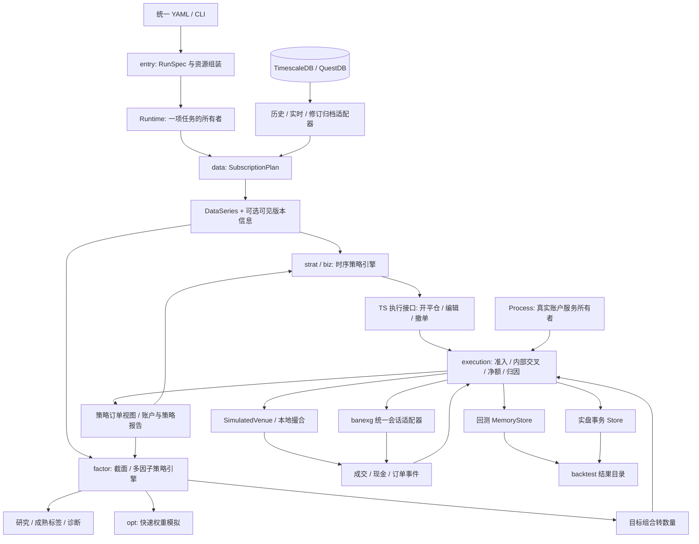

# BanBot 时序与截面双引擎、共享执行的架构调整方案

日期：2026-10-02。研究基准：本地 HEAD `0674129986c50ae378045486956d83a351e4b00f`，以及当前工作区所有相关未提交修改和新增源码。

实施更新：2026-10-03。第 2–12 节保留原调研与目标方案，其中“当前”、旧问题诊断和旧代码行号均描述上述调研快照，不再表示实施后现状；各节明确写出的实施更新例外。以下完成表与 [实施记录](better_arch_implementation.md) 表示当前结果；只有有源码和回归证据的条目标记完成。真实会话、断电和性能验收仍有缺口，不能把全部 A–G 标记完成。

## 实施完成表

| 状态 | 对应要求 | 实施结果与主要证据 |
|---|---|---|
| [x] | 1、3、4：两个引擎、typed Runtime、按需状态 | 普通 trade/backtest 读取同一 RunSpec；纯 TS 保留既有路径，CS 不制造 TS jobs；mixed 使用真实 TS jobs。`runtime/factor_state.go`、`entry/runtime_entry.go`、`entry/mixed_factor_backtest_test.go` |
| [x] | 4.2：账户与任务所有权 | Process 拥有账户服务，Runtime 借用；回测 RunID 隔离，账户/时钟不兼容时拒绝。`runtime/shared_account_test.go`、`execution/account_owner_test.go` |
| [x] | 4.3、10.3：接入、计算与关闭 | live 接入锁与慢计算/sink/output 分离；Stop 取消、Join 等实际操作；账户故障阻止全部借用方新增风险。`factor/runner/architecture_test.go`、`runtime/shared_live_failure_test.go` |
| [x] | 5.1、6.3：真正内存执行存储 | 默认 events/dry-run 与 mixed 使用领域 MemoryStore，不创建执行 SQLite/文件租约；与 SQLite 共用领域操作、撤销日志和提交边界。`execution/storage_memory_test.go` |
| [x] | 5.1：实盘独立持久参数 | 实盘执行连接独立 WAL/FULL/foreign_keys/busy_timeout，不初始化 ormo schema；Close 真正关闭，无隐式 reopen。`execution/storage_boundary_test.go`、`execution/storage_close_test.go` |
| [x] | 5.2、9.4：QuestDB 恢复文件发布 | 保留定向可见性等待、超时 marker、替换前验证；Windows 原子替换及可写 flush 句柄回归。`orm/questdb_visibility_test.go`、`orm/exsymbol_recovery_test.go`、`orm/recovery_file_test.go` |
| [x] | 5.2：元数据 latest、删除与持久版本 | 六类 `_q` 元数据先选 latest 再筛删除/可变状态，同机 storage identity 下 OS 锁与持久高水位按批预留版本；首建等待 WAL，错误禁止 INSERT。`kline_un_q.bar_ts` 分离事件/版本并兼容旧 NULL；v5 安装/升级/中断/丢表恢复回归通过。首次升级停旧 writer，跨主机需外部 single-writer。`orm/metadata_version_test.go`、`metadata_migration_test.go`、`unfinished_metadata_test.go` |
| [x] | 5.3：普通数据库输入与 PIT 边界 | Storage+SubscriptionPlan 直接回放；最新表要求显式 static-approximation，严格 PIT 缺不可变历史版本时拒绝。`entry/factor_storage_test.go`、`factor/runner/storage_input_test.go` |
| [x] | 5.3、10.3：实际内容与类型证据 | 完成时对已消费的 typed VersionRecord 流生成 ContentDigest/ManifestID；中断不伪造完整内容身份。Kline 使用实际 PG/Quest 类型与 NULL 语义。`orm/kline_schema_test.go`、`factor/runner/storage_input_test.go` |
| [x] | 6.1–6.2：镜像、attempt、checkpoint 精简 | schema v4 删除 outbox/fill 镜像、attempt 转 typed audit、合并为受约束 exec_checkpoint；逐步核验旧数据，失败事务回滚，迁移表按需创建。`execution/storage_schema_test.go` |
| [x] | 6.2：不为表数牺牲语义 | lot/actual/external basis、内外 allocation 与冻结 membership 保留明确约束；按文档允许继续分表，未硬凑十张表 |
| [x] | 6.2、7.1：策略级账户 API | 客户端提交本策略 Full/Patch/稳定动作与 checkpoint；账户核心合并并接纳，不在客户端重拼其他策略目标。`execution/strategy_rebalance_test.go`、`execution/storage_boundary_test.go` |
| [x] | 6.4：版本化结果与错误完成状态 | 普通结果目录保存配置、策略结果、run.json、events；mixed 按账户输出 orders.csv/gob；执行事件+postings 分块 Gob/manifest/SHA256。输出与 storage Join 失败标 incomplete，保留原始错误。`entry/unified_backtest_test.go`、`entry/mixed_factor_backtest_test.go`、`execution/archive_test.go` |
| [x] | 6.4：可选执行历史冷回读 | 默认 MemoryStore 保持无文件；显式 `execution.history` 在冷归档事务提交后淘汰非活动领域记录，历史订单、lot、posting、事件、revision/去重和 paper receipt 保留索引回读，不依赖猜测 finality。历史翻倍热记录不增长。`execution/storage_history_test.go`、`paper_history_test.go`、`factor/runner/history_test.go` |
| [x] | 6.4、7.4：mixed 历史元信息与终态投影 | legacy-ts 主 checkpoint 只留活动索引；订单/lot/command 元信息原子分拆并冷点读。最新计划不继承已无持仓/活动分配/intent 的历史零目标，旧计划与动作可回读；软件待单过期即使无 venue 事件也刷新终态；64 行分页恢复完整报告与导入成交量。`biz/shared_checkpoint_history_test.go`、`runtime/shared_checkpoint_legacy_test.go`、`entry/mixed_factor_backtest_test.go` |
| [x] | 7.2：生产 TS 统一发送者 | 普通 live 及交易工具借用 Process sender；SDK Create/Cancel/Edit/SetLeverage/Call 经过物理账户 owner/同机文件租约，跨结算域不能双发送。`entry/runtime_sender_test.go`、`runtime/legacy_execution_test.go` |
| [x] | 7.3：内部交叉与真实成交 | 两类成交独立来源、冻结分配与真实 highwater；Unknown/CancelPending 保留，不盲发；资金/费用归因保留。`execution/recovery_contract_test.go`、`runtime/shared_partial_test.go` |
| [x] | 7.4：TS 共享兼容缺口 | 禁入/暂停/计数、Force/styles/Relay、限价退出编辑、fill 后关闭延迟、部分退出与保护条件保持；独占 TS 继续保留原市场/profile。`biz/entry_admission_test.go`、`runtime/shared_order_bridge_test.go`、`runtime/shared_migration_exit_test.go` |
| [x] | 7.5：稳定事件与动作身份 | Accepted→OrderChanged→真实 Fill 映射，callback 至少一次；稳定 EventID/CommandID 幂等。新内部 ID 使用长度编码避免分隔符碰撞，兼容旧持久身份。`execution/id_compatibility_test.go`、`biz/intent_bridge_test.go` |
| [x] | 7.1：OHLC 模拟职责下沉 | `execution.OHLCProfile` 承担 intrabar、market/limit/stop、保护 hit/价格/时间、SDK 精度和公共费用；biz 保留钱包、拆单与策略回调。固定数值及真实 pending/protection 回归通过，两个模拟 profile 分别保留。`execution/ohlc_profile_test.go`、`biz/odmgr_local_profile_test.go` |
| [x] | 8.1–8.3：统一配置与易用默认 | 保留根 key/run_policy/More，engine 缺省 TS；显式共享预算按账户校验，不自动均分；注册 Go builder 可替换，支持字段来源与高级覆盖。`config/unified_test.go`、`config/run_spec_test.go`、`config/advanced.go` |
| [x] | 8.4：磁盘 YAML 等价迁移 | 原字节备份、权限/DACL、路径锁、源摘要冲突、同目录原子替换、全链重读、失败不启动；内存输入只转换内存。`config/migration_test.go` |
| [x] | 8.4：旧 JSON 入口 importer | 保留原文件，生成并重读 v2 YAML；混用冲突拒绝，路径保留；不再以 JSON 为独立默认组装链。`entry/factor_unified_test.go` |
| [x] | 8.2：实际默认与来源导出 | 普通 backtest 输出独立 resolved.json，保留真正的币种/NAV/预算/周期/价格/资金费/风险及逐字段来源；用户 YAML 保持简洁，导入覆盖不伪标默认。`entry/factor_resolved_test.go` |
| [x] | 8.3–8.4：Web 配置与回测整链 | Web/CLI 共用 RunSpec/preflight；保存要求原文摘要、路径锁与原子替换，拒绝 stale 保存；编辑切页/关闭前 flush，factor/mixed 读取统一 run/result 实际状态。`web/dev/config_editor_test.go`、`unified_backtest_report_test.go` |
| [x] | 9.1：CS 池外 TS 标的 | 实际 TS jobs 补齐单位、报价与资金费 union；共享/独立账户皆可交易，不扩张 CS Reference/Investable，也不要求额外 DAG 历史。`entry/mixed_factor_backtest_test.go` |
| [x] | 9.1–9.3：中性计划与安装 | bar/event、显式字段投影、最大预热、required/optional、观测预热、Install/Stop/Join；保留 Kline/侧源专用 reader。`data/subscription_plan_test.go`、`data/event_history_test.go`、`runtime/shared_sources_funding_test.go` |
| [x] | 9.2：历史 bootstrap 与真实 TS 预热 | 不可变 union plan 首次 Open 前 bootstrap 一次；失败阻止 reader；decision-grid 预热只推进指标/OnData/OnBar，不交易。`entry/factor_storage_test.go`、`factor/runner/storage_input_test.go` |
| [x] | 9.2：实时完整暖机与 optional | 侧源主动读取历史并验证 bar 连续覆盖、有效 event 观测与 decision-grid readiness；optional 故障有消费者降级证据，required 故障关闭准入。`runtime/shared_sources_history_test.go`、`data/live_subscription_test.go` |
| [x] | 9.2：完整动态订阅边界 | Kline/侧源完整候选代准备与暖机；固定 TS jobs 不重暖/不重建。回调边界与序列化账户快照原子交换，继承单调目标序号；已结算标的可删，非零 lot/活动订单按账户及策略保护。新旧可变 Session 别名提前拒绝，失败停止/回收候选且旧代继续；旧目标 scope 裁剪后的真实 Paper/AccountSink 成交通过。`runtime/shared_sources_update_test.go`、`data/live_generation_runtime_test.go`、`factor/runner/live_generation_account_test.go` |
| [x] | 9.4：输入页字节预算与可解释报告 | `data.page_bytes` 限制逻辑 decoded payload，启用时 legacy whole-array 源明确拒绝；reader/bootstrap/feeder 贯穿类型/NULL 和错误。报告包含实际 stream/page/prefetch/warmup 行与字节范围。`data/history_page_test.go`、`orm/series_budget_test.go`、`entry/factor_storage_test.go` |
| [x] | 10.1：共同决策核心 | history/live/research 共用 DefinitionBuilder/DecisionEngine/custom PortfolioBuilder/generic manifest；不新建 DSL。`factor/runner/decision_regression_test.go`、`factor/runner/architecture_test.go` |
| [x] | 10.2：实际多策略计算共享 | RunMany 和共享 live 按完整数据/时钟/Universe/定义身份复用；十策略真实 live 测试验证节点次数和独立目标。`factor/runner/architecture_test.go`、`runtime/shared_live_many_test.go` |
| [x] | 10.3：任意字段与复制边界 | 克隆 helper 消除临时 VersionStore；显式 archive schema 恢复大整数/JSON/NULL/missing，原始 Values 保留；数值视图不扩大显式字段投影。`entry/factor_unified_test.go`、`data/source_helpers_test.go` |
| [x] | 10.3：归档增量决策读取 | 有界 raw chunk 建立可见时间游标与 event heap；决策只复制各流最新合格版本，`Next` 保留所有原始修订。先应用 publication/reception 准入再选 latest，回退截止走准确查询；真实 Barrier/Run 的迟到接收回归通过。`factor/runner/archive_visibility_test.go` |
| [x] | 9.2、10.2：共享计算的换代回收 | Session 按借用计数管理；最后一个消费者的实际工作和 barrier Join 后释放。兄弟借用、Join 超时保留和二十代换代回归通过。`factor/runner/computation_lifecycle_test.go` |
| [x] | 4.3、10.3：入口取消与绑定资源 | `ExecuteContext` 贯穿普通 backtest/trade 和归档 driver；TS 调用方取消不发布成功完成，内部正常早停语义保留。多账户 factory 失败回收部分绑定，成功路径先 Join 账户再关闭绑定。`entry/command_context_test.go`、`entry/factor_live_binding_lifecycle_test.go`、`opt/backtest_context_test.go` |
| [x] | 4.3、11：私有流失败与进程崩溃 | 私有流注册失败取消并排空已接纳源，残留回报提示持久冻结；已退出 worker 不伪装运行。独立子进程 abrupt exit 验证 Sending/ACK 丢失、稳定身份、不盲发及成交后 cursor 前重放。`execution/account_service_reports_test.go`、`execution/storage_crash_test.go` |
| [x] | 4.3、12：八包完整 race 验证 | factor、data、execution、biz、runtime、entry、opt、factor/runner 完整包测试经 Windows race 插桩通过，未检测到数据竞争。仅 data 4 项与 biz 5 项真实 DB/网络测试依环境开关跳过；日志及临时工具链说明见实施记录 |
| [x] | 9.5、12：可复用性能比较工具 | dirty source/config/input/环境、工具管理构建、相同 workload 参数、运行前后输入/binary 核验、10 轮 AB/BA 和 paired-log 95% CI；smoke 无验收资格。9 项 Python 回归通过；v0.5.7 双均线计算/回调对比已执行，但 CI 跨过 5% 门槛，未宣称通过 |
| [x] | 12：单 CS 两年计算核规模 | 500 资产×17,520 小时×20 输出，8 列/1 消费者，8,760,000 资产事件和 192,720,000 节点更新，874.002 秒 PASS；sampled heap 54.52 MiB、进程峰值 working set 86.777 MiB。不包含 provider/DB/账户/报告、TS/mixed 或 old/new 对照 |
| [x] | 10.4：研究与接纳语义 | 研究标签成熟后更新 IC，live 缺成熟 provider 拒绝；TargetsAccepted、Fills、AccountFills 独立，研究不创建账户 |
| [x] | 10.1、10.4：可选研究消费者 | `factor.research.labels: []` 关闭研究；weights/events/trade 不建立标签队列、累计器或 IC 历史，不因研究队列预算停止交易。标签启用时保留原评估；只有 HistoryIC 建立 IC 历史。live 无标签可运行，research/HistoryIC 仍要求成熟标签证据。`factor/runner/optional_research_test.go`、`entry/factor_optional_research_test.go` |
| [x] | 10.4：Evaluation-only 不阻断实时安装 | live DAG 只订阅 Investable/Reference；Evaluation-only 不作为必需暖机历史。Reference 同样缺历史时仍拒绝安装；执行报价/资金费/legacy 订阅范围独立保留。`runtime/shared_evaluation_subscription_test.go` |
| [x] | 7.4：Relay 与配置默认交易语义 | Relay 保留 market/limit/maker 类型，按当前被动侧报价重定价；共享入场继承配置 OrderType、StopBars、Leverage，退出继承配置类型并保留投影，显式请求优先。指定 OrderID 退出与旧 TS 一致自动 Force 跳过延迟但不改变样式。稳定命令身份在默认值解析前核验，重试不受新报价影响；不修改调用方请求。`runtime/shared_capabilities_test.go` |
| [x] | 9.4：分页边界与取消完整性 | 仓库 reader/bootstrap/feeder 共用页校验，拒绝超行数、乱序、越界、nil/异 SID；合法字段类型别名不误判循环，结束时释放 Kline 缓存，最后一页取消不误报成功。`data/page_boundary_test.go`、`orm/series_budget_test.go` |
| [x] | 11：终态离线历史恢复 | 启动按 64 个稳定 ID 分页查询全部已发送/导入订单，包含冷历史终态；费用/成交和 ACK 原子归因，无效批次回滚，重复恢复不新增 ACK 事件。缺失或不权威历史阻止启动，不推定 finality、不盲发。`execution/startup_history_recovery_test.go` |
| [x] | 11：迁移与恢复回归 | legacy 业务迁移与 schema 迁移分开；pending/freeze/preflight/来源证据保留，发送前提交、恢复对账后准入、单调投影回归保留 |
| [ ] | 2 P0、12 G：默认 verified banexg live binding | banexg v0.2.64 已有 full snapshot（含条件单）、client-ID/query 与资金费查询；仍缺高层调用的 owner context 传递、完整会话 Join、统一 settled cash 和累计费用/成交完整性证明。缺 verified binding 时明确拒绝，未降级 paper；版本源码证据见实施记录 |
| [ ] | 6.3、11、12：物理断电与真实 venue 验收 | WAL/FULL 与本地回滚/重开测试已完成，物理断电、真实账户恢复及跨主机 fencing 没有验收证据 |
| [ ] | 1.3、9.5、12：三模式 ≤5% 与大规模验收 | 已运行本机微基准、完整/专项 race 和 v0.5.7 双均线 10 轮 AB/BA；该计算/回调对比为 inconclusive。仍缺原 dirty-tree 固定基线、PG/Quest 全链路和三模式规模/交错置信区间，未标性能完成 |
| [ ] | 9.4：预算范围与全进程内存验收 | 行和逻辑页字节预算已实现；48 小时两账户 SQLite/paper 归档全链路及两年 CS 计算核已测 sampled heap/进程 working set。普通数据库/纯 TS/mixed 与两年完整执行仍待测；活跃状态、返回集合、driver/allocator、聚合/warm cache 与全进程内存不在逻辑页硬预算内 |

完整测试命令、实际结果和仍需完成的最小出口见 [better_arch_implementation.md](better_arch_implementation.md)。上述表是需求追踪表，不能把未勾选项解释为可安全省略的要求。

本轮修订按用户最新要求明确：时序策略引擎与截面/多因子策略引擎长期并存、同等重要；日常配置保持现有 key 和使用习惯，以少量可选字段扩展；旧 YAML 默认备份并转换为等价新格式，运行阶段只使用新模型。以下目标方案替代上一版将时序配置移入 `time_series`、单独配置 `factor.strategies` 的建议。

本文从业务需求重新确定边界，不把已有包结构、JSON 配置、SQLite 表或兼容桥接当作必须保留的设计。依据为 [业务需求](factors.md)、[实施记录](factor_implementation.md)、[当前架构说明](../docs/arch.md) 和下文引用的核心代码。初始调研由三个 `gpt-6.1-sol / high` 子 agent 与主 agent 完成；后续同模型并行实施结果见上表。未使用当前项目的 DeepWiki。

**推荐方向：时序与截面两个完整策略引擎，共享 Runtime、订阅与账户执行基础设施；回测默认内存执行状态，实盘使用事务账本。** 时序引擎继续拥有逐标的回调、指标与交易生命周期，截面引擎拥有跨标的快照、因子 DAG 与组合决策。二者均可独立运行或混合运行，不存在用因子引擎替代时序引擎的迁移终点。

这里的“统一”是统一契约、事实来源与所有权，不要求所有实现合成一个函数。K 线聚合、任意事件源、快速权重回测、精确订单模拟仍可有各自实现。数据处理进一步合并必须证明性能退化不超过 5%；尚无基准证明的优化不得作为已完成能力。

## 1. 先固定业务要求，再判断什么可以简化

### 1.1 必须保持的能力

| 业务要求 | 架构含义 |
|---|---|
| 时序与截面两个引擎同等重要 | 时序引擎持续开发与优化，完整保留 Go 策略接口、开平仓条件、回调、优化与独占账户行为；截面引擎同样是完整运行入口 |
| TS 与 CS 在同账户、同合约共存 | 策略拥有虚拟仓位，账户拥有真实净仓位；全部发送、撤单与恢复经过同一个 owner |
| 单独 TS、单独 CS、TS+CS 都简单可用 | 按实际启用的引擎装配资源；纯 TS 不创建截面屏障、因子 Session 或研究组件 |
| 配置保持熟悉且可自由扩展 | 保留 `run_policy` 及既有 key；省略新引擎字段仍按时序执行；默认可推导项不必填，确有需要的高级项仍可配置 |
| 旧 YAML 自动迁移 | 原文件先备份，验证等价后原子保存新格式；之后重读新格式，两个引擎只消费同一配置模型 |
| 同一份策略定义用于研究、回测和实盘 | 因子定义、缺失规则、可见时间、组合构建共享；输入驱动和执行后端可不同 |
| 任意时序字段可读写 | `orm.DataSeries.Values map[string]any` 继续贯穿全链，保留扩展字段的具体类型、缺失与 NULL；不引入 typed OHLCV 快速路径 |
| 决策只能使用当时可见的信息 | 冻结 Universe、SID 身份、数据版本与可见性截止；未来标签不能进入推理计划 |
| 成交与费用可以解释 | 冻结分配关系；虚拟仓位、真实仓位、外部仓位与资金归因分别可核查 |
| 实盘故障后可恢复 | 网络副作用前提交发送事实；未知提交不能盲目重发；恢复对账前禁止新增风险 |
| 普通回测不依赖执行数据库 | 执行状态默认在内存，结果按现有 backtest 模式落盘；可选流式归档控制内存 |
| 行情与关系元数据主要使用现有数据库 | TimescaleDB/PostgreSQL 与 QuestDB 继续承担数据底座；不新增因子 SQLite 元数据库 |

`doc/factors.md` 第 1、5、9—11 节规定了新增引擎的核心业务契约。本次及最新补充需求对双引擎地位、存储、配置与统一数据链提出了约束，优先于旧方案里对 SQLite、独立 runner、JSON 和嵌套配置结构的具体安排。

### 1.2 不应当成业务不变量的实现选择

以下内容可以调整：21 张 `exec_*` 表、`factor-config` JSON、归档作为所有因子回测的必经输入、传统与共享订单的两个执行事实源、运行器中重复的快照/组合组装、固定 Momentum/Vol CLI、按账户重新计算同一因子，以及把新职责继续堆进 `runtime/shared_*.go`。

以下复杂性不能通过删类型、删表或删校验消失：限价与过期条件、部分成交、撤单期间成交、提交结果未知、策略保护触发、PIT 数据修订、预算版本、外部仓位、资金费和尾差归因。它们可以集中实现，不能用“统一目标仓位”掩盖。

首版仍采用模块化 Go 单体，不新增服务集群、通用 DataFrame、字符串表达式平台、全市场估值模型或分布式 owner 接管协议。业务示例中的 24 小时窗口、Top/Bottom 10 和多空各 50% 应是默认策略参数；实际首版支持范围可以明确限制，但不应由通用 manifest 类型替所有组合永久规定这些参数。

### 1.3 双引擎的产品与性能边界

| 能力 | 时序引擎 | 截面/多因子引擎 | 共享部分 |
|---|---|---|---|
| 策略定义 | TradeStrat/StratJob、逐标的/周期回调、banta 指标 | Go builder、TS/CS/GROUP DAG、组合构建 | 注册入口、参数、策略与账户身份 |
| 运行节奏 | OnData/OnBar/OnWsTrades/既有 batch 语义 | 观察网格、Universe 就绪屏障、快照和发布 | 数据源、时钟、订阅与生命周期 |
| 历史模拟 | 现有订单生命周期、OHLC profile、参数/滚动优化 | 研究、weights/events、成熟标签与诊断 | 加载、执行/账本、结果目录、费用与精度 helper |
| 实时交易 | 现有支持市场和订单功能持续保留 | 首版已声明的线性永续与组合执行能力 | 同账户 owner、净额/归因、恢复与风险 |

共享执行不要求 TS 先生成截面 Frame 或 Portfolio；它直接提交开平仓/编辑命令。纯 TS 的普通事件不经过截面屏障或研究队列。纯 CS 不创建用于凑接口的数百个 TS job；混合运行才同时装配两种状态。

新增 CS 首版的 `linear_perpetual` 限制不能缩减原有 TS 的现货、反向合约等已支持范围。共享执行核心尚不能承接的 TS 能力，在统一 owner 和公共执行接口下保留经过验证的 TS 专用执行实现，随后逐能力抽取；不能把拒绝旧功能当作重构完成。相同账户混合模式只在两侧市场/执行能力交集内开放。

性能分别验证纯 TS、纯 CS 和混合模式；基础设施变化不能让纯 TS 承担未启用因子功能的成本，也不能让独立 CS 被 TS 兼容路径放大。保留启动期编译与批量读取，避免每条事件反射判断引擎或无必要深拷贝；代表性热链路继续执行 5% 门槛。

## 2. 主要发现与优先级

“事实”表示源码直接支持，“判断”表示基于事实提出的架构结论。优先级针对改造顺序，不等同于已发生生产事故。

| 优先级 | 发现 | 事实与影响 | 建议 |
|---|---|---|---|
| P0 | 共享路径的旧准入规则存在缺口 | 旧 `allowOrderEnter` 检查禁入、数量与策略上限；共享 `ProcessOrders` 直接进入 Bridge，没有同样调用。静态事实，高置信度 | 先建立准入与回调契约测试，再收敛执行路径 |
| P0 | 真实 live 能力尚未形成默认可用出口 | live binding 注册表默认为空；现有 SDK 的完整取消、Join、权威快照不能靠配置声明获得。事实，高置信度 | 把 verified banexg 会话能力作为上线前置工作，不把架构重排当成实盘完成 |
| P0 | 回调游标不等于任意 callback 恰好一次 | 两个 callback 完成后才推进游标，崩溃发生在两者之间时存在重放窗口。事实，高置信度 | 事件 ID、至少一次交付与幂等策略动作；不承诺无法原子提交的外部副作用恰好一次 |
| P1 | 回测与实盘存储策略混在一起 | 因子 events/dry-run 强制新 SQLite 文件与文件租约，传统 backtest 已有内存订单与文件输出。事实，高置信度 | 给同一执行领域逻辑注入 MemoryStore 或事务 Store |
| P1 | 执行 schema 有可确认的冗余 | 全部 21 表无条件初始化；outbox 仅镜像订单状态，fill 无业务读者。事实，高置信度 | 先删除重复写模型，再分阶段合并与按需创建 |
| P1 | 执行所有权分散 | `biz`、`runtime`、`execution` 都包含共享账户业务，传统管理器也有提交与撮合。事实；维护成本判断，高置信度 | 真实执行和模拟撮合归 `execution`；时序引擎保留完整策略编排与交易接口 |
| P1 | 配置和入口形成两套组装 | factor JSON 独立加载，live 又加载 YAML；公共账户、币种、源、风险与单位需要重复对齐。事实，高置信度 | 一次加载 YAML，生成不可变 RunSpec；manifest 由运行结果生成 |
| P1 | 通用订阅入口还不能表达所有流 | 当前通用 normalization 要求可转秒的周期，而 `event` 源另有组装路径。事实，高置信度 | 统一计划契约显式表达 bar/event，保留 source adapter |
| P2 | 历史与 live 决策核心重复 | 两个 runner 都构造默认因子、manifest、Session、组合和目标；历史 Freeze+Evaluate 与 live Compute 的发布机制不同。事实，高置信度 | 共用 DecisionEngine，只更换事件驱动、时钟与执行端 |
| P2 | 计算共享能力尚需从内核走到产品路径 | Session 可共享同一快照，编译器可合并公共节点；每个 Run/NewLive 仍新建 Session，benchmark fanout 不等于默认多任务共享。事实，高置信度 | 在相同计算上下文内合并定义/复用 Session，独立预算和执行订阅 |
| P2 | 复制、扫描与输出可能成为热点 | Visible 每轮扫描块并克隆；live 单条记录使用临时 VersionStore；live 锁内有计算、sink 与输出。事实；性能影响待测 | 先 profile，再减少重复边界复制及索引扫描；解耦慢输出和计算 |
| P2 | 文档与能力命名存在漂移 | 旧 Runtime 文档的 legacy gate 不再对应当前源码；`Executed` 输出未区分接纳计划与实际成交。事实，高置信度 | 在能力矩阵和事件模型里明确语义，实施时同步文档 |

关键证据：`biz/odmgr.go:842,1021`、`biz/shared_order_mgr.go:1321,1332,1338,1347`；`entry/factor_live.go:51,73,83`；`execution/store.go:82`；`factor/runner/paper_sink.go:16`；`factor/runner/runner.go:93,133,459`；`factor/runner/live.go:40,227,370`；`factor/version_store.go:99`；`factor/runner/output.go:49`。更详细的存储及订阅证据见相应章节。

## 3. 目标架构：两个策略引擎，共享基础设施



### 3.1 模块边界

| 模块 | 保留/新增职责 | 不应承担的职责 |
|---|---|---|
| `entry` | CLI/Web 输入、统一配置、构造与停止任务 | 因子计算、成交归因、直接查询并改写执行表 |
| `runtime` | Process/Runtime 所有权、显式依赖、注册资源、取消与等待 | 订单状态机、历史资金费归因、旧 lot 投影业务 |
| `data` | 订阅编译、源能力、预热、加载/回放/实时驱动、事件边界 | 策略预算、组合、真实订单 |
| `orm` | 行情和关系元数据存储、schema、PIT 原始版本的存储适配 | 策略决策与交易事务 outbox |
| `strat` | 时序引擎的策略定义、状态、DataHub、指标与用户回调，持续扩展 | 对交易所直接下单、账户净仓事实 |
| `factor` | 截面引擎的定义、DAG、Session、快照与决策核心，持续扩展 | SQL 连接、交易所会话、CLI 生命周期 |
| `factor/research` | 标签成熟、IC 历史、处理/合成与诊断 | 在未来标签可见前更新实时决策权重 |
| `execution` | 账户服务、准入、目标/条件意图、真实订单、模拟撮合、账本、恢复 | 导入 `factor`、`runtime` 或 `biz`，识别交易所名称写专用分支 |
| `biz` | 时序引擎 Trader 编排、开平仓生命周期接口、InOutOrder 策略视图与回调 | 第二个共享账户发送者、独立的账户成交事实和资金账 |
| `opt` / `live` | 历史/实时任务装配、快慢回测执行端、报告 | 再造一套因子业务或账户协调算法 |

`factor/runner` 的组装能力可以渐进收敛：先抽纯 DecisionEngine，再把 PaperAdapter 等执行实现移到 `execution`，账户装配移到外层。无需为每个职责新建包；首先通过现有包内文件和小接口减少循环依赖。

`execution` 内的通用 Quote、Funding 与状态类型不应长期来自 `factor/backtest`。先下沉真正共用的交易契约，再由两种策略引擎和各类模拟器接入。通用 DTO 放在能避免 import cycle 的最低层；不要把运行依赖塞进 `context.Value`。时序引擎与截面引擎不互相依赖，二者的算法和调度可以分别演进。

### 3.2 一个入口不是一个算法

`trade`、`backtest` 按策略配置装配纯 TS、纯 CS 或混合任务；省略新增设置时保持当前时序运行习惯。`factor research` 与 `factor trade/backtest` 可以长期保留为截面专用入口，复用任务工厂和规范配置，无需为了统一组装而废弃一类引擎的命令。统一的是配置与基础设施，两种引擎各自提供完整的用户体验。

快速 weights 回测继续使用简化数量账，events 使用账户协调器与模拟 venue，live 使用真实 venue。weights 不需要完整订单状态机，且不承诺与 events 净值相同。简化项、资金费、滑点、可执行价格假设分别进入 manifest。

## 4. Runtime：一个 typed Runtime，按需承载两种引擎状态

### 4.1 选择同一个 Runtime

推荐继续使用当前显式 `runtime.Runtime`，已有时序状态与新增的 `FactorState` 按实际启用的引擎装配。不要复制一个 `FactorRuntime` 的配置、时钟、Storage、Symbols、日志、订单视图和停止逻辑，也不要恢复 `ContextRuntime` service locator。共享 Runtime 的地位与两种引擎对等，不由任何一个策略引擎拥有另一个。

时序组件继续持有 StratJob、指标、DataHub 与回调编排；因子组件持有编译定义、Session/计算组、RoundBarrier、冻结快照引用、待发布目标、成熟标签队列与研究累计器。未启用的组件不创建，mixed 才同时创建。实际组件可由外层装配并注册到现有 `OnClose` / `OnCloseWait`，不必先扩展成通用组件框架。

当前 `Process` 已经持有 Runtime 注册表、账户 owner、共享账户服务及调度器借用协调；`Runtime` 持有任务依赖并借用账户。这些是可复用基础。旧 [runtime_context.md](runtime_context.md) 关于 ContextRuntime/legacy gate 的历史描述须重新核对，不能把不存在的 gate 当成当前并发隔离保证。证据：`runtime/runtime.go:47,502,551,1122,1134`。

### 4.2 状态所有权

| 所有者 | 状态 | 隔离与共享原则 |
|---|---|---|
| Process | 真实账户 AccountService、只读定义注册表、可借用的资源 | 同 AccountKey 一个 owner；Runtime 仅释放借用，Process.Close 等待任务与账户工作并处理未完成状态后才关闭服务/Store/租约 |
| Runtime | 不可变配置、任务时钟、Symbols/Storage 绑定、数据计划、策略与研究组件 | 两个独立回测的可变状态不得共享；借用资源不能随一个 Runtime 关闭而被销毁 |
| 计算组/Session | BarEnv、窗口、递归状态、冻结 Frame | 只在相同数据身份、Universe/参考池、采样和决策时钟下共享 |
| 策略执行状态 | 策略目标、预算版本、虚拟 lot 与保护条件 | 账户之间不共享，同账户策略之间不覆盖 |
| 模拟账户 | MemoryStore、模拟 venue、模拟时钟 | 身份包含 RunID，两个回测不能因使用同一个 `default` 账户名互相抵消 |

不能只以 PlanHash 或 SID 相同判定可共享。共享键至少包含存储命名空间、源/schema/复权版本、Universe 及参考池、可见性/采样策略、时钟域和计算定义。共享不可变计划不等于共享可变 Session。独立优化任务首先共享只读数据块，不共享推进中的窗口和账户。

### 4.3 生命周期与调度

历史与实时都消费统一事件协议，分别注入模拟时钟和真实决策时钟。历史 driver 负责确定性事件排序；live driver 负责有界接入、晚到和截止。不得把实盘 wall clock 用于历史计划的可执行时间，也不能把本机计算耗时随机加入确定性回测。

实时接入回调只做有界投递和必要的轻量状态更新。因子计算、慢报告输出、策略回调与私有订单回报分离；账户事件仍在一个 owner 内串行提交。队列满时采用明确的拒绝/冻结/背压政策，不能静默丢成交或资金费事件。只可合并被语义证明可替代的快照更新。

目前 `Live.Observe/Flush` 在 `l.mu` 下执行计算、sink 和 Output；这说明同实例接入与停止可能受慢操作影响，不足以据此宣称所有独立私有流都被该锁阻塞。目标是计算先冻结输入，在锁外执行候选，按 generation/版本验收发布；仍保留 RoundBarrier 的过期和旧计算拒绝规则。

停止顺序为：关闭任务准入与决策发布 → 取消并停止输入/计算 → 等待 worker 和已接纳回调 → 释放该 Runtime 的账户借用 → Process 最终持久化或冻结未完成真实状态、停止私有流和网络操作、Join 后关闭 store/lease。Stop 发布取消，等待由外层 Join 承担，避免 callback 等待自身。

需要区分“任务正常退出”和“账户 feed 或对账失败”：前者只退出自己的借用和策略任务，后者必须关闭该账户所有借用方的新增风险准入。不能因为拆开 Runtime 就丢失现有账户级故障隔离。

## 5. 存储按数据语义划分，避免 SQLite 扩散

### 5.1 默认选择

| 数据 | 推荐默认存储 | 原因 |
|---|---|---|
| K 线、扩展列、资金费/持仓量等任意序列 | 当前 TimescaleDB/PostgreSQL 或 QuestDB | 复用 SeriesRepo、投影、范围、字段和 NULL 契约 |
| SID、日历、复权、数据覆盖与源 schema 元数据 | 同一数据后端的现有元数据体系 | 不新增一份 SQLite 事实源 |
| PIT 原始修订 | 当前数据后端的显式修订表或有界不可变文件块 | 必须保留多版本；不能覆盖成最新值 |
| 因子窗口、Frame、屏障、研究队列 | Runtime/Session 内存，面板按需文件输出 | 通常是可重建的派生状态，不应每轮事务落库 |
| 回测执行状态 | MemoryStore | 省去 SQL/磁盘/跨进程 sender lease；同样保留事务与幂等语义 |
| 回测结果 | 现有 backtest 输出目录与文件工厂 | 配置、manifest、订单/执行事件、权益、诊断统一归档 |
| 实盘执行状态 | 本地 SQLite；已有 PostgreSQL 的部署可选事务 PostgreSQL | 原子更新、去重和发送前 durable commit |
| 实盘查询/长期分析副本 | 可选异步导出到现有数据后端 | 分析副本不参与真实执行恢复或安全决策 |
| 现有 Web 任务索引 | 暂保留既有 SQLite | 与新增引擎无关，不借本次重构扩大范围 |

SQLite 保留在实盘事务账本和已有 UI 索引是明确的例外；不是行情、因子元数据和普通回测的推荐通用数据库。纯 QuestDB 用户不应为了关系元数据被迫增加 PostgreSQL 集群。

### 5.2 QuestDB 的关系元数据应如何复用

现有 `_q` 表确实采用时间版本和逻辑删除模式：`exsymbol_q`、`calendars_q`、`adj_factors_q`、`sranges_q`、`ins_kline_q`、`kline_un_q`。后续因子源定义、Universe 等低频元数据若需要落库，沿用其逻辑主键、版本追加和 latest-state 查询契约，或使用可重放的配置/文件 manifest；不要各模块自行实现软删除。

读取必须先按逻辑键选最新版本，再过滤最新状态的删除标记，不能先删除 tombstone 再把旧记录“复活”。复用现有查询及缓存/锁机制，版本生成不得只依赖可能重复的毫秒 wall clock。低频元数据的最新版本查询，不等于研究数据的 PIT 查询。

**实施完成：** 六类 `_q` 查询的删除及可变状态（如范围 `stop_ms/has_data`、品种属性）均在 latest 外层筛选；仅逻辑键条件可提前下推。版本按表和已证明的 storage identity，复用同机 OS 锁与原子、可 flush 的高水位文件，每批只预留一次；初次初始化先等待 WAL 应用，再读取数据库版本上界。已有预留即使尚未可见也不重用，损坏/可见性超时/持久化失败禁止 INSERT；恢复重放仍保留原版本身份。首次升级须停止旧 writer，跨主机仍需外部 single-writer，不宣称分布式序列。

`kline_un_q` 的版本 `ts` 与 K 线事件时间通过可空 `bar_ts` 分离，旧数据读取 `coalesce(bar_ts, ts)`；v5 仅增量加列，无破坏性重建。初始建表/丢表恢复也包含当前字段；迁移逐句执行，只忽略明确的 ADD COLUMN 重复，全部成功后才写版本标记，中断可重试。专项覆盖墓碑不复活、回退/并发/重开、WAL timeout/suspended、目录 flush、删除后旧事件再写及迁移中断。

WAL 写入成功不表示立即可读。对依赖可见性的后续步骤，等待预期版本、范围或计数；超时保留 recovery marker。CTAS/替换必须在 DROP/RENAME 前校验候选的预期快照；不能因首次读为空删除原表。证据：`orm/sql/qdb_migrations.sql`、`orm/pub_meta_queries.go`、`orm/questdb_visibility.go`。

**执行账本不套用这个异步软删除模型。** 行情和元数据可接受明确的异步可见性边界，真实发送、订单分配和资金账需要同一事务中的原子提交与去重。减少 SQLite 使用不意味着把 `exec_*` 直接搬到 QuestDB。

### 5.3 PIT 修订与最新序列不能混为一张表

现有普通序列去重键是 `(sid, ts)`；在 Values 中添加 `revision` 不能保留多个版本。修订存储需要显式身份 `(source, frequency, sid, event_time, revision)`，并记录 `available_at`、`ingested_at` 和 source/schema 版本。查询先按决策可见时间过滤，再选择当时最高修订。

数据库修订 reader、文件归档 reader 与实时 publication mapper 实现同一输入契约，输出 `DataSeries` 与版本信息。数据正常采集仍可维护最新序列用于普通 TS；不能从今天的最新表倒推出过去未归档的发布/修订时间。数据集必须声明是真实 PIT、static-universe 或显式近似，并把限制写入 manifest。

文件归档是可复现输入选项，不应要求所有因子回测都先人工生成 Gob、填写 SIDMap/schema/source version 再运行。普通用户可直接用现有 Storage + SubscriptionPlan；要求严格 PIT 的场景缺少修订记录时明确拒绝或选择有标记的简化。

## 6. 执行存储：逐表判断，先消除重复事实

### 6.1 当前全部 21 张表的用途与处置

所有表当前在 `OpenStoreWithLeaseDir` 无条件初始化；还通过 `ormo.Conn` 创建既有交易 schema，因此新执行文件并不只有这些表。当前 schema 为 v1，缺少独立的历史归档/保留策略。证据：`execution/store.go:47,82,97,102,107`、`orm/ormo/base.go:21`。

下表的“可删”是目标改造判断，不授权直接删除用户现有数据库。删除表前必须完成 schema 迁移和回归验证。

| 当前表 | 当前用途与主要读写环节 | 判断和目标 |
|---|---|---|
| `exec_schema` | OpenStore 创建/校验 schema 版本 | 版本信息必要，收归持久层公共迁移元数据，不算执行业务对象 |
| `exec_account` | 真实现金、未归属现金、freeze、提交 checkpoint；Send/Snapshot/Reconcile 使用 | 核心账户状态，保留 |
| `exec_strategy` | 策略现金、费用、资金费与 NAV 热查询 | 保留策略物化余额，不每次遍历历史流水 |
| `exec_plan` | 历史计划、序列、最新目标、冻结条件；Prepare/Send 与客户端保留成员使用 | 先保留；拆清策略目标修订与真实订单冻结版本，历史计划归档 |
| `exec_virtual_intent` | Entry/Exit 条件、触发、到期、追踪锚点与执行量；EvaluateIntent/Prepare/Send 使用 | 活动意图必要，条件运行态由执行核心单独拥有 |
| `exec_plan_intent` | 跨计划复用稳定 intent 的合法成员关系；Prepare/InternalMatch/迁移校验 | 当前有真实读者，不能因 intent 有 plan_id 就删；明确冻结成员/版本替代后再考虑合并 |
| `exec_order` | 稳定 client/exchange ID、真实订单、状态、累计数量/成本/费用、尝试号与恢复 | 核心；承担发送待办状态，保留唯一键与状态索引 |
| `exec_allocation` | 净订单对应策略/lot/intent 的固定分配、预留与已成交量 | 核心；不能由当前目标倒推已提交订单归属 |
| `exec_internal_allocation` | 内部交叉消耗的 intent 数量；预留/剩余量查询 | 信息必要，可与 allocation 按来源类型合并 |
| `exec_outbox` | 创建订单时写入、随 order.state 同步；没有独立业务读取 | 可确认的镜像冗余，删除独立表与同步写；发送前订单事务不能删 |
| `exec_attempt` | Send/Cancel 前写 number/generation/kind/time，记录 ACK/Unknown 结果 | 完整尝试事实必要；迁入 typed OrderAttempt 事件后可删表，不只保留最新数字 |
| `exec_lot` | 策略逐 lot 数量、成本、PnL、费用、资金费；退出/保护/投影使用 | 保留逐 lot 身份，不降成策略×标的总量 |
| `exec_position` | 真实净仓及真实 basis；reduce-only、风险、对账使用 | 保留真实仓位角色；不能简单累加虚拟 basis 得出 |
| `exec_external_position` | 手工交易/强平等未归属仓位；Snapshot/Reconcile 使用 | 与 position 可按 role 合表，未归属语义与独立 basis 保留 |
| `exec_event` | 不可变事件去重、提交顺序、增量投影、延迟资金费校验 | 核心事件索引，保留；不要求用全量事件回放代替所有热查询 |
| `exec_projection` | 消费者游标、分页投影与回调进度 | 与 checkpoint 合表，保留单调且不超过已提交序列的约束 |
| `exec_strategy_checkpoint` | TS 请求/保护兼容恢复、不可变账户/策略 policy 等 | 与 projection 统一物理结构；不同 kind 使用不同写 API，不退化为无约束 KV |
| `exec_fill` | Fill/fee correction 写入；没有独立业务读取 | 可确认的冗余；事件、order highwater、allocation 与 posting 保留后删除 |
| `exec_ledger` | 每事件已确定的数量、现金、费用、资金费与 PnL 归因；EventsAfter 使用 | 归因事实必要，推荐保留明细表，避免把大历史塞进 JSON |
| `exec_migration` | legacy 导入 pending/freeze/ready、来源 hash/version，恢复拦截 | 仅迁移路径按需建表，普通新账户不需要 |
| `exec_legacy_source` | 旧订单→策略 lot 的原始来源与恢复证据 | 仅迁移路径创建/归档，不能因当前调用少而丢失审计来源 |

主要读写证据：`execution/store.go:192,293,365,392,396,461`；`execution/intent_store.go:23,41,53,88,124,136`；`execution/ledger.go:21,37,92,153,183,241,405,499,579`；`execution/settlement.go:94,147,269,352`；`execution/projection.go:34,60,99,113`；`execution/adapter.go:188,218,247,388`；`execution/migration.go:112,234,286,320`。

### 6.2 推荐的精简顺序

1. **21 → 19：先去掉 `exec_outbox` 与 `exec_fill` 镜像。** 保留 order 的状态索引、event 唯一性、ledger 和 allocation，状态变换与事务边界不变。
2. **19 → 18：迁移完整 attempt 事实后去掉独立 attempt 表。** 网络前记录与结果记录的事务、尝试类型、generation、稳定身份不能缺失。
3. 合并 projection/checkpoint、内部/外部分配、actual/external position；这些需要改查询与 API，应分步验证。迁移表改为仅在显式迁移工具运行时创建。
4. 最后调整 plan/intent 的关系。账户服务先接收策略级更新并拥有合并逻辑，客户端不再拼 combined plan；随后才能替换历史全量 plan 和 membership 的存储方式。

终态可使用约 **10 张常规业务表**：account、strategy balance、策略目标修订、条件 intent、真实 order、分类型 allocation、分角色 holding、typed event、ledger posting、分类型 checkpoint；加公共 schema 元信息及 2 张按需迁移表。这里是可评审模型，不是必须凑到十张的指标。

holding 如果合表，必须保留 `Virtual/Actual/External` role、独立成本基准和逐 lot 主键；若分表更清晰就继续分表。目标/intent 成员关系需要高频 SQL 校验时也可继续保留关联表。优先减少重复写与复杂查询，不为了表数去掉约束、索引或把整个账户序列化成一个大对象。

新目标修订只更新本策略：Full 清空本策略旧范围的省略项，Patch 只更新指定项。目标修订不修改已发送订单的 allocation，不延长其他策略保留请求的 expiry，也不修改原始限价或 StopBars。删除 `exec_plan_intent` 前，替代模型必须表达 intent 的版本与冻结成员资格，而不是仅保存指向最新可变 intent 的指针。

这不是全面 event sourcing。活动关系状态承担启动与热查询；不可变事件承担幂等、审计、增量投影与核查。迁移 genesis 保存初始资金、lot 与 basis，不能假设当前 ledger 已足以从零重建全部账户。

### 6.3 共享执行逻辑，分开内存和实盘提交

当前 `Store` 的方法直接使用 `database/sql`，`atomically` 通过 context 携带 scoped SQL transaction；把 `StorePath` 改成 `:memory:` 只会变成内存 SQLite，不是需求中的领域内存存储。证据：`execution/store.go:23,36,42,157`。

目标采用小型领域提交边界：读取带版本的账户状态 → 校验命令并生成变更行、事件及 postings → `Commit(expectedVersion, changes)` → 成功后发布只读视图/通知。内存实现使用 staged changes 保证失败回滚，SQLite 实现用真实事务。不能让 MemoryStore 模拟 SQL，也不需要为理论上的十种后端建设通用 DAL。

真实 Send/Cancel 先 durable 提交固定订单定义、client ID、attempt 与 Sending/CancelPending，再调用网络。内存回测复用数量、风控、分配、highwater 与取消语义，但没有常规跨进程 lease 或逐成交 fsync；故障测试可单独启用持久后端和注入 Unknown。

当前 SQLite 使用 WAL 和 `synchronous(NORMAL)`（`orm/base.go:484,568`）。因此“SQL Commit 成功”与“断电后发送前记录一定保留”不是本次已证明的同一件事。实盘持久层须明确 durable 等级，使用相应同步策略并验证崩溃边界；不能直接继承旧连接默认值后宣称已解决断电一致性。

### 6.4 回测文件与内存上限

复用 `opt` 的输出目录、唯一 RunID 和报告生命周期，默认完成后保存配置、manifest、summary、权益与订单/执行事件。兼容 UI 需要 `orders.csv/gob` 时从旧订单投影生成；原始执行及归因流水使用带 schema version 的分块文件。JSON Lines 仍可作为显式 stdout 输出方式，不再是唯一默认产物。

传统模式已有 `ormo.InOutOrder.Save → saveToMem`，回测任务负 ID 不要求数据库，报告再输出 `orders.csv/gob`。证据：`orm/ormo/bot_task.go:77`、`orm/ormo/order.go:555,618`、`opt/reports.go:572,700`。因子当前 PaperSink 则强制新 SQLite 并拒绝重开；PaperAdapter 的 Query 无恢复能力（`factor/runner/paper_sink.go:16,29`、`factor/runner/paper.go:127`）。保留 SQLite 文件不等于已经支持回测续跑。

小回测可结束时统一落盘，大回测只保留热状态并流式输出已提交历史。去重索引、未知订单、活动 intent、非零 lot、未消费投影和延迟资金费归因证据不能随意裁剪；需根据稳定数据源水位、消费水位及重复窗口设计归档。

结果写到临时产物，成功后原子发布并标记 complete；取消/文件失败输出 incomplete 和原因，不能让报告文件存在就代表成功。续跑不是本次默认需求，若加入必须同时保存时钟、输入游标、策略/因子状态、模拟 venue、账户、去重水位和 manifest。现有 `orders.gob` 不具备这一完整契约。

## 7. 订单执行：收敛两套权威状态，保留策略语义

### 7.1 从策略级 API 开始，而不是先搬文件

账户服务应接收两类输入：

- 因子策略提交本策略的完整/增量目标、预算与决策版本。
- TS 策略提交指定 lot 的 Enter/Exit/Edit/Cancel 命令、限价、条件、有效期与稳定动作 ID。

执行服务内部管理最新成员、条件运行态、风险、保留目标及账户 sequence。TS 和 factor 客户端不再读取其他策略目标、各自拼 combined plan，然后让账户服务再次合并。当前重复位置见 `biz/shared_order_mgr.go:1548`、`factor/runner/account_sink.go:237,272`、`biz/shared_account.go:337`。

`biz.SharedAccount/shared_policy/shared_reports` 的真实账户协调、政策、网络尝试、恢复和回报管理移入 `execution`。时序引擎继续拥有完整的策略交易接口、任务定位、InOutOrder 生命周期视图及回调，订单 manager 在该接口与公共执行服务之间连接。这里变薄的是重复的账户执行层，不是时序引擎。条件触发/预留/到期只有 execution 更新；迁移 checkpoint 仅保留无法由领域事实恢复的历史请求与视图元信息。

`LocalOrderMgr` 的历史撮合拆成 `execution` 中模拟 venue 的 OHLC profile；`LiveOrderMgr` 的统一 Create/Cancel/Query/report helper 归入 banexg adapter。时序用户继续通过熟悉的管理接口使用这些能力。先抽与迁移职责，证明所有相关 TS 能力和性能保持后再删除重复写分支；公共核心尚不支持的市场/功能保留专用实现，不让它退化成截面目标模拟。

所有交易所特有协议、client ID 约束、数量/价格精度、合约单位和账户快照差异由 banexg 封装。banbot 只消费统一 capability，禁止在 execution 内按交易所名称分支处理。

### 7.2 单策略也走同一账户核心

TS 和 CS 的单策略都可以独占账户，混合任务共享同一账户服务；基础状态机不因策略引擎而复制。独占账户继续保留对应引擎的下单、原生保护、市场模式和回测语义，不强制启用内部交叉或截面模型。一个账户进入统一 owner 管理后，OrderMgr、工具命令、Web 操作、原生触发管理和恢复入口都经过该边界；不同能力 adapter 可以共用 owner，但不能成为第二个不受管发送者。

当前 SharedExecution 构造会替换 Local/Live manager，独立 Live manager 会拒绝共享组合；这值得保留。但普通 `trade` 构造还没有统一 AccountOwnerKey/SharedExecution，不能推断所有旧入口和进程已经被拦截。证据：`biz/odmgr_local.go:46`、`biz/odmgr_live.go:99,111`、`entry/runtime_entry.go:239`。

终态构造层统一认领真实 AccountKey，持久后端认领 sender lease；没有账户句柄的代码拿不到可发送会话。OS 文件锁只证明同一主机/共享目录上的互斥，owner generation 只证明同进程句柄权限；二者都不是跨主机 fencing。首版不自动按 TTL 接管真实账户。

### 7.3 两种撮合是不同业务

**策略内部交叉**处理相反方向的虚拟需求，产生 InternalFill，按当时可执行报价和条件确定价格，真实账户仅发送剩余净需求。**本地历史撮合**模拟 venue 对真实净订单的成交。它们可以复用精度与条件 helper，但不能混成一种成交来源。

账户只协调已满足条件的可执行目标，并计算：

```text
account_target = 所有策略的可执行目标数量之和
projected_position = 实际仓位 + 已确认订单剩余有符号数量
unordered_delta = account_target - projected_position
```

Sending/Unknown/CancelPending 不能按剩余量为零处理。真实成交按发送时冻结 allocation 归因；内部交叉不伪造交易所订单号和手续费。取消 ACK 后查询权威最终累计，再释放预留；新目标不能修改已经发生的归属。

同账户虚拟 +1 和 −0.6 时真实 +0.4；+1 的策略退出后真实目标变成 −0.6，可能先减真实多仓再建立净空。逐策略 stop 不能直接用 reduce-only 1 表达。软件策略保护、账户级 venue 紧急保护是不同能力，停机期间的软件保护不工作，不能伪装成常驻原生保护。

### 7.4 时序能力保持与共享模式差异矩阵

| 语义 | 当前共享路径状态 | 目标处理 |
|---|---|---|
| 禁止品种、暂停入场、账户/策略订单数上限 | 未经过旧 `allowOrderEnter` 完整路径 | 两种运行方式都保留并验证这些规则；共享 gross/margin 不能替代计数限制 |
| Market/Limit 入场与退出 | 有桥接 | 保留限价、数量、期限、成本和 tag；版本化验证 |
| Force、其他 style、RelayOrders | 当前共享实现存在明确拒绝 | 纯 TS 保留已支持行为；在共享模式补足对应语义，未完成前只限制共享组合，不能全局删除 TS 功能 |
| Limit exit 编辑 | 共享编辑接口未完整覆盖旧动作 | TS 原能力保持；共享实现单独补齐与回归，不能将拒绝操作作为已完成兼容 |
| FilledOnly/UnFillOnly、StopBars、部分退出、trailing | 已有大量专门实现与测试 | 把条件状态收归 execution，保留绝对到期、锁存和真实成交成本 |
| 每策略杠杆 | 旧 manager 可 Get/SetLeverage，共享使用统一 margin/risk | TS 独占模式保持原行为；同账户混合时明确账户级 venue 设置与策略约束，冲突不能靠轮流改杠杆解决 |
| 请求接受/挂单变化回调 | 旧请求处理后回调与共享成交投影不同 | 区分 Accepted/OrderChanged/Fill/LotChanged，定义旧接口映射与顺序 |
| OHLC 内模拟 stop 与可观察 quote stop | 模拟假设不同 | 保留显式 historical profile；不声称天然相同净值 |
| 实盘外部仓位、手工订单和强平 | 有 Unassigned/freeze 模型 | 保留，不根据 symbol 自动分配或平掉 |

证据：`biz/odmgr.go:842,1021,1044`；`biz/intent_bridge.go:87,175`；`biz/shared_order_mgr.go:643,662,694,720,1327,1377`；`biz/odmgr_live.go:2528`；`biz/shared_migration.go:285`。

当前共享实现的限制属于新增组合模式的待补能力，不能反向成为时序引擎的弃用清单。TS 独立运行与 CS 独立运行分别验收完整性；同账户混合在确定的能力交集内提供清楚约束。

“旧配置字段仍能解析”不等于语义兼容。订单数必须区分虚拟 lot、传统 InOutOrder 和真实净订单；策略限制默认按原虚拟生命周期计数，真实订单限制另外声明。旧 0 值、默认值和禁入时钟的意义保持或明确版本化，不能无声改为新含义。

### 7.5 回调与事件可靠性

事件与 allocation、现金、highwater 在一个提交中发布。投影只消费已提交事件，按事件当时状态展示累计数量与费用，不提前展示后续事件的最终值。保留分页、重入 tail 和策略/周期身份匹配，不每次扫描全部历史构建兼容视图。

当前游标在 manager callback 和策略 callback 后推进，故存在崩溃窗口。目标契约为稳定 EventID 和至少一次投递，策略动作由 EventID 派生幂等 CommandID。同 ID 同内容重复不执行第二次，同 ID 异内容拒绝。若策略状态与游标可在同一事务提交，可加强这一内部边界；任意外部 callback、通知或用户副作用不能据此宣称恰好一次。

## 8. 配置：保留熟悉的 key，少量扩展，自动转换旧格式

### 8.1 新格式的最小变化

继续保留根层 `run_policy`，以及 `name/env/exchange/accounts/database/pairs/pairlists/time_start/time_end/run_timeframes/stake_currency` 等现有 key。时序参数 `stake_amount/stake_pct/leverage/max_open_orders` 和策略项中的 `params/pair_params/max_open/max_simul_open` 等也保持位置与原有语义。代码可以把它们归入统一领域对象，但用户不需要为了内部职责划分移动配置。

统一 `run_policy` 中每项新增可选 `engine`：省略或 `time_series` 表示时序引擎，`factor` 表示截面/多因子引擎。`name` 仍为注册的 Go 策略名，`run_timeframes`、`pairs/filters`、`params` 继续表达周期、品种和策略参数。同一 name、不同引擎可通过引擎各自的注册表解析，不要求维护第二份策略清单。

文件仅增加一个 `config_version: 2` 格式标记，用于可靠识别旧文件与防止重复转换；它不替代 source/schema、策略或执行账本版本。没有标记的现有 YAML 按 v1 导入，新文件模板由工具自动写入标记。以下配置模型已实现，示例片段与已有公共配置合用；普通数据库输入还需明确 PIT 与资金费政策，真实 live 需 verified binding。

纯时序策略仍可这样写：

```yaml
config_version: 2
run_policy:
  - name: Demo
    run_timeframes: [5m]
    params: {atr: 15}
```

混合运行只增加截面策略项，以及真正需要的共享资金分配：

```yaml
config_version: 2
run_policy:
  - name: Demo
    run_timeframes: [5m]
    capital_weight: 0.5
    params: {atr: 15}
  - name: MomentumVol
    engine: factor
    run_timeframes: [1h]
    capital_weight: 0.5
    params: {window: 24, k: 10}
```

MomentumVol 示例的输入 close、处理器、组合方式、多空比例、预热与输出由注册的 Go 定义提供默认值。用户仍可替换策略和参数；并非只能运行这个 preset。`run_timeframes` 对 TS 保持原来的周期选择含义，对 factor 表示定义支持的决策频率，具体定义不支持多频率时校验报错，不增加重复的 `frequency/decision.interval` 必填项。

`capital_weight` 是新增的可选共享预算份额，不是现有 `stake_rate` 的别名。**新旧纯 TS 配置即使包含多个策略，也默认保留原 stake sizing 和账户风控，不新增预算必填项。** 仅当用户显式设置共享预算，或同账户启用 TS+CS 混合时，多个参与策略才要求完整的显式份额；合计不超过 1，未分配部分留在账户，不自动按策略数平均。单个使用预算的策略可默认使用全部可分配资金；多 CS 的独立预算也需明确。一个 TS policy 下的多个 StratJob 使用该策略的同一预算，不能按 job 数再次切分。配置升级与接入统一 owner 都不自动启用预算新语义。多个账户按实际绑定分别校验，省略绑定沿用现有账户选择语义。

多数策略沿用当前稳定任务身份即可。只有重复定义不能区分、需要跨配置变更保持独立 lot 身份时才提供可选 `id`；不能以每个策略必须另填一套 ID 降低易用性，也不能仅以列表下标作为新持久身份。

### 8.2 减少必填项，保留可配置自由度

日常配置表达用户选择，不表达整个运行对象图。以下内容从策略定义、公共配置、数据源目录和交易所能力推导；只有覆盖默认值、接入外部数据或做特殊研究时才填写。

| 内容 | 默认来源 | 需要自定义时 |
|---|---|---|
| TS/CS 周期与品种 | 现有 `run_timeframes/pairs/pairlists`，策略级覆盖规则 | 沿用同名 key；截面 Reference 等特殊集合可在策略专用块中指定 |
| 输入字段、预热与 retention | 策略声明、factor DAG、source schema | 策略声明或可选 `data` 覆盖；不重复手写完整订阅计划 |
| 因子处理、合成和组合 | 注册 Go 定义及 `params` | factor 策略项下可选 `factor` 专用块提供 `combo/portfolio/decision/research` 等覆盖 |
| 执行报价和资金费流 | 所选市场与已验证 adapter/source 的通用能力 | 可选 `execution` 指定真实来源和策略；不能默认用零资金费弥补缺源 |
| 合约单位、精度、SID 和版本 | banexg metadata、SymbolState、数据源/归档 manifest | 离线或特殊数据显式覆盖并校验，不让普通用户逐标的填写 |
| 模拟资金与费用 | 现有 `wallet_amounts`、成本配置及模拟 profile | 继续使用现有 key；仅新增原配置不能表达的模拟参数 |
| 执行存储与租约位置 | 运行模式、DataDir、账户身份 | 可选 `execution.store` 等覆盖；backtest 默认内存，live 默认事务后端 |
| 分页、预取、迟到和截止 | 经测试的源/策略默认值 | 可选 `data` 和策略专用块显式调整 |
| 研究标签与可复现证据 | 研究命令/策略定义，运行生成 manifest | 按需选择标签、归档和输出；不手填策略 hash、snapshot digest |

`data` 与 `execution` 作为可选高级覆盖块保留，不是每份配置的必填骨架。账户身份、凭据和既有账户参数仍只放在 `accounts`；只有账户之间确有差异时，才在 `execution.accounts.<name>` 覆盖相应服务设置。同一值只有一个主配置位置，避免根层、账户层和每个策略同时登记一份相同风险上限。

不再要求新增 `time_series.run_policy`、`factor.strategies`、`data.contexts` 或数据上下文引用来描述普通任务。上一版的深层示例不作为实现目标。复杂场景允许按需扩展，但每个新 key 应回答“现有字段或 Go 定义为什么不能表达这个用户选择”，不为内部组件的每个字段都建立配置。

默认推导必须透明：提供有效配置查看/导出，注明关键默认值和覆盖来源。真实 live 缺资金费、价格或完整会话能力时明确报告缺项；减少配置不意味着关闭验证、放宽风险或悄悄切成 paper。

如果研究参数确实很多，可以通过现有 `--config factor.yml` 加载 YAML overlay；其中仍使用相同的 `run_policy` 和可选块，不另设 loader。纯 TS、纯 CS 与混合模式均使用这一模型。

### 8.3 统一加载与覆盖规则

加载顺序继续是 `config.yml → config.local.yml → --config 顺序 → ConfigData → 实际传入的 CLI`。保持现有 `run_policy/wallet_amounts/fatal_stop/watch_jobs/historical_coverage` 整块替换及 timerange 的互斥规则，不能把转换后的策略列表改成按 ID 合并而悄悄保留旧策略。证据：`config/biz.go:108,129,157,161,241,249`、`config/types.go:78,88,151`。

- 新 `run_policy` 列表中可同时包含两个引擎；上层文件提供列表时，整体替换下层列表，与原使用习惯一致。
- 保留缺省与显式 `false/0/[]/null` 的区别，CLI 只在 flag 实际传入时覆盖；策略参数、计数、时间和杠杆的旧默认不能被新 Go 零值覆盖。
- 新增内建字段严格检查未知/重复 key、duration、decimal、引用和 mode；原有开放的策略 `More` 参数继续传递，不因增加 engine 字段全局收窄自定义参数。
- 原有相对路径和 `$`/`@` DataDir 规则保持；新增 archive/store 路径按提供最终值的配置文件目录解析。转换在原目录保存，保留字段来源，不展开成依赖某台机器的绝对路径。
- `trade/backtest` 根据同一策略清单装配对应引擎；research、weights、events、paper、live 各自验证，不能以简化入口改变 TS 原有启动习惯或把 live 自动降级。
- TS 根层账户限制归一到统一准入政策，`RunPolicy.MaxOpen/MaxSimul/OrderBarMax` 继续属于策略约束；配置 key 不需要随代码模块移动。
- 无副作用的完整校验在创建交易所、账户服务和数据库之前完成。纯 archive research 不被迫连接交易所或时序库，交易相关要求由运行模式决定。

新 DTO 仍放在 `config` 纯配置层，不能直接嵌入 `runner.Config` 形成 import cycle。先生成唯一的规范配置，再映射两种引擎的参数；Snapshot 深拷贝、dump、脱敏、hash 和 Web 编辑都基于新模型。内部 RunSpec 可以完整，保存给用户的 YAML 保持简洁，不把所有派生项和默认项都展开。

### 8.4 旧 YAML 默认备份、等价转换、重读新格式

本节的配置入口迁移已实现并有专项回归；本次验证只使用临时配置，未批量改写工作区用户配置。迁移发生在配置入口，执行与两个策略引擎只接收 v2，不维护 v1/v2 两条业务分支。

```text
读取文件并识别版本
→ v1 导入器生成 v2 候选，保留原始表达
→ 校验完整加载链的新旧有效配置与行为参数等价
→ 为待转换原文件建立备份
→ 原目录原子保存 v2
→ 重读 v2，按原覆盖顺序装配任务
```

1. **可靠识别。** 无 `config_version` 的旧 YAML 按 v1 解析；v2 文件不重复转换、不重复备份；高于已支持版本明确拒绝。格式版本不改变 TS 默认 engine。
2. **最小编辑。** 优先保留原 key、顺序、注释、锚点、环境变量表达、开放策略参数和省略项；普通 TS 文件通常只需添加版本标记。需要改变形状的历史别名转换到规范 key；新默认与旧行为不同的字段显式补上等价值，不把所有默认值展开成几十行。
3. **验证等价。** 对原加载链和候选加载链分别计算规范结果，比较策略清单、TS 引擎归属、账户/品种/周期、预算与计数、成本/profile、时间范围及参数；排除纯格式标记。保留显式空列表和覆盖来源。只改变排版或最终合并值相同，不足以证明每个 overlay 的后续覆盖行为相同。
4. **备份原文。** 每个会改写的文件先建立唯一备份，例如 `config.yml.bak.20261002T103000.<id>`，保存精确原始字节和原有访问权限，不覆盖既有备份。备份位置在转换日志中显示，凭据和环境变量值不写日志。
5. **原子保存。** 转换器和应用配置写入口共用按规范路径的写入锁，覆盖读取、备份、源摘要重验和原子替换；平台支持时同时使用文件排他保护。在同目录写临时新文件，保留源文件访问权限，完成写入检查，核对源文件摘要仍与读取时一致后替换。备份失败或检测到编辑冲突时不改写该文件；不能先覆盖再补备份，也不能把进程内锁当作任意外部编辑器的互斥证明。
6. **多文件和重试。** 对 `config.yml/config.local.yml/--config` 文件逐个保留身份和相对基准，先准备并验证完整候选链，再备份和提交。不把它们合并成一份用户配置，避免抹掉覆盖规则。全部提交后重读，校验各文件内容摘要、完整覆盖链及候选的有效配置等价性，通过后才启动。跨文件不能假称一个原子事务；中途失败或重读发现竞争不启动任务，保留备份与具体冲突记录，下次识别已转 v2 和未转 v1 安全继续。
7. **边界情况。** 无法证明等价、只读配置目录或写入失败时保持原文件，给出具体文件与原因，停止依赖该配置的启动。ConfigData、stdin 等没有原文件的输入只在内存转换，并在运行产物保存新格式快照；不制造不存在的源文件备份。涉及新增保留字段与旧 `More` 同名冲突时，保留原策略参数传递并显式处理，不能把原用户参数误解释为 engine。
8. **转换完成。** 成功后重新读取 v2，后续运行仅使用新格式；转换幂等，不创建长期旁路解析器或每次运行再转换。备份用于恢复原配置；它不是订单数据库迁移或真实发送后的账户回滚工具。

原文转换在环境变量展开之前完成，不能把启动时的密钥、CLI 参数或一次性的时间范围写回用户 YAML。有效配置导出是独立产物，与简洁的持久配置、原始备份分别保存。

`--factor-config` 旧 JSON 同样只作为入口 importer：保留原文件和路径语义，生成可校验的 v2 YAML，转换完成后由统一入口运行。与同次 YAML 设置冲突时报错，不保留 JSON runner 作为第二条默认配置链。

### 8.5 配置验收：少配置、同功能、可恢复

配置转换需要真实样例和端到端行为对照，而不只测序列化。验收至少包括：旧纯 TS 单/多策略均无新增业务必填项，未显式启用时不切换共享预算；TS/CS 单独与混合的简洁示例；run_policy 整块替换、显式空列表、时间互斥和自定义 More；注释/环境变量/相对路径保留；备份原文与唯一命名、源/备份/新文件权限保持；失败不覆盖、并发写入保护、提交后摘要/完整加载链重验、中断重试和第二次无变化；新旧策略身份、有效配置、固定输入订单/权益等价。

高级覆盖必须能生效并可查看，不允许通过删除配置能力来缩短示例。新增默认值的确定依据和真正必要的共享预算/真实源证明需明确记录；默认值不可靠时要求相应字段，而不是猜测用户意图。

## 9. 数据订阅：统一计划，保留源能力

### 9.1 计划应该覆盖所有消费者

把中性的 Subscription/StreamKey/SubscriptionPlan 从 `strat` 依赖中解耦；旧 `strat.DataSub` 转换到新契约，DataSource/DataSink 逐步消费中性类型。当前 `data.Subscription` 只是 `strat.DataSub` 的新类型名，source 接口仍暴露 DataSub。证据：`data/subscription.go:14`、`data/series_source.go:19,23,229`。

收集需求时包含：主/信息 TS 任务及 OnDataSubs、factor DAG Inputs、执行报价、资金费与真实/虚拟池外持仓的跟踪流。然后一次编译并安装完整计划，不让 entry 先建 K 线、runtime 再另建侧源、feeder 每次重新遍历策略声明。

当前重复链为：`factorLiveKlineSubscriptions → SetKlineSubscriptions`，另有 `SubscribeFactorLive` 手工合并 factor/price/funding/legacy 侧源；历史 SetSubscriptions 又分别创建 Kline 与 HistSeriesFeeder。字段并集和预热逻辑散布在多处。证据：`entry/factor_live.go:381,401`、`runtime/shared_sources.go:84,97,120,195`、`data/subscription.go:59,127,147`、`data/feeder.go:1605,1615`。

### 9.2 统一契约的内容

| 层 | 负责的内容 |
|---|---|
| 消费声明 | 源、SID/身份、bar/event 频率、字段、预热、required/optional、消费者身份 |
| 计划编译 | namespace/schema 校验、字段并集、加载/预热最大需求、源能力和缓存预算 |
| 源安装器 | 统一 Install/Stop/Join 与安装状态；历史、实时各自驱动 |
| Source adapter | K 线下载/聚合/复权、通用序列分页、tick/稀疏事件等专用实现 |
| 事件分发 | 每流读取一次，以 DataSeries 分发；旧回调与因子版本输入分别适配 |
| 决策视图 | 每消费者的 as-of、freshness、缺失/迟到规则、Universe 和快照冻结 |

流共享身份至少是 `(数据命名空间, source, sid, frequency)`。同流字段取并集，预热满足各消费者，但同源不同 freshness、迟到截止、参考池和缺失政策不能被 union 擦除。`Plan.Inputs` 适合推导加载需求，不能代替细粒度 Requirement。

当前 NormalizeSubscriptions 依赖 `TFToSecs > 0`，不能直接处理 event 频率（`data/series_source.go:588`）。新模型须显式支持规则 bar、非规则 event 与 calendar/sparse 能力。event 预热不能简单算 `count × timeframe`，需要有效观测数、最早读取时间或 as-of anchor；因子 decision-grid 窗口与原始源事件数也不是同一件事。

字段投影显式表达 `default/all/selected`：当前 Kline 空字段取默认八列，generic source 空字段取 schema 全列。先按源展开，再 union，防止少字段订阅覆盖“全字段”。missing key 与显式 NULL 分别处理；NULL 不触发缺字段补读，不填 0。证据：`orm/series.go:29`、`data/provider.go:443,1526,1581`。

统一 installer 先验证并完成 bootstrap，再发布可用计划；失败停止准入，不运行半安装计划。动态增删按决策/事件边界生效，旧非零 lot 和活动订单继续有行情、资金费及风控订阅，不能随投资池退出而被删除。

Kline warmup 和侧源 warmup 都进入统一 bootstrap 协议，不执行历史交易目标。当前 Kline 调用 Live.Warmup，而侧源路径主要把 WarmupNum 交给 source，不能推断每个 source 都已经主动补齐历史。需要明确 source 返回可见性与历史完整度，再开始 live 决策。

### 9.3 不强行合并的内容

Kline adapter 仍可专用，因为有物理周期选取、unfinished、多周期聚合、日历与复权。generic series adapter 保留 schema/coverage/page query，tick adapter 保留事件顺序与原生协议 codec。统一安装入口可在启动时选择 adapter，避免每条事件反射分发。

它们全部面向时序消费者输出 `orm.DataSeries.Values`，不新增 typed OHLCV 快速路径。现有 `OnWsTrades`/深度回调和 banexg 原生协议对象可在兼容边界保留，另提供 generic event adapter，不为统一迫使所有协议对象做两次昂贵重编码。

DataRecord 是存储行，DataSeries 是运行事件，保留轻量转换合理；`RecordToSeries` 已共享 Values（`orm/series_store.go:209`）。DataHub 是最新字段/TA 视图，同 EndMS 或更旧事件会被忽略（`strat/datahub.go:192`）；它不能代替修订存储或冻结 Snapshot。schema、订阅、manifest 分别描述存储、需求、冻结证据，也不能混为一个可变 registry。

### 9.4 QuestDB 可见性与预算

实时 Kline 扩展字段可能从存储补读，WAL 暂不可见应识别为存储可见性等待，不立即变成永久缺字段。等待预期时间行/字段，失败时与业务源迟到分别记录，保留对应恢复状态。涉及替换/可见性调整的实施必须包含专项回归。

当前预算以保留行数计量；通用订阅入口已向 Kline 和侧源分配分页预算，但不计宽 JSON/String 字节，也未覆盖所有物理支路、warm cache 和聚合桶（`data/series_prefetch.go:10`、`data/subscription.go:70,77,122`）。先给计划输出实际流数、页大小和保留估算，测 heap/RSS 后再增加 byte budget；未实现前不得称其为全进程内存硬上限。

### 9.5 5% 门槛决定进一步合并

先统一声明、编译和安装，保留原 reader 热路径。只在 profile 证明必要时统一读取循环、聚合或共享不可变记录。硬门槛是代表性旧时序链路性能退化不超过 5%，不是只看 factor 内核 benchmark。

固定同机、Go/banta/banexg、GOMAXPROCS、数据库版本、字段宽度、输入 digest、预热与分页预算；基线必须包含当前 dirty 工作区的源码 hash，不能只写 HEAD。

| 基准 | 输入与对照 | 必看指标 |
|---|---|---|
| TS 热链路 | feed→DataHub→OnBar，8/32/128 列，1/10 consumers，int64/string/bool/JSON/NULL/missing | ns/event、allocs、回调序列与字段摘要 |
| 历史端到端 | PG/QuestDB 分开，1/100/500 SID，Kline+稀疏源，1h/4h，冷/热缓存 | 总耗时、吞吐、DB 查询、峰值 heap/RSS、GC |
| live fixture | 固定乱序/重复/迟到/慢源，warmup→live、报价和订单回报 | input→callback、ready→决策、report P50/P95/P99、停止延迟 |
| 规模与保留 | 500 资产×2 年×20 因子，1/10 策略、两账户、宽列、历史翻倍 | 节点更新次数、常驻状态、输出量与总内存 |

现有基准入口包括 `strat/data_access_test.go`、`orm/series_access_test.go`、`factor/session_benchmark_test.go`、`factor/runner/benchmark_test.go`。可以先运行：

```powershell
go test ./strat ./orm ./factor ./factor/runner -run '^$' `
  -bench 'Benchmark(DataHubConsume|DataAccess|SeriesStoreAccess|MomentumVolatility500Assets|SharedArchivePipeline)' `
  -benchmem -benchtime=2s -count=10
```

完整 provider/live 基准需要按上表建设；已有内核或小规模 synthetic 基准不能替代。old/new 交错至少 10 轮，耗时比 new/old 的 95% 置信区间上界需不超过 1.05；冷/热 DB、tail latency 单列。噪声不足以判断时结论是尚未验收，继续测或收缩范围。失败时保留专用 reader 和当前数据处理实现，统一外层契约即可。

## 10. 截面引擎核心：减少研究、历史与实时的重复逻辑

### 10.1 一份定义，一个决策核心

当前 Run 和 NewLive 都生成 Momentum/Vol、combo、manifest、Session、TopBottomK 与目标；`Config.Plan` 可由 Go 注入，CLI 默认仍是固定 preset。通用能力已有，但产品组装尚未充分复用（`factor/runner/runner.go:35,133,144,480`、`factor/runner/live.go:53,67,427`）。

抽取纯编译步骤与 DecisionEngine：注册的 Go 定义 → 规范化 DAG 与输入依赖 → 快照/屏障 → Frame → Transform/Combiner → PortfolioBuilder → 不可变 TargetPortfolio。history/live driver 只推进事件和截止，BudgetSource/Sink 处理账户依赖；研究标签与快速 weights 模拟是可选消费者。

这里的一份决策核心是截面引擎内部的研究/历史/live 复用。时序引擎继续有自己的事件决策与指标编排，不被改写成 factor DAG；两个引擎通过公共数据和执行契约协作，避免重建基础设施。

YAML 选择已注册 Go builder 和参数，用户自定义 Go 节点继续显式声明版本、依赖和 missing policy，不新建 DSL。默认策略保留 Momentum/Vol 与 50%/50% 示例，策略参数与可替换组合构建器不应绑定到 generic Manifest 校验。当前 `BuildManifest` 强制两侧 0.5（`factor/research/manifest.go:73`），可将限制移到具体首版 builder/capability，manifest 记录实际参数。

历史默认增量路径保证连续递归状态，研究可选已验证的 batch/tav；二者共享定义与缺失语义。EMA 不在每块用有限 lookback 重启后声称精确一致。历史 Freeze+Evaluate 和 live RoundBarrier.Compute 的机制可以共用准备/发布规则，但历史不必承担不需要的 worker 拷贝成本。

### 10.2 真正共享计算，而不是只共享数据接口

编译器公共子图去重限于当前编译计划；每个 Run/NewLive 新建 Session 仍会复制状态。同一数据/时钟/Universe 上下文内，可合并同一批策略的输出定义形成共享计算组，或复用完全相同定义的 Session。多账户只订阅冻结结果，各自确定预算、目标和执行；不能共享账户可变状态。

不同参考池、schema/源版本、复权、采样或可见 cutoff 的计算不强行合并。先支持相同定义和同一 Runtime 上下文；跨 Runtime 的共享只读 Frame 或兼容计算组作为明确借用能力，避免建立全局万能指标缓存。通过更新计数验证 1→10 消费策略不重复执行共享节点，不能用 benchmark 的自定义 fanout 代替实际入口验收。

### 10.3 优化重复扫描和复制，但保留不可变边界

**本轮实施完成：** `factor/runner/input.go` 的归档 reader 在有界原始块上建立可见时间索引和事件堆，单调决策按游标推进，只深拷贝每流当前合格版本；独立或回退的 cutoff 保留准确查询。`Next` 仍交付全部原始修订，回调修改不影响索引或后续冻结。最新版本选择先满足 `AvailableAt/IngestedAt <= now`，避免已发布但未接收的新记录遮住旧 as-of 数据。真实 RoundBarrier 和 Run 回归覆盖该边界；关闭后读取明确报错。以下旧扫描成本描述保留作为初始调研依据，不再描述当前归档决策路径。

`VersionStore.Visible` 每轮扫描原始块、选择版本、深拷贝并排序；barrier 再克隆，Snapshot 再冻结。live 为单个新记录创建容量为 1 的 VersionStore，再 Records 克隆。源码可以确认这些成本存在，瓶颈占比需要 profile（`factor/version_store.go:38,99,128`、`factor/runner/live.go:305`、`factor/barrier.go:108`）。

优先把校验/clone helper 提出来，避免“为复制一条记录创建一个 store”；归档 reader 可按 stream 与可见时间索引/推进，减少每轮全块扫描。内部若共享 immutable record，必须在源进入时建立深拷贝/类型完整性和生命周期，hash 只在确定身份时计算；外部可变 callback 边界继续隔离。不能只共享 map 指针然后要求用户“不要改”。

保留 raw Values 的类型与 NULL；数值矩阵/数组是显式选择字段的派生视图。Snapshot/manifest 中的数据身份重复保存是冻结证据，不能和重复手工配置混为一谈。哈希编码必须区分具体类型、missing 与 NULL，不能以 JSON float64 中转代替原始字段归档。

当前 `factor archive` 的普通 JSON 解码仍将 JSON 数字变成 float64，直接导出已有 VersionStore 才保留原具体类型（`entry/factor.go:122`、`factor/runner/README.md`）。因此大整数和具体整数类型的全链路兼容不能仅靠 Gob 输出宣称成立。输入转换应使用源 schema 引导数字解码与类型恢复，原始类型无法确定时显式记录/拒绝不兼容转换，不猜测所有数字都是 float；回归包含超过 float64 精确整数范围的值。

### 10.4 研究、执行和报告分别表达事实

研究标签成熟队列与推理数据分离；HistoryIC 在标签完整且可见后更新，live 缺成熟历史 provider 时继续拒绝，而不是静默使用当前未来标签。`Evaluation-only` 不增加交易就绪条件；CS/GROUP 在冻结 Reference 拟合，再应用于活动资产，不能为了共享缓存改变参考样本。

事件分为 DecisionProduced、TargetAccepted、OrderPrepared、OrderAcknowledged、FillAllocated、LotChanged 和 RunCompleted。当前 `Executed` 在 Sink 成功后输出，不能据此证明计划已全部成交；计数和报告应区分已接纳、已发、部分/全部成交。研究不需要创建 Book/账户，events/live 不需要额外维护一份浮点模拟资金账作为权威余额。

统一 run artifacts 与旧 backtest 报告工厂，但不强制所有因子 panel 常驻内存，也不把多策略虚拟 NAV 直接相加当真实可提现权益。报告分别提供真实净仓、各策略虚拟仓、未归属资金/仓位、费用与资金费差异及模拟假设。

## 11. 恢复、schema 迁移与旧系统切换

### 11.1 执行不变量

1. 接受策略命令/checkpoint、目标、内部成交及真实 order/allocation 在同一领域提交中成功或失败，不残留部分可执行请求。
2. 同 EventID 同内容幂等，异内容拒绝；累计数量/成本不倒退，零数量费用修正可以正确归属。
3. 冻结分配数量等于实际新增成交量，尾差有明确账户调整项；intent 的 reservation+consumption 不超额。
4. 实际数量与虚拟/外部数量可核查守恒；真实与虚拟成本基准分别保持，PnL/现金差异通过明确归因和 reconciliation 表达，不强行抹平。
5. Unknown、Sending、CancelPending 保留身份和预留；不完整查询不释放，不换随机 ID 重发。
6. 启动先恢复离线成交，再验证真实现金、净仓和完整活动/条件单，再放行；pending migration、外部未归属和未知订单不得被普通对账清除。
7. 投影游标单调且不超过已提交序列，按稳定事件身份交付；资金费归属使用结算截止的持仓证据。
8. 真正的一个账户 writer/sender；借用者退出不关闭他人账户服务，故障仍可关闭账户所有借用方的新风险。

### 11.2 两种迁移分别设计

旧 `ormo`→shared 是业务事实迁移，exec schema v1→精简 schema 是存储迁移，二者不能复用含义不清的 migration ID。

沿用现有值得保留的机制：停旧侧并 Join、保留备份、pending+freeze、导入前与最终提交前两次 preflight、成功才 ready，失败保留恢复标记。证据：`runtime/shared_migration.go:11`、`execution/migration.go:145,159,177,250,259`、`execution/settlement.go:410`。

旧执行 schema → v4 流程（与 YAML 的 config_version: 2 分开）：

1. 停止真实准入和发送，排空/确认回报与 owner，获得一致备份。WAL 数据库不能仅复制裸主文件冒充完整备份。
2. shadow 导入账户/策略资金、全部角色 basis、活动 lot/intent/order/allocation、原期限/触发锚点、政策、游标、幂等事件和未归属/pending 状态。
3. attempt 转 typed audit；冗余 outbox 不产生新事实，fill 用 event/highwater/posting 验证；跨计划 intent 关系明确保存。
4. 校验守恒、稳定 identity、费用 highwater、关联、政策和期限；禁止网络发送运行恢复/投影 dry-run。
5. 全部通过才切换 schema/路径并恢复 owner；失败保留旧 schema 与 pending。发生 v4 真实发送后，不能启动旧版本盲目回滚接管。

首次切换不捆绑删除旧库和历史备份。活跃订单、未消费回调、延迟费用/资金费和去重水位未释放前不能归档关联数据。回测文件 importer 和 UI 查询适配也需要独立版本。

## 12. 建议实施阶段与验收出口

| 阶段 | 工作 | 可审核出口与主要文件 |
|---|---|---|
| A：契约与基线 | 固定纯 TS、纯 CS、混合三种模式的代码/数据/配置与行为矩阵，准入/回调缺口、性能基线；修正文档漂移 | 两个完整引擎的能力与性能基线；TS 现有市场/功能不缩减，混合限制另列 |
| B：规范配置与双引擎组装 | 保留 run_policy/key、engine 默认 TS、v2 DTO；旧 YAML 原文备份、等价最小转换、原子写回、重读校验；JSON importer、按需引擎状态与 CS 共享决策核心 | `config`、`entry`、`strat/biz`、`factor`；纯 TS 单/多策略无新增必填项，转换失败/并发/中断恢复回归；两引擎只消费新模型 |
| C：执行领域与内存存储 | 小提交边界、MemoryStore、Paper/本地撮合下沉、文件报告；账户服务接收策略级更新 | `execution`、`biz/shared_*`、`factor/runner`、`opt`；内存与 SQLite 同输入逐提交状态一致 |
| D：schema 和保留策略 | 先删镜像，再迁 attempt/合表/按需迁移表；独立实盘 durability | 新旧 schema shadow 对照、崩溃恢复、归档水位；不丢旧库存/游标/条件 |
| E：完整订阅计划 | 中性订阅、event、字段投影、预热、统一安装；保留专用 reader | `data`、`strat`、`runtime/shared_sources`；相同字段/时间摘要，性能≤5%退化 |
| F：双引擎独立与混合完整支持 | TS 交易接口持续支持、去除重复账户执行、全部 live 构造 owner；保留独占/混合的编辑、杠杆与回调语义 | 纯 TS 原能力/profile 对照、纯 CS 全流程、TS+CS 守恒；无绕过发送路径 |
| G：性能和上线出口 | 三模式全链路优化、共享计算实际入口、真实 banexg binding 与完整 venue 能力验收 | 纯 TS、纯 CS、mixed 分别统计，未启用组件无额外负担；stop/join/race 与真实恢复证据 |

执行领域提取和纯配置组装可并行研究，但 schema 删除依赖新语义与迁移验证，不能先删表。真实 banexg 能力属于 A 阶段必须识别的前置阻塞，具体建设可与本地阶段并行；G 没有完成不得宣称实盘已可生产使用。

每阶段做小而可回滚的变更，writer 与 reviewer 分离；有行为重构时先锁回归，再改代码。某阶段完成不要求一次迁完所有 globals、全仓库 UI 或全部市场；但尚存旧路径必须有清楚的账户隔离和禁止混用边界。

配置升级与执行后端替换分别验收：转换为 v2 不改变原 TS 模拟 profile、支持市场或真实交易路线，也不自动迁移订单库。数据/执行的统一不能以要求用户改写全部策略、改配置习惯或牺牲原 TS 能力作为前提。

### 12.1 必须覆盖的行为用例

- 旧准入禁入/暂停/计数、0 值含义、请求接受与成交回调顺序、限价/Force/Relay/编辑能力矩阵。
- 纯 TS、纯 CS、mixed 各自完成初始化、回测/实盘能力校验与停止；纯 TS 不创建 CS 屏障/研究队列，纯 CS 不创建伪 TS job。
- TS 已支持市场/订单/优化能力在新架构保持；新增 CS 的首版市场限制不传播到 TS，同账户混合限制与独占模式分开验证。
- 旧 YAML 自动备份并转换的有效配置与固定输入结果等价；原有 key/覆盖/空值/More/环境变量/路径保持，失败不改原文件、重试幂等，新格式不重复迁移。
- TS +1、CS −0.6 净 +0.4；退出、反向减仓、部分成交与资金费不误作用其他策略，Full/Patch 不延长保留条件。
- 内部交叉与真实成交区别、固定分配、尾差、重复报告、累计 highwater、零数量费用修正、外部仓位与强平。
- 发送前 Commit 失败不联网；发送成功但 ACK 丢失、Unknown、Cancel ACK 后继续成交、重启恢复无第二笔盲发。
- callback 与 cursor 间崩溃、分页超过 512、callback 重入产生新 tail，幂等动作不重复。
- MemoryStore/SQLite 同输入逐次比较状态、事件、posting 和拒绝结果；回测文件失败/取消不标 complete。
- 两完整 runner 的配置、时钟、输入和账户隔离；同真实 AccountKey 唯一 owner，不同 clock domain 拒绝；兄弟 Runtime 取消无误关闭。
- 任意字段大整数/string/bool/JSON、missing/NULL/NaN、扩展列聚合与复权、归档类型不损失。
- event/稀疏源预热、最后时间批次、乱序/迟到/缺失、参考池与投资池不同、未来修订/标签扰动不改过去决策。
- 连续递归、batch/cached 对齐、共享节点次数与有界内存，慢计算/慢输出/网络取消的 Stop/Join。
- QuestDB 定向可见性超时、硬错误、marker 保留与替换删除前验证；不得只补 happy path。
- 真实 venue 完整余额/净仓/普通和原生条件单、稳定 client-ID 查询、资金费与上下文取消证明。

可复用测试入口包括：`runtime/shared_order_bridge_test.go`、`runtime/shared_partial_test.go`、`runtime/shared_carried_constraints_test.go`、`runtime/shared_trigger_test.go`、`runtime/shared_startup_test.go`、`runtime/shared_projection_pages_test.go`；`execution/store_test.go`、`execution/recovery_contract_test.go`、`execution/cancel_final_snapshot_test.go`；`opt/backtest_runtime_concurrency_test.go`；`factor/runner/parity_test.go`、`factor/runner/warmup_test.go`；`factor/snapshot_test.go`、`factor/session_test.go`；`data/subscription_test.go`、`data/history_foundation_test.go`；`orm/questdb_visibility_test.go`。本轮全仓测试通过，外部数据库/真实会话及环境依赖的 skip 仍需单独验收。

### 12.2 停止和验收标准

完成标准是：时序与截面两个完整引擎长期独立/混合支持；TS 单/多策略能力、预算行为和日常配置习惯保持，CS 默认配置简单且可扩展；旧 YAML 原文备份、等价最小转换、原子写回并重读新格式，失败/中断可恢复，运行只用新模型；默认普通回测不创建执行 SQLite/租约；共享账户只有一个真实执行事实源；混合语义差异有测试和明确范围；订阅保留任意字段；恢复不盲发；三个模式的性能有统计证据并满足 5% 门槛。

真实能力、外部环境或性能证据缺失时，只报告相应阶段完成与未验收项。若 reader 合并无法达到性能门槛，结束该合并分支，保留专用 adapter；不削弱 map、扩展列或 NULL 契约换取速度。

## 13. 实施证据与未决项（更新于 2026-10-03）

本轮已实施配置、执行域、CS 决策、订阅、普通存储输入、混合运行、sender ownership 和结果生命周期，并执行全仓 `go test ./... -count=1 -timeout 15m`、`go vet ./...`、`go build ./...`；本地全仓通过。已运行本机微基准，但没有生产交易、用户数据库迁移、物理断电或满足 5% 门槛的 old/new 全链路对照。源码、专项回归和实际命令结果见 [实施记录](better_arch_implementation.md)。

继续阶段补齐归档增量索引、Session 换代回收、调用方取消、binding 失败清理、私有流冻结和独立进程崩溃测试；独立需求审计补齐 §5.2 元数据查询/持久版本及未完成 K 线事件时间分离。本次进一步完成可选研究、Evaluation-only 安装边界、TS 默认/Relay/指定订单 Force、严格输入页及全部已发送终态历史恢复。最新全仓 test/vet/build 全部出口 0（1,929 顶层 PASS、45 skip），本次七包专项 race 无告警；前阶段八包及完整 ORM race 证据保留。单 CS 两年计算核、18 项短矩阵与性能工具 smoke 有证据；跨主机、真实数据库/venue 和全链路旧新性能边界仍按开头未勾选项管理。

领域 MemoryStore、v2 YAML 自动转换、schema v4、策略级账户命令、订阅安装和实际计算共享已有实施证据；保留专用 holding/allocation/membership 表是符合第 6.2 节的设计选择。以下未决项仍不影响已有实现的真实状态，但阻止全量验收：

| 未决项 | 最小验证与决策 |
|---|---|
| 执行持久化的全链路性能占比 | 内存/SQLite 操作与历史规模基准已运行；仍需三模式全链路对照，不预设具体提速倍数 |
| 可删除表是否有仓库外消费者 | 检查外部报表/运维脚本依赖，提供版本 importer/导出；本次“无读者”限当前仓库业务源码 |
| 执行历史保留边界 | 可选冷历史已保留全部事实并提供索引回读；提交后仅淘汰热副本，不破坏 lagging consumers 或延迟归因。全进程内存另行测量，不能由 hot record 数量推导 |
| 实盘断电 durability | 独立持久参数与故障注入；不能用 NORMAL/WAL 默认值作为完整证明 |
| 默认真实 live binding | 在 banexg 验证统一 transport、查询/快照、条件单库存、资金费与 stop/join；缺失时保持明确不可启动 |
| 普通数据库输入的真实 PIT 数据 | reader/身份/类型验证已实现；数据源实际缺历史发布/修订记录时仍不能从最新表还原，保持显式近似或拒绝 |
| OHLC 与 quote 模拟差异 | OHLC 数值职责已下沉并有固定数值/真实回调对照；两种市场假设保持独立。profile 微基准不替代三模式性能验收 |
| 动态订阅/全进程内存 | Kline/侧源/固定 legacy 的完整动态 generation 已验证，已结算 SID 可删除，按策略保护活动账户状态。逻辑 page_bytes 不等于 bootstrap transport/warm cache/全进程 RSS 硬上限 |
| TS 已有能力与公共执行接口 | 逐市场/功能验证，未抽取完时保留单 owner 下专用实现；不能把新增 CS 限制作为 TS 完整性标准 |
| 最终 5% 门槛 | provider/回调/DB 全链路 old-new 交错测量；未通过则保持 reader 现状 |

需求追踪以开头完成表为准。第 12.2 节的真实会话/环境/性能验收规则继续生效，不能以本地 PASS 代替尚未取得的证据。
