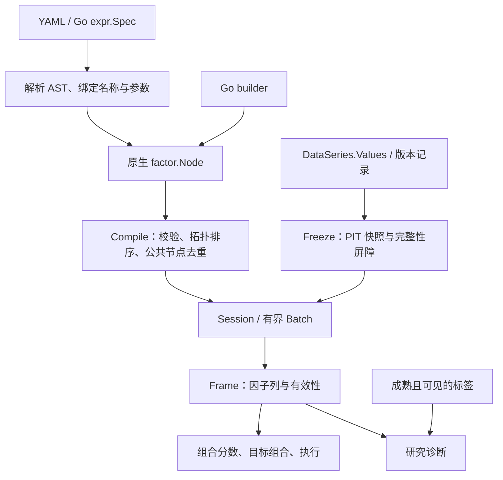

# 因子表达式核心架构原理

> 2026-10-04 校订：本文保留历史设计和测试口径。当前使用见[多因子指南](../bandoc/zh-CN/guide/factor.md)，逐包实施/暂缓与本次实际验证见[重构记录](strategy_engine_refactor.md)。缺失实施文档的链接已修复，历史结果不据此重新验收；真实 venue 与性能承诺仍需独立证据。

Go builder 与因子表达式共享同一个截面、多因子计算内核：`factor.Node → factor.Plan → Session/Batch → Frame`。Go 代码直接构造节点，表达式则在启动时解析并转换为原生节点；执行时不逐 bar 解释字符串。常见因子可以通过公式、参数和命名中间项组合，只有新增原子算法才需要修改 Go。

本篇说明当前实现及其边界。Go builder、表达式配置、测试及回测/实盘接入步骤见[因子构建与使用指南](factor_expression_guide.md)。

## 1. 分层与数据流

各层职责如下：

| 层 | 当前职责 | 主要源码 |
|---|---|---|
| 表达式前端 | 受限语法、名称绑定、参数检查、转换为原生节点 | [parser.go](../factor/expr/parser.go)、[compile.go](../factor/expr/compile.go) |
| 计划内核 | 节点契约、周期校验、拓扑顺序、内容哈希、预热与保留长度 | [dag.go](../factor/dag.go)、[pointwise.go](../factor/pointwise.go) |
| 数据与执行 | 冻结版本快照、数值视图、增量状态、批量计算 | [snapshot.go](../factor/snapshot.go)、[value.go](../factor/value.go)、[session.go](../factor/session.go)、[batch.go](../factor/batch.go) |
| 策略装配 | 定义选择、组合、计算共享、研究与回放/实盘驱动 | [decision.go](../factor/runner/decision.go)、[computation.go](../factor/runner/computation.go) |
| 入口 | 统一配置装配、输入和价格依赖、离线编译检查 | [factor_config.go](../entry/factor_config.go)、[factor_expression_commands.go](../entry/factor_expression_commands.go) |

依赖方向是 `expr → factor`，runner/entry 负责装配。表达式本身不查询数据库、不访问交易账户、不提交订单，也不执行任意 Go 或脚本。

## 2. 从表达式到可复用计划

`expr.Spec` 包含 schema 版本、决策周期、数据源绑定、数值参数、`lets`、`outputs` 和组合配置。绑定别名与数据源名称可以不同；例如 `kline.close` 中的 `kline` 是绑定别名，最终节点保存绑定的真实 source、field 与周期。

解析器使用 Go 标准库 `text/scanner`，按优先级生成包含位置的 AST。`* /` 高于 `+ -`，二元运算左结合，支持一元正负号和嵌套函数。名称必须显式属于 `alias.field`、`factor.name` 或 `param.name`；特殊字段名通过 `field("alias", "some-key")` 表达。参数在编译时绑定为有限数值，窗口参数还必须满足整数和范围限制。

`lets` 和 `outputs` 属于同一个定义集合，可以前向引用，不能同名或形成循环。编译器会解析和校验所有声明，包括未使用的中间项；最终只将输出可达的节点交给完整计划。因此，一个未使用但非法的 `let` 仍会报错，一个未使用的合法字段引用不会增加最终订阅。`Plan.Inputs()` 汇总实际可达节点的 source、timeframe、字段和采样要求。

转换阶段直接调用 `factor.Field/AsOfField/Return/StdDev/Rank/Add/Div/...` 等 builder。表达式里的算术具有独立原生 operator 身份，不统一包装成 `Custom` 回调。`expr.Compile` 只返回计算计划；runner 的 `CompileDefinition` 另外解析组合默认值并校验组合列和权重。

### 公共节点去重与 hash

`factor.Compile` 递归访问依赖，检测循环、校验节点并生成依赖在前的拓扑顺序。节点 ID 是规范化 `NodeSpec` 与**有序依赖 ID**的内容哈希，相同 ID 合并为一个节点；多个输出中的相同字段、收益率或其他公共子表达式只保留一份计算节点。计划 hash 包含节点 ID 序列和输出名称到节点的映射，输出名称变化也可能改变完整计划身份。

空白和绑定别名等源码形式不直接进入计划 hash；相同输出映射、算子版本、参数、依赖和采样契约的 Go builder 与表达式可以生成相同 hash。这里只做结构去重，不做代数重写：`x * 0`、`x / x`、交换操作数或重新结合加法都会影响浮点舍入及无效原因，不能按数学恒等式消去。

计划编译会复制节点声明及参数 map，后续修改 builder 不会改变已编译计划。计划可复用，Session 的状态则由具体运行拥有；当前没有跨任务自动持久化的表达式编译缓存或因子结果缓存。

## 3. 任意字段与数值有效性

输入契约始终是 [`orm.DataSeries.Values map[string]any`](../orm/series.go)，默认 K 线和扩展字段都通过这一模型传递。冻结快照对支持的原始值进行克隆和按具体类型哈希，保留字段、类型和 NULL；不引入 typed OHLCV 快速路径，也不把原始 map 改写成浮点列。循环或不支持的值会明确失败。

算子显式读取字段时，`Number` 才产生派生 `Numeric{Value float64, Validity}` 视图：

| 输入情况 | 派生有效性 |
|---|---|
| 不存在字段 | `Missing` |
| 字段值为 `nil` | `Null` |
| 非整数/无符号整数/浮点数类型 | `NotNumeric` |
| NaN 或无穷值 | `NonFinite` |
| 有限数值 | `Valid` |
| 窗口尚未产生有效结果 | 通常为 `Warmup`，具体传播遵循对应算子 |

原始整数类型仍被保留，但转成 float64 的派生视图可能损失大整数精度，不能用它替代 SID 或精确标识。字符串和布尔值不自动转数值。当前 `Null` 的判定是接口值为 `nil`，不要将任意 typed nil 都理解为同一数值状态。

Session 和 Batch 共用 `evaluatePointwise`：多输入按声明顺序传播第一个无效输入；除零、非法对数/平方根、非正值经 `positive` 过滤及计算溢出产生 `NonFinite`。`max(x, epsilon)` 不填补 NULL，也不会改变缺失原因。派生 JSON 对无效数值编码为 `null` 并保留 validity。

窗口算子的缺样本和初始化规则由对应 banta 内核及适配逻辑决定，不能因为 `MissingPolicy` 标记为 `skip-invalid` 就认为所有窗口都按同一种有效样本计数。特别是 Batch 的 EMA 使用有效值压缩视图计算，再恢复原时间位置，以对齐 Session 的初始化规则。

## 4. 时间、快照与状态

### PIT 与完整性屏障

[`Freeze`](../factor/snapshot.go) 按 `(SID, source, timeframe)` 选择当时可见的最新事件及修订。`EventTime <= GridTime`、`AvailableAt <= DecisionTime`，指定 `ReplayTime` 时还要求 `IngestedAt <= ReplayTime`。schema、source version、SID 映射、Universe、复权版本和可见性策略随快照固定；访问器返回独立副本，迟到数据或历史修订需要创建新快照并重新回放。

`GridTime` 是逻辑观察时间，`DecisionTime` 是实际可见性截止时间，两者允许不同。屏障检查每个要求的流是否到达、是否为目标已闭合事件或满足 asof 时效；数据流已到达但字段 NULL 与整个数据流未到达是两种情况。只有 Ready 快照可以执行。

同周期默认字段使用 source-events，要求当前网格的已闭合事件。不同周期源必须显式绑定 `asof`/`asof-latest` 和正 `max_age_ms`，转换为决策周期的 `AsOfField`。asof 读取网格之前、截止时间已可见且未超龄的最新记录；之后的窗口每个决策观察推进一次，重复读取同一个源事件也算一次观察。

### Session 与 Batch

Session 为每个活跃 SID 保存 banta 环境及各节点 Series，通过锁串行推进。活跃集合来自 Reference、Investable，以及默认情况下的 Tracked；runner 可使用 `TrackedQuotesOnly` 将账户持仓报价监控与因子数据就绪分开。保留在活跃集合中的资产延续状态，离开集合的资产状态被删除，重新进入时重新预热；Universe 内容变化需要新版本，SID 对应资产不能悄悄变化。

重复求值同一个已发布快照返回最新 Frame 的副本，不重复推进节点。时间倒退、同网格冲突、源/schema 上下文变化都会被拒绝，应创建新 Session 回放。`Warmup` 可以用固定的可见性截止时间推进多个历史网格，但不发布 Frame，也不能在已发布后继续预热。

编译时按依赖推导预热：lag/return 增加 period，EMA/std 增加 period−1。计划采用所有节点的最大保留长度；Session 会裁剪注册 Series 的数组，同时保留递归内核状态。因此连续运行不会保存全部原始历史，但不是每个节点都采用最小独立保留长度，预热估计也不保证缺样本时必然有效。

Batch 必须给出显式 `maxRows`，从已知起点计算一段完整历史，静态池使用 tav 时序内核和同一截面/逐点实现。它按消费者计数释放不再需要的中间列，返回的历史 Frames 仍由调用者持有。动态 Universe 会回退到同一新 Session 连续回放。跨块延续 EMA 等状态应复用 Session，不能对每块重新调用 Batch 并期待与整段结果一致。

实盘通过 [`RoundBarrier`](../factor/barrier.go) 处理 generation、冻结、取消及发布。候选计算 fork 有界 Session 状态，只有当前有效回合才能 commit；克隆失败、过期或取消不得推进 live owner。新增递归状态必须满足安全克隆契约。

## 5. 截面、组合与研究隔离

截面算子在当前快照的 Reference 资产池中选取有效样本拟合统计量，再对活跃目标资产应用结果；Investable、Tradable、Evaluation 等资产集合分别承担可投资、可交易和研究角色，不应混为一个池。实现见 [operators.go](../factor/operators.go)。`cs.rank` 使用 0 起始平均名次；`group.residual(y,x)` 是单解释变量截面回归残差，其名称不表示已支持任意分类分组表达式。

Frame 保存时间、SnapshotID、PlanHash 及命名因子列。runner 在 Frame 之后调用 [`research.Combine`](../factor/research/combine.go)，支持 equal、fixed 和 history-ic；默认 equal 且选择全部输出，显式 columns 可选子集。非零权重输入无效时组合分数无效，不按资产重分配权重。固定权重按给定值求和，不自动归一化；history-ic 使用成熟且当时可见的历史 IC，缺少可用非零历史时等权回退。

表达式和原生推断计划均拒绝 label 依赖。未来收益只进入有界 [`LabelQueue`](../factor/research/labels.go) 和 [`research.Evaluate`](../factor/research/diagnostics.go)，标签在成熟和可见后才用于研究或历史 IC。固定/等权纯交易回放可以关闭研究队列；研究模式及 history-ic 仍需要标签。标签隔离保证推断数据流的边界，研究者仍需自行设计训练、验证、测试区间以及跨边界标签处理，不能将隔离机制视为自动完成时间外验证。

[`Manifest`](../factor/research/manifest.go) 区分因子计划 hash、策略定义 hash 和完整运行 ID。策略定义身份包括代码版本、计划、组合、组合构建参数、标签及成本；完整运行身份还覆盖执行模式、延迟假设、Universe 与快照 lineage。它记录当前可复现运行的输入，不等于已有版本化用户因子目录或算子 lock 文件系统。

## 6. 共享边界与入口边界

一个 Plan 内的多输出通过内容哈希共享公共节点。多个消费者只有完整 `computationKey` 一致时才通过显式 [`ComputationGroup`](../factor/runner/computation.go) 共享 Session；key 包含完整 Plan hash、输入身份或归档内容摘要、数据/时钟/采样上下文、快照上下文、决策间隔与延迟。同快照的多个消费者拿到 Frame 副本，各自持有组合、研究、预算、目标和账户状态。最后一个借用者退出后释放共享槽位。

不同计划即使有部分相同子图，也不会自动共享状态。需要共享大量候选的公共子表达式，应把兼容的候选编入同一个多输出 Plan。完整计算共享不等于跨计划全局缓存，也不等于共享交易账户。

表达式入口不能同时提供显式 Plan 或非空 definition；既有 Go 入口在传入 Plan 时优先使用该计划。统一入口负责把 `expressions` 转为 `expr.Spec`，补齐未填写的表达式周期并验证它与 `run_timeframes`/决策间隔一致。外层参数会进入 Go definition 的 Manifest.Parameters，表达式参数则单独控制公式；两种方式都使用外层持仓配置。成交价格通过独立 PriceStream 依赖获取：归档缺少可识别行情流时必须明确指定价格，不能把因子输入的资金费率等字段推断为成交价格。

`factor validate` 与 `factor explain` 当前执行相同的严格独立 YAML 编译检查，输出 hash、周期、输出列、节点数、预热、保留长度、实际 inputs 和组合，不加载行情或账户。它们不验证真实数据字段存在或预测策略收益；完整入口预检负责实际数据依赖。

## 7. 资源限制、扩展与性能取舍

表达式编译有明确静态边界，见 [parser.go](../factor/expr/parser.go)：单式最多 16 KiB，总表达式文本 256 KiB，所有声明的 AST 总计最多 8192 节点，深度上限 64；lets+outputs、bindings、params 各组最多 512 项，窗口最大 10000。深度还检查展开后的引用 DAG。独立 CLI spec 文件最大 1 MiB，仅接受一个 YAML 文档并拒绝未知字段。这些是语法和结构上限，不是峰值内存 admission 或全链路吞吐保证。

当前语言没有比较、条件、循环、模块导入、任意代码调用、分类分组表达式，也拒绝对含 CS/GROUP 结果的输入再做非零 TS 窗口。Go builder 的能力范围与表达式白名单不同。执行侧另有 Batch 行数、标签队列行/列和 IC 历史窗口限制；大量输出还会增加 Frame map、标签副本和研究列间两两相关的成本，不能只看解析节点数估算资源。

新增普通公式直接组合已有函数。新增原子算子时，应依次完成：

1. 在 builder/NodeSpec 中定义名称、不可变版本、参数、周期、有效性、预热、保留长度及后端能力，并补编译校验。
2. 增加 Session 与 Batch 实现；逐点逻辑优先放在共用 evaluator，状态逻辑同时验证初始化、缺样本、生命周期和安全克隆。
3. 在表达式前端白名单、参数检查和转换中开放函数，补指南；目前没有自动算子目录注册机制。
4. 用独立手算样本验证数值和 validity，再验证 Go/表达式 hash 与结果、Session/Batch、回放/实盘一致性，并记录性能。

可信 Go 代码还可以使用 `Custom(version, inputs, evaluate)`，但它是显式依赖的纯逐点函数。闭包不得暗中持有可变计算状态或读取外部数据；hash 不包含闭包代码，调用者必须为不同实现提供不同版本。同版本且相同依赖的不同闭包可能错误去重，编译器不会自动识别该冲突。

原生表达式消除了重复策略代码和运行时解析，但不保证比融合的 Go `Custom` 更快。多个原生算术节点会增加中间 map、Series 及分配；公共子图去重也只有在实际重复时收益明显。已有 [banstrats 对比报告](../../banstrats/examples/crosssection/BENCHMARK_expressions.md) 在 100 资产×256 根日线、单线程的三次中位数中，表达式编译约为原 Go 的 2.7–3.4 倍；多因子 Session/Batch 分别快 3.8%/13.8%，趋势慢 15.1%/18.8%，成交量动量慢 7.9%/12.3%。这些是整段数值执行数据，不代表单 bar 或完整交易回测，应随改动重测。

架构契约的可运行核对入口包括 [表达式编译测试](../factor/expr/compile_test.go)、[逐点测试](../factor/pointwise_test.go)、[runner 表达式测试](../factor/runner/expressions_test.go) 和 [入口测试](../entry/factor_expressions_test.go)。编写新因子及复现测试见[使用指南](factor_expression_guide.md)。
