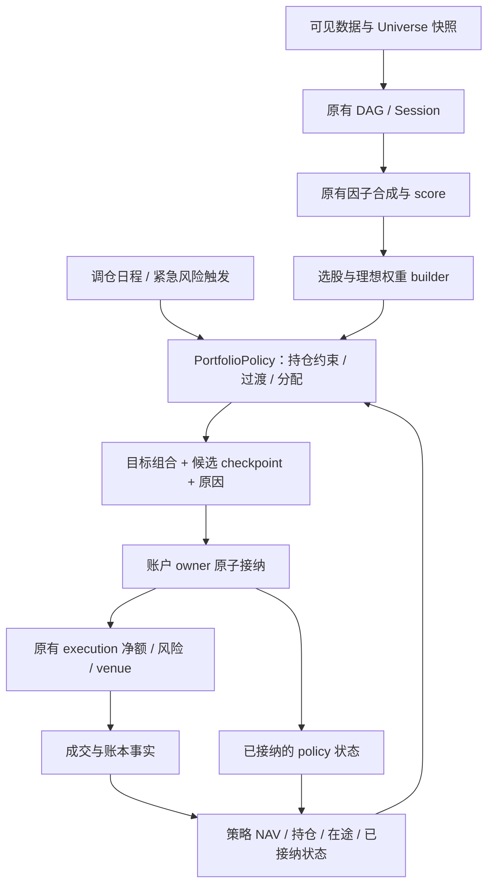

# 截面与多因子框架：持仓生命周期及经典能力扩展方案

日期：2026-10-06。状态：已按阶段实施。当前实现、源码与测试对应关系见 [实施记录](factor_opt_implementation.md)，配置入口见 [用户指南](../bandoc/zh-CN/guide/factor.md)，研究扩展见 [Go 接口说明](factor_research_extensions.md)。

本文保留设计时的基线分析及扩展边界。第 4 节的“当前事实”、示意 API 和分阶段措辞描述实施前状态；判断本版本能力以实施记录、用户指南和源码为准。

本方案依据 [参考框架调研](../tmp/quant-framework-research-2026-10-01.md)、[截面架构](factors.md)、[双引擎架构](better_arch.md)、[逐包实施记录](strategy_engine_refactor.md)、[当前用户指南](../bandoc/zh-CN/guide/factor.md)及本地源码。Banbot 源码基线为 `1dda0d5642c3240db719ecf5163b050477b0ea98`。外部七个框架沿用原报告的固定 revision，并重新抽查关键实现；DeepWiki 仅用于公开参考框架的定位，未查询 banbot/banexg/banta。没有安装、运行外部框架，也没有跨框架性能结论。

## 1. 结论与设计目标

现有框架已经具备因子 DAG、截面变换、多因子合成、成熟标签、目标权重、动态策略净值和共享账户执行。此次应补充的是**有状态的组合决策能力**，而不是另建资金账户或在交易所适配器里加入选币规则。

用户要求框架支持多种规则并保留足够自由度。因此建议：

1. 将**计算周期、调仓日程、选股规则、持仓期限、过渡方式、资金配置**分开。用户可以只配置需要的部分。
2. 提供直接调仓、落选渐退、重叠批次等常见预设；预设共用一个组合策略契约，自定义 Go 策略可以替换完整组合策略，或复用预设中的纯函数阶段。
3. 保留现有 `PortfolioBuilder` 和未配置新选项时的行为；有状态策略按 run/strategy 创建实例，不能把状态藏进全局注册函数闭包。
4. 每次按最新的**策略 NAV**分配新增资金；严格数量退出和权重退出分别表达，避免净值增长时意外买回正在退出的订单。
5. 组合状态与执行计划接纳原子提交；计算结果、计划接纳和实际成交分开记录。恢复依赖现有账户 owner 与 execution 账本。
6. 先实现多种持仓规则与可靠执行，再补多期限研究、稳健处理、风险组合和实验管理。复杂优化器不作为基本换仓功能的前置条件。

16 小时只是用户提供的候选值，不能写进引擎默认常量，更不能未经样本外验证就认定每个币的最佳周期。

## 2. 两个参数究竟表示什么

### 2.1 当前事实

本地 banbot 和相邻 banstrats 全仓搜索均没有发现 `swapPerBars`、`holdBars` 的定义或引用。因此无法从当前代码确认它们原本属于哪段策略、具有何种既定语义；也不能把它们宣称为框架现有参数。

建议将这两个名字理解为需求入口，而不直接在引擎中实现含糊的同名开关：

| 用户用语 | 推荐正式概念 | 需要说明的边界 |
| --- | --- | --- |
| `swapPerBars` | `rebalance.every_bars`：每多少个基础决策 bar 产生普通调仓目标 | 是间隔，不是减仓比例，也不是每次替换多少币 |
| `holdBars`：满期前尽量保留 | `holding.min_bars`：最短普通持仓期 | 到期获得普通退出资格，排名仍好可以继续持有 |
| `holdBars`：固定到期 | `holding.max_bars`：最长持仓期 | 到期触发退出，仍入选也不能无限续期 |
| `holdBars`：每批固定持有 | `transition.period_bars`，配合 `mode: cohort` | 是批次寿命，可与最短持仓约束分别配置 |
| 每次减 `1/8` | `transition.exit_steps: 8`，配合线性退出 | 必须声明按原始权重还是原始数量减；不能由 `holdBars` 唯一决定 |

新框架配置使用 snake_case。只有确认某个已有用户策略确实使用这两个 camelCase 参数时，才在该策略的配置适配层映射，并记录到 `resolved.json`；不在全局同时维护一套猜测出来的别名。

### 2.2 三种经常混淆的机制

**A. 每批固定持有 16 小时，每 2 小时轮换一批。**

设基础 bar 为 1h，调仓间隔 `S=2`，批次周期 `H=16`，共有 `N=H/S=8` 个等预算批次。每次到期批次释放自己的仓位，按最新排名创建新批次。某币连续落选会随着旧批次到期逐步消失；连续入选可以占据多个批次。这是 cohort/分批建仓，不要求任何一次排名落选后整币立即清仓。

批次可能持有不同资产集合。只有某币原本占据八个等额批次且不再进入新批次时，才呈现 `1 → 7/8 → … → 0`；一般持仓路径不能简化为所有币都每次减 `1/8`。

**B. 新币分配完整目标份额，满 16 小时且排名落选后分八次退出。**

这是聊天举例最直接对应的规则：`holding.min_bars=16`、`transition.mode=linear-exit`、`exit_steps=8`。调仓间隔独立配置，例如每 2 小时一次。满期后依然入选则继续持仓；落选才进入退出阶段。它与 A 的建仓过程、退出条件和实际持仓长度不同。

以退出开始时的原始份额为基准，每个合格退出轮次执行：

`r(j) = max(0, 1 - j / N)`，`j=1…N`。

这是线性减法。`r(j)=(7/8)^j` 是按剩余份额比例退出，八次后仍剩约 34.4%，需要独立的 geometric 模式及最终清仓阈值。

若首次减仓恰在入场后第 16h、之后每 2h 一次，则八次目标分别在第 16、18、20、22、24、26、28、30h 产生，成交还受执行延迟影响。不能把这种规则称为“所有订单最多持有 16h”。

**C. 每次向新目标只移动一部分。**

`w_next = w_prev + α × (w_desired - w_prev)` 是目标平滑/部分再平衡。`α=1/8` 同时限制增仓和减仓，通常渐近而不在第八次归零。这也是有价值的可选模式，但不等同于 B。

“比例是持仓时间的倒数”只有把时间先转换成**无量纲的轮换次数**才成立。在 A 中 `N=H/S`，每批预算占 `1/N=S/H`。对 B 则应显式指定 `N`；持仓资格和退出持续时间可以不同。第一版不静默推导二者；提供 cohort 预设时可根据整除关系自动计算批次数，并在 resolved 输出中展示。

## 3. 七个参考框架如何处理这些问题

以下“未见内置支持”只表示本次检查的核心路径未提供对应能力，不是对整个仓库所有用户扩展的不存在证明。来源见第 12 节。

| 框架 | 调仓/持仓相关机制 | 换仓与资金配置 | 对本需求的适用判断 |
| --- | --- | --- | --- |
| Qlib | Executor 的交易步长与策略调用；`TopkDropoutStrategy` 的 `hold_thresh` 限制普通卖出前的持仓 bar 数 | `topk`、`n_drop` 按排名替换若干标的；新买入按 `available cash × risk_degree / buy_count` | 借鉴最短持仓及 dropout；`n_drop=8` 不是每个订单减 `1/8`；按剩余现金分配也不等同每轮完整 NAV 再平衡 |
| Hikyuu | Portfolio 的 `adjust_cycle/adjust_mode` 调仓周期/日期模式；`ic_n/ic_rolling_n` 属于 IC 研究口径，未找到统一 hold_cycle | Selector 与 AllocateFunds 分离；按 `total_funds × weight` 分配，`adjust_running_sys` 可主动调整已有系统 | 借鉴选股、分配和组合调度分层；不能把因子 IC 的收益周期直接当订单持仓期 |
| VeighNa Alpha | 示例 `EquityDemoStrategy` 每个 `on_bars` 调仓；`top_k/n_drop/min_days` 控制持仓数量、替换数量与最短天数 | 根据 signal 排名选取；新买入按 `available_cash × cash_ratio / buy_count`；卖出 `set_target(..., 0)` | 具体股票策略可参考，但参数不是所有 Alpha 策略自动具备的能力；替换是全平，不是比例退出，也不是每轮全组合 NAV 等权再平衡 |
| WonderTrader SEL | 重算计划/定时调度，SEL 与 CTA/HFT 分开；策略设置目标仓位 | 执行单元消费目标数量并处理拆单、撤单等 | 借鉴计算、计划和执行分离；NAV 权重、持仓寿命与渐退属于组合层 |
| FinRL-X | rotation 配置中 `rebalance_frequency: weekly`，walk-forward 决策日程 | `generate_weights` 与权重产物；交易转换使用 `portfolio_value × weight - current_value`；执行器还提供换手限额缩放 | 当前 NAV 比例和组合流水线值得借鉴；本次抽查未见通用持仓年龄/cohort/落选线性退出 |
| QuantDinger | `FactorResearchEngine.run(holding_period)` 同时控制 `research_index[::holding_period]` 和未来收益期限 | 分组等权研究、成员变化换手和成本；该研究模块不是订单生命周期引擎 | 可参考研究 UI/报告；持仓期与研究采样耦合应在 Banbot 中拆开；不能照搬成实盘 holdBars |
| Vibe-Trading | `rebalance_mask` 日历调仓；`position_adjustment=hold|rebalance` 控制同方向 resizing | backtest 按可观察执行时点 equity 换算目标名义额；Alpha Zoo 输出合成分数或方向信号 | `hold` 不是持有 N bars；`holding_bars` 是成交统计。可借鉴日程、执行证据和注册血缘；退出曲线需组合策略提供 |

没有证据表明七个框架提供一套同名、同义的 `swapPerBars`/`holdBars`。可复用的是分层和机制，不是照搬参数名。

需要纠正/保留的证据边界：

- QuantDinger 此 revision 的 `ic` 是因子 rank 与收益 rank 的相关系数，实际为 RankIC；研究路径按未来收益是否可用筛样本，不能复制到当期选币池。
- Vibe 的 `position_adjustment=hold` 忽略同方向调整，不应被理解成严格固定期限或线性退出。
- FinRL-X 源码有换手检查与订单数量缩放；DeepWiki 对该细节的遗漏不应导致结论“没有换手限制”。这也说明只查 Wiki 不足以判断能力。
- 各框架在证券池、停牌、交易日、资金费率及执行时点方面的假设不同，不能直接把日频股票参数换成小时币圈参数而不检查时钟和成本。

## 4. 当前 Banbot 的能力与缺口

以代码为准，历史设计文档中尚未落地的目标不计为现有支持。

| 维度 | 当前事实与源码位置 | 本次需要补充的部分 |
| --- | --- | --- |
| 因子计算 | `factor.Plan/Session/Batch`；原生图与表达式共享计算 | 继续复用，不增加第二套因子解释器 |
| 截面处理 | [operators.go](../factor/operators.go)：rank/zscore/quantile/分位 winsorize、按原始分组字段 demean/zscore、单解释变量 OLS residual | MAD、稳健缩放、多暴露 OLS/WLS 和表达式层分组能力；不是从零补“中性化” |
| 因子组合 | [combine.go](../factor/research/combine.go)：equal/fixed/history-ic；历史 IC 只使用成熟可见样本 | RankIC/ICIR 权重、指数衰减、方向/稳定性规则和更完整训练接口 |
| 调度 | [runner.go](../factor/runner/runner.go)：`DecisionInterval` 驱动计算和当前组合决策；[live.go](../factor/runner/live.go) 有 barrier/代际 | 增加独立调仓日程，不通过放大决策周期跳过 Session 输入 |
| 组合构建 | [definition.go](../factor/runner/definition.go) 注册无状态 builder；[portfolio.go](../factor/portfolio.go) 默认 top/bottom K | 当前 builder 没有上次目标/实际持仓/年龄/恢复状态，需要有状态策略接口 |
| 目标语义 | 不可变 `TargetPortfolio`，冻结策略 NAV，Full/Patch 和 content hash | 保留权重合同，新增版本化 allocation 目标用于严格数量退出；所有新路径消费端共同支持 |
| 资金利用 | [runner.go](../factor/runner/runner.go) 每轮从 BudgetSource 取 NAV；[account_sink.go](../factor/runner/account_sink.go) 从策略账和未实现盈亏估值 | 主要是确认/报告口径，不重建“复利钱包”；新增资金配置预设 |
| 研究期限 | `LabelSpec`/`LabelQueue` 能描述多个标签；[validate.go](../factor/runner/validate.go) 当前运行驱动只接受一个 executable-return horizon | 多 horizon 的价格捕获、成熟队列、归档/存储入口与资源预算全部贯通 |
| 诊断 | [diagnostics.go](../factor/research/diagnostics.go)：Pearson IC、RankIC、ICIR、覆盖、分组收益、因子相关、暴露相关、换手和费用 | 生命周期/成本后持仓期限曲线、分组研究、稳健显著性、归因与实验比较 |
| 执行 | [rebalance.go](../execution/rebalance.go)、[strategy_rebalance.go](../execution/strategy_rebalance.go)：策略归属、在途差额、减仓优先、保证金/gross 风险边界 | 不把持仓策略塞入 execution；补状态接纳通路和实际成交反馈 |
| 恢复 | [intent_store.go](../execution/intent_store.go) 的 `StrategyCheckpoint` 支持 JSON payload 与计划原子接纳 | runner 的 pending/前目标/研究历史等目前为 run 内存；组合 policy 需要单独恢复合同 |

两个现有细节需要特别保留：

1. `TopBottomKNotional` 即使 short_notional 为 0，当前仍要求至少 `2*K` 个有效分数并生成两尾。新 selector 应支持 long-only/short-only、两侧独立 K 和分位选择；不要顺手改变旧 builder 的历史结果。
2. Patch 在 account sink 中保留被省略资产的**绝对目标**，不会按新 NAV 自动调整它们。要求全组合按新 NAV 再平衡时，应生成包含保留、退出和新增资产的 Full 完整目标；不能靠 Patch 表示“一部分资金换仓”。

## 5. 架构：组合策略共用一个有状态边界



### 5.1 保留两个稳定扩展入口

- 原有 `RegisterPortfolioBuilder`：从因子分数产生理想候选/权重，继续支持用户自定义选股及分配。显式 builder 总是优先；启用 lifecycle 且未显式选择 builder 时才使用新版两侧 selector；省略 lifecycle 时仍用旧默认 builder。
- 新增 `RegisterPortfolioPolicy(name, factory)`：工厂为每个策略 run 创建组合状态策略。内置预设和用户 Go 实现使用同一接口；注册表不持有实例状态。

配置维度分开，不意味着每个选项都要变成公开接口。内置 selector、日程、期限检查、退出曲线和资金分配先用清晰的纯函数组合；用户可复用导出的稳定 helper，也可自行实现完整 policy。只有出现实际独立替换需求时再增加细粒度注册接口。

建议代码示意（均为新增设计）：

```go
type PortfolioPolicy interface {
    Propose(PortfolioContext, json.RawMessage) (PortfolioProposal, error)
}

type PortfolioPolicyFactory func(PortfolioPolicyConfig) (PortfolioPolicy, error)

type PortfolioProposal struct {
    Target    *factor.PortfolioTarget // 新增版本化 allocation 合同；nil 不提交交易目标
    NextState json.RawMessage        // 版本化、有限大小的候选状态
    Reasons   []factor.Diagnostic
}
```

`PortfolioContext` 包含冻结的 Frame、Universe、理想目标、逻辑网格时间、实际决策完成时间、策略 NAV/资本上限、该策略已接纳目标、实际与在途持仓、成交年龄证据及策略状态版本。上下文为拥有副本的只读数据；不传可写账户、SQL 句柄或未来标签。纯 research 若要模拟持仓规则，必须显式装配模拟持仓证据，不能伪造实际成交时间。

Propose 不提交订单、不写 checkpoint，不修改已接纳状态。输入相同证据和状态，输出应确定；自定义随机选择必须提供 seed 并写入 manifest。runner 在提交/接纳成功后才切换状态。无交易但需要更新生命周期的轮次，由同一 owner 提供本地状态事务，不假下一个零数量订单。

`PortfolioTarget` 是为新 policy 增加的不可变 allocation 合同；原 `TargetPortfolio` 和 builder 签名保留，通过纯权重适配器接入。没有启用 policy 时继续走旧目标路径，避免在一个无错误返回值的旧 getter 中混入数量语义。第 7.3 节规定新合同及消费端能力校验。

### 5.2 状态只归该策略所有

可共享的是因子计算，不能共享不同 strategy 的 policy 状态。状态身份至少包括 account、strategy、policy 版本、配置 hash、稳定 SID 映射版本和 state schema。Universe 成员版本是每轮证据，不是持久状态主键；普通入池/退池不丢弃生命周期，只有 SID 重映射或不兼容 metadata 才需要迁移。

基本状态包括：已接纳逻辑轮次及 sequence、每个资产/方向的首次有效成交时间、当前生命周期、退出锚点、已接纳退出步数、最后目标、对应 ledger cursor。cohort 模式另保存批次 ID、创建/到期时间、所属资产和批次贡献。状态规模限定为活跃生命周期与有界审计窗口；已关闭且成交结算完成后归档。

当前 account sink 使用每 SID 一个 `factor:<sid>` virtual lot。第一版可在 policy 内保存 cohort 贡献、执行时聚合为每 SID 净目标；这不会自动获得逐 cohort 的执行 lot/PnL 归因。需要严格批次成交年龄和收益归因时，再传入稳定 batch lot 身份，复用现有 VirtualLot，不能另外维护真实账户余额。

cohort 状态明确区分计划入场数量、在途数量和已成交贡献。默认 `entry-nav` 的旧批次只携带已成交数量，剩余入场需求在该批入场窗口结束后取消并对账，不无限追补过去没买够的批次；入场窗口默认一个调仓间隔。聚合 lot 的新增成交按当时已接纳、仍有效批次的未成交需求比例分摊，减少成交优先归属于本次到期/退出贡献，再按到期时间与稳定 batch ID 分摊风险减仓；所有分摊可由 ledger cursor 重放。

例：seed-all 八批各计划 1，实际只成交 4，按比例每批贡献 0.5；无新批次入场时，最早批次到期后的保留数量为 3.5，而不是计划数量 7。若还有过期批次增仓在途，先取消/对账；未知状态保留退出义务，迟到成交归原批次并形成退出目标，不归给新批次。`current-nav` 可以显式重估并补足活跃批次，这是用户选择的再平衡行为。严格逐批成交期限与收益归因属于 batch lot 扩展，默认聚合模式不作该承诺。

同币同方向的到期批次与新批次可以在同次接纳中内部转移已成交贡献，转移量不超过旧批可释放贡献与新批需求中的较小值；差额才形成外部目标变化。转移写入 policy checkpoint，保持数量守恒，不伪造 ledger 成交/费用。新批时间使用新计划批次窗口，资产首次真实成交时间不因此重置。例如八批各已成交1，到期1而新批需1，内部转移后仍为八批各1，净持仓8；即使没有外部 fill，新批也有明确持仓贡献。

## 6. 用户配置：默认简单，组合与扩展自由

下面配置已实现，作为已有市场配置的覆盖片段使用。沿用 `run_policy[]` 顶层 `portfolio` 等字段，入口仍是普通 backtest/trade。因子公式、市场、账户和数据设置沿用现有配置。

### 6.1 聊天规则：满期、落选、分八次退出

```yaml
run_policy:
  - name: momentum-vol
    id: rotation
    engine: factor
    run_timeframes: [1h]          # 计算/基础时钟；每小时继续推进因子图
    params: {window: 24, k: 10}
    portfolio:
      long_notional: 1.0
      short_notional: 0.0
      policy: lifecycle-v1
      rebalance: {every_bars: 2}
      holding: {min_bars: 16}
      transition: {mode: linear-exit, exit_steps: 8, basis: quantity}
```

不配置新字段时继续使用旧 builder。启用 `lifecycle-v1` 后默认 selection 使用新两侧独立的 TopK selector，新增资金按当前策略 NAV，普通落选触发退出。`k=10` 是理想入选集合大小；退出尾仓可能使实际持币数暂时超过 10，资金总额仍受 side budget 和账户风险限制。

规范化默认：lifecycle 的 rebalance 为每个基础 bar、holding 无最短/最长限制、transition 为 direct、allocation 为当前 NAV 等权且 reserve_ratio=0；显式原 builder 覆盖默认 selector。linear-exit 必须显式 exit_steps 与 basis；cohort 必须显式 period_bars，默认 startup=gradual、sizing=entry-nav。启用 lifecycle 自身不会自动产生十六小时或八步规则。

### 6.2 每两小时轮换一批、每批十六小时

```yaml
portfolio:
  policy: lifecycle-v1
  long_notional: 1.0
  short_notional: 0.0
  rebalance: {every_bars: 2}
  transition: {mode: cohort, period_bars: 16, startup: gradual}
```

第一版 cohort 要求周期是间隔的整数倍。`startup: gradual` 首次只建立 `1/8` 预算批次，逐步填满；可选 `seed-all` 用当前可见排名创建八个具有显式不同到期时间的初始批次，立即投入完整预算，manifest 标记它不是历史真实批次。cohort 到期优先于普通最短持仓；二者冲突必须预检拒绝，不能静默选择一条。

### 6.3 最长持仓、排名缓冲、每币覆盖

```yaml
portfolio:
  policy: lifecycle-v1
  long_notional: 1.0
  short_notional: 0.0
  rebalance: {every_bars: 2}
  selection: {long_k: 10, short_k: 0, retain_rank: 15}
  holding:
    min_bars: 16
    max_bars: 48
    by_asset:
      'BTC/USDT:USDT': {min_bars: 24}
      'FAST/USDT:USDT': {min_bars: 4, max_bars: 12}
  transition:
    mode: linear-exit
    exit_steps: 8
    basis: quantity
    on_reselect: restore
    by_asset:
      'FAST/USDT:USDT': {exit_steps: 2}
  allocation: {method: equal, reserve_ratio: 0.02}
```

资产名先由统一 symbol metadata 解析成稳定 SID/身份，策略运行不解析交易所私有格式。覆盖顺序为显式 per-asset 配置 → 当前可见且版本化的规则产物 → 策略默认值。新币/样本不足回退默认。自定义 resolver 可按流动性、波动率、分组、score 等可见输入返回参数；不从历史回测全样本挑最佳周期后直接带入早期决策。

### 6.4 支持范围与校验

| 配置维度 | 首批内置 | 后续预设/自定义入口 |
| --- | --- | --- |
| rebalance | every_bars、稳定 anchor/phase | duration、交易日历/日周月、score 变化触发、Go schedule helper |
| selection | 两侧 TopK、稳定 SID ties、retain_rank 缓冲 | 分位数、分组配额、每轮 dropout 数量、用户 builder |
| holding | min/max bars、按资产覆盖 | duration、最大持仓收益/风险条件、可见参数 resolver |
| transition | direct、linear-exit、cohort | geometric、target-step、年龄/排名联合曲线、Go policy |
| allocation | equal、当前 NAV、现金保留比例 | fixed-notional、score/逆波动、vol-target、用户 builder/policy |
| 退出基准 | quantity、weight，明确选择 | 自定义曲线；必须输出合法目标并遵守 execution 风险合同 |

选择自由度不包括绕过资金、账户归属、PIT、订单幂等或交易所能力校验。用户可定制策略偏好；框架仍统一执行事实与安全不变量。

整数 bar 字段不得截断 float；负数、零间隔、`min > max`、重复资产身份、未知 policy/mode、相互冲突的配置直接报错。`basis` 在 cohort/direct 等不使用该参数的模式下显式配置时应报错，避免“看似生效”。同一规则不能同时声明 bars 和 duration。自定义 policy 名称带版本，参数需 schema 校验并进入策略 hash；不用第二套字符串脚本解释器。

完整自定义可使用 `policy: my-rotation-v2` 与 `policy_params: {...}`，factory 注册自己的参数 schema；内置生命周期字段不再被强制套用到该策略。自定义 builder 产生理想目标，自定义 policy 决定何时及如何形成最终目标。自定义实现仍遵守有界状态、只读证据、确定性和原子接纳合同。

## 7. 交易语义与边界情况

### 7.1 调度、年龄与成交

普通计算每个基础决策网格继续执行；调仓门在组合层判断。网格锚点不能使用 archive chunk 起点，否则切块/重启会改变换仓轮次。24/7 固定时长 bars 由绝对网格与 timeframe 计算；有交易日历的品种使用显式 calendar/version，不能直接把周末当股票交易 bar。

硬风险、max_bars 和 cohort 到期检查不受普通 every_bars 调仓门阻挡，在第一个到期后的可决策网格产生相应目标；报告网格离散与执行延迟。需要比基础 bar 更精细的退出时点时，使用显式执行事件/更细监控时钟，不能把网格精度之外的时点保证藏在 max_bars 中。

最短持仓年龄默认从**首次该生命周期的有效成交**开始，不从提交订单开始；加仓默认不重置老仓年龄。cohort 则从约定的计划批次窗口计到期，实际未成交仍不会凭空形成持仓。可选 fill-based 批次期限必须按批次保存成交事实。决策时间、成交时间、批次时间和标签期限均单独保存。

重复轮次不得重复减仓。缺失数据时不增加普通落选/退出步数；年龄可按时钟继续经过，但延期、最长持仓和紧急退出通过单独原因处理。恢复默认只在下一可见轮次执行一步，不追发停机期间的历史订单；cohort 已到期批次在恢复时一次形成当前应有净目标，不逐批回放旧买卖。用户可选择基于 elapsed time 的退出曲线，但必须显式配置并可审计。

### 7.2 排名重入、反手和强制退出

普通规则的处理顺序为：硬风险/外部强制 → 明确的最大期限/批次到期 → 最短持仓保护 → 排名缓冲/退出触发 → 退出曲线 → 分配剩余预算 → 目标约束校验。

- 普通落选：最短持仓未到先保留；到期后根据 transition 处理。
- 排名重入：默认 restore，停止渐退，将其重新列入理想候选，按可用预算补回；保留首次成交年龄。可配置 resume（不补，只停止退出）、finish（继续原退出）、new-cohort（下一批参与）。名称与行为写入报告。
- 生命周期归零后再入场：建立新的入场年龄和锚点，不能继承上轮退出次数。仍有未完成退出/未知在途状态时不当作新生命周期。
- 反向信号：默认先退出原方向，确认执行事实后建立相反方向；用户可选执行账户支持的直接净额反手，但必须明确新生命周期。退出阶梯不能穿过零变成新开仓。
- 硬止损、下架/不可投资、强制降杠杆：允许绕过普通最短持仓及渐退，明确原因；没有可执行价格/不可交易时保留未完成退出义务和冻结的目标，不虚报成交或把资产从 tracked 删除。
- 到达最长持仓仍在前列：`max_bars` 触发显式零目标，绕过普通退出曲线；默认当轮不立即新开同资产同方向以规避 max_bars，可配置 cooldown/下一批再入。这里限制的是最晚退出目标时点，无法保证停牌/成交受阻时实际仓位同时归零。想“满期后开始渐退”使用 min_bars 或自定义触发条件，不重载 max_bars。
- 同分、全常数、有效分数不足：明确 skip/缩小池/持现金规则。默认复用已有保守 skip 语义，不能把缺失 score 当排名末尾。

### 7.3 线性权重与严格数量退出

`basis: weight`：退出锚点是当时基准权重 `w0`，第 j 步目标为 `w0 × r(j)`，该权重再乘当前冻结 NAV。它适合资本占比衰减，但不保证订单原始数量恰好减少 `1/8`；净值大涨可能形成数量回补。

`basis: quantity`：退出锚点是该策略同方向的已确认持仓数量 `q0`，第 j 步绝对目标为 `q0 × r(j)`，按 instrument 单位向零取整。新增币仍以当前 NAV 分配资金。用户要求“订单也减 1/8”应使用此模式。

开始数量退出前先取消/对账该资产残留增仓意图；取消状态不明则暂停形成退出锚点。退出中不再补回该方向；若其他风险动作已减到更低数量，后续阶梯只能继续减，不能按旧锚点买回。部分成交时以已接纳绝对目标和 execution 的实际/在途差额继续收敛，不把未成交部分当作已释放现金。

当前 `TargetPortfolio` 只有权重，account sink 会以执行价格重新换算数量。因此**单靠 builder 把数量除以决策时价格转换成权重，不能实现严格数量退出**。建议新增不可变 `PortfolioTarget`，统一包含类型明确的 NAV-fraction/absolute-quantity allocation，作为新 policy 的最终目标合同：

- 每个 SID 只能有一种执行基准：NAV fraction 或 signed absolute quantity。原 `TargetPortfolio.Targets()` 保持返回 map 的旧签名和纯权重语义；新 `PortfolioTarget.Allocations()` 为执行事实入口，不提供会丢失数量的同名 getter。需要兼容纯权重组件时使用显式 `AsWeightPortfolio() (..., error)`，混合/数量目标转换失败；不会把数量转成权重后偷偷送进旧 sink。
- 数量使用标准资产单位的精确十进制序列化，不能把账户币值、合约张数与基础币数量混在一起；sink 通过统一 instrument metadata 转 `SignedSteps`。
- 新合同复用原 `PortfolioSpec` 的身份、预算及 Full/Patch 语义，提供自己的 clone/content hash 与 `EffectiveAllocations`。持久化、输出、预算预估、weights book、paper/live sink 必须共同理解它；新目标版本/能力校验拒绝不支持的消费端。计算/报告可生成估值权重，但不以它替代数量事实。纯权重旧对象和旧产物继续可读，新 allocation 产物显式版本化，不修改旧 content hash。
- 底层 [ExecutableTarget](../execution/coordinator.go) 已是 `SignedSteps`，不需要改造账户持仓模型或写交易所分支。新增的是 factor 目标到既有 execution 目标之间的通路。
- 配置退出 N 步时，第 N 步提交显式零目标；本例 N=8。dust/最小交易额无法退出时保留残留并报告，不伪造平仓。实际订单可受步长/部分成交影响，不承诺每笔成交严格等量。

### 7.4 预算、复利与尾仓

当前 `FrozenBudget.NAV` 是策略 NAV，不能将同账户多个策略都按全账户 equity 配仓。策略资本初始分配使用 `capital_weight`；日后策略预算读取其资金归属及盈亏，不能用 `stake_rate` 替代。

[AccountSnapshot](../execution/ledger_types.go) 明确 `SyntheticStrategyCash = capital + virtual realized PnL - fee + funding`；account sink 再加该策略未实现盈亏形成 NAV。报表中的费用/funding 字段不应再加减一次。NAV 不是自由现金/可用保证金；新订单仍经过实际流动资金、挂单占用与账户风险校验。

例：策略 NAV 从 10,000 增为 12,000，侧预算为 NAV 的 100%、等权目标为 10 个，则完整份额从 1,000 变为 1,200。若存在退出中的旧币尾仓，应先占用侧预算，再将剩余预算给当前候选；不能把尾仓与新 TopK 各自归一化到 100%。

默认先保留受保护与退出中的占用，选中资产向理想目标补足，用现金余量按候选比例分配，单资产上限不突破，无法满足时持现金并报告。受保护资产因价格上涨超预算时，风险约束优先，允许缩减并标记原因。quantity 尾仓占用按当前 mark 估值；weight 尾仓占用按 NAV fraction。新增订单 sizing 按最新冻结 NAV，不按旧下单固定金额；资金不足时 execution 延后/拒绝增仓并留存未达目标。

cohort 有两种可配置 sizing：`entry-nav` 在建批时按当前 NAV 分配并保持批次数量；`current-nav` 每次调仓重估所有活跃批次预算。默认 entry-nav，避免“被动持有批次”每轮隐性补仓；同时允许用户选择 current-nav 提高持续复利投入。两者都使用当前 NAV 建新批，报告要展示持现金比例与预算利用率。

## 8. 接纳、恢复及数据边界

现有 `StrategyCheckpoint` 能保存合法 JSON，并与计划接纳同事务写入；`SharedAccount.PrepareStrategiesWithCheckpoint` 已存在，但普通 `SharedAccountBorrow.RebalanceStrategyContext` 未向 factor sink 暴露组合 checkpoint。因此需补一条受 owner 管理的接纳 API，不能让 runner 直接访问 Store 绕过 owner。

接纳流程：

1. 冻结 NAV、持仓/在途证据与已接纳 state version，Propose 返回候选目标和候选状态。
2. sink 在账户串行 owner 内重新检查证据版本，完成数量转换、风险检查、计划 ID 和 state hash 的验证；证据已变化则重新 proposal，不能用陈旧状态硬提交。
3. 执行计划、目标 revision、policy checkpoint 及需要的接纳事件原子持久化。计划身份绑定目标 ID、前置 state version 和候选 state hash；同 ID 的 checkpoint 内容冲突必须报错，不能只比较订单请求后将其当作成功重试。没有交易的状态变化使用同 owner 的本地事务，并同样校验版本。
4. runner 获得明确 accepted receipt 后更新内存状态。发送失败但计划已经接纳时，恢复该已接纳计划继续执行，不回滚成未提案，也不另发一个新 ID。
5. 成交事件更新首次入场等事实。它们由 ledger cursor 幂等派生；不是简单在每轮 Propose 中对“目标非零”设置入场时间。

计划过期、被更新目标替代、barrier 失败、输出失败、代际未提交等都不能提前增加退出步数或创建已接纳批次。目标已接纳但未成交可进入下一合格阶梯，产生更低绝对目标，由 execution 继续收敛；报告退出步数是目标步数、成交进度是另一指标。

启动恢复先对账真实账户/订单，再加载匹配的最新 policy checkpoint，恢复目标 sequence/日程锚点/生命周期，补齐 checkpoint 之后的成交事实，再接收新决策。已有持仓缺生命周期证据时默认拒绝自动采用有年龄规则的策略；用户显式配置 adopt（从接管时开始计龄）或提供可核验历史，不猜测订单年龄。

配置或 policy/schema 升级必须有明确 migration/rebuild 规则，不将旧状态无条件解释成新状态。候选代的状态私有，热切换成功才成为活动状态。纯 weights 使用内存状态并在模拟目标接纳后提交；纯 research 不创建真实执行账本。混合账户策略 checkpoint 各自独立，同一账户批次更新需各策略状态与组合计划一起提交，不能只保存其中一个策略。

原始数据仍通过 `orm.DataSeries.Values map[string]any` 传递，保留扩展列及类型/NULL。policy 不改变数据模型。交易所差异继续归 banexg。新增策略状态优先复用执行事务存储；若后续研究产物写 QuestDB，遵循 WAL 可见性等待和超时保留恢复标记，表替换前验证快照，不用即时空读推断丢失。

## 9. 经典功能差距与优先级

以下不是对每个参考项目都具有全部功能的断言，而是结合已有 Banbot 能力、参考实现和用户需要筛出的路线。

| 能力 | 当前支持/缺口 | 优先级与实现位置 |
| --- | --- | --- |
| 多持仓规则与过渡 | 无年龄/期限/cohort/渐退；已有 builder/目标/执行 | P0：新增组合 policy，复用 runner 和 execution |
| 独立调仓与排名缓冲 | 当前每决策组合一次；无通用 retain/dropout | P0：组合层日程和 selector，计算仍按原时钟 |
| 多 horizon 与持仓期研究 | 底层 label/diagnostic 可容纳，runner 单 horizon | P1：研究驱动成熟队列与多期限可观察价格捕获 |
| 成本后周期与持仓诊断 | 已有换手/简单成本；无生命周期分解 | P1：按资产/分组/批次的统计及实验产物 |
| 合成权重质量 | equal/fixed/历史平均 IC 已有 | P1：RankIC、ICIR、EWMA、最低样本/置信度、显式回退；全部成熟可见 |
| 稳健变换/中性化 | 分位 winsorize、组内处理、单变量 OLS 已有 | P1：MAD、稳健 zscore、多暴露 WLS；读取 PIT 风格/行业数据 |
| 波动率与组合暴露约束 | execution 已有 gross/margin；不是风险模型 | P1/P2：逆波动、vol-target、单资产/分组/net/beta 上限，纯目标层 |
| 换手预算/交易成本与容量 | 简单手续费滑点及执行风险已有 | P1/P2：区分预估目标换手与实际成交，impact/参与率/ADV/资金费率；不复制交易所执行规则 |
| 基准与收益归因 | 因子相关/暴露相关已有；无完整归因 | P2：benchmark 超额、风格/分组、选择/过渡/sizing/执行成本归因 |
| 滚动训练与模型产物 | 图/combiner 扩展已有；无完整 fit/predict 生命周期 | P2：训练窗口/模型版本/可见时点、walk-forward、purge/embargo，与运行推理分离 |
| 风险模型和约束优化 | 未见完整 covariance/优化器流水线 | P2：独立 builder 插件，先对角风险/收缩协方差，后指数增强；不可行状态与约束放松可审计 |
| 实验与因子注册 | manifest/hash/数据版本 lineage 已有 | P1/P2：因子元信息、试验目录、比较报告、trial ledger、样本外/随机基线；复用现有 manifest |
| 大规模研究体验 | Session/Batch、公共子图共享和流式输出已有 | P2：按 profile 补缓存失效、滚动实验和内存预算；不重建一套 DataFrame 内核 |

不优先移植 AI/计费/完整 Web 工作台，不新增依赖来解决上述基本组合逻辑。求解器、ML 依赖若确有需要，在 P2 单独评估；不把其配置暴露给普通 TopK 用户。

### 9.1 “每个币最佳持仓时间”的正确研究方式

横截面 IC 是同一时点多资产的相关性，不能直接按单个币计算一个“截面 IC”就得出该币最佳周期。

应提供两个互补报告：

1. **因子预测期限**：例如 2/4/8/16/24/48h 的成熟未来收益、IC/RankIC、覆盖、分位表现、稳定性和排名自相关。回答信号强度在何时衰减。
2. **交易生命周期期限**：固定排名/选股定义，网格扫描 hold、rebalance、exit 曲线，模拟真实入场/退场，报告成本后收益、回撤、资金费率、换手、资本利用率、持仓年龄和实际退出延迟。回答执行此规则的经济结果。

两者都需要成本后分析；多期限不是只删掉 `validate.go` 的单标签限制。runner 中 evaluation 的 begin/end 价格、deadline、pending 上限、label maturity、history-ic 的指定 label 及 output 要一起按 horizon 改造。用同一份冻结 Frame 派生标签，不为每个期限重复运行全部 DAG。保留有界队列；长期 horizon 带来的未成熟样本量与 unresolved 单独报告。

按币结果稀疏时先按流动性/波动率/生命周期分组并向全局参数收缩，达到最低独立样本和稳定性要求后才输出 per-asset 建议。通过滚动训练窗口选择参数，留出未参与选择的测试窗口；重叠收益使用 block bootstrap/HAC 等适当口径，记录扫描次数与多重选择偏差。研究产物包含训练结束、样本截至、可用时间、算法版本和数据 manifest，实盘 resolver 只能加载当时已可见版本。

history-ic 当前 live 驱动拒绝使用；接入实时成熟标签/历史 warmup 与恢复之前，不宣称新增 IC 模式可直接 live。

### 9.2 风险、换手与目标可执行性

组合层先控制投资偏好，execution 再做不可绕过的账户/市场校验。软约束冲突时输出约束剩余、持现金和未满足目标；硬风险退出不因普通换手预算被拖延。不能在 solver 失败时静默删除换手限制。

组合约束顺序要固定并写入版本：期限/退出 → 初始配置 → 单资产/分组/方向/风险上限 → 换手/成本约束 → 整数数量与可交易性复核。缩放后再次检查，因取整无法满足时给出 infeasible/fallback 状态，不以“正常目标”掩盖差异。

换手口径同时报告 `0.5 × Σ|Δw|`、双边名义额和真实成交额；资金进出、NAV 漂移、同币批次到期再入不应被混在一个数字里。同币旧批到期且新批入选允许 execution 净额相抵，虚拟生命周期仍有到期/新建记录；成本按真实外部成交而不是虚构两笔订单收取。

## 10. 逐阶段实施清单

### P0a：契约、调仓和无状态兼容

- 在 `factor` 增加组合 policy 的输入/提案类型和生命周期纯函数；runner 注册 factory。复用旧 builder 产生理想组合，不改 DAG。
- 定义版本化 `PortfolioTarget` allocation 合同与纯权重 adapter，先贯通 direct 纯权重提案/接纳，使后续数量扩展有稳定入口；原 `TargetPortfolio`/builder 签名保留。
- 扩展 `research.PortfolioDefinition` 的可选规范化 policy 配置，纳入 StrategyHash；补 `CloneManifestSpec/CloneConfig` 嵌套复制。
- 更新 `config/unified.go` 的允许字段与 `entry/factor_config.go` 解码、预检、resolved 输出。未知字段失败，不让 params 误以为框架参数已生效。
- replay/live 共用 policy proposal 逻辑和绝对日程锚点；提供 direct 和日程门。显式原 builder 继续产生理想组合，仅未显式 builder 的 lifecycle 默认使用新 selector。计算共享 key 仍只按计算需求，policy 配置进入策略 identity 而不无谓破坏公共 DAG 共享。
- 验收：不启用新字段时旧目标、hash/输出兼容口径、Full/Patch、资金和性能不退化；新增 long-only selector 独立版本。

### P0b：最短/最长持仓、线性退出与数量目标

- 实现 linear-exit 的 min/max、rank retain、重入、按资产覆盖、weight/quantity 基准。
- 扩展 P0a 的 allocation 合同，贯通 absolute-quantity 的单位校验、`factor/backtest/book.go`、runner 输出/克隆、paper/account sink 和归档格式版本校验；拒绝不支持数量的消费端。
- 增加只读策略持仓/在途/成交证据源；从 ledger 派生首次成交与退出锚点。
- 为 min/linear 尾仓自动合并 tracked、执行 SID、价格及 funding 订阅；复用 `runtime/shared_sources_update.go` 的活跃持仓/挂单保护，并补 factor live 的配置 Universe 与执行 SID 桥。Universe 不再入选不能立刻退订仍有持仓或在途的标的，归零且结算完成后再释放。
- 在 `execution/strategy_rebalance.go`/borrow owner 入口补带 policy checkpoint 的原子接纳，复用现有 Store。runner pending 保存完整 proposal，明确 accepted receipt 和恢复读取。
- 验收：八个合格轮次提交零目标，拒绝/过期/重复不多减；NAV 上涨不买回 quantity 退出仓；重启恢复与连续运行一致。

### P0c：cohort 与混合账户

- 复用 policy 状态，支持批次预算/到期、gradual/seed-all、entry-nav/current-nav；先统一周期，后按需实现异构 cohort，不提前制造大量 timer。
- 延续 P0b 的 tracked/执行 SID 管理，补 cohort 到期资产的订阅与估值需求。
- 同币批次聚合净目标；支持与 TS/其他 CS 策略共享 owner 的归属、资金费率和风险隔离。checkpoint 批量接纳保证各策略状态一致。
- 验收：16/2 八批机制、同币重复入选、到期净额相抵、启动/停机/热切换和混合守恒。

### P1：研究与经典低复杂度能力

- 贯通 multi-horizon、rank autocorrelation/decay、生命周期与成本后报告，新增 research 参数扫描/产物引用。
- 补 MAD、多暴露 WLS、history RankIC/ICIR/EWMA，严格成熟可见性；完善因子元信息和 trial 记录。
- 补分位/分组选择、dropout、逆波动、单资产/分组 cap、目标换手预算及 geometric/target-step 预设。继续通过统一 policy/builder 工作。
- 验收：未来数据扰动不影响过去推理；参数产物仅在训练结束后使用；成本后报告与实际事件账本可解释。

### P2：模型、风险优化与产品能力

- fit/predict、rolling/purge/embargo、模型发布/恢复、风险矩阵与独立优化器 builder。
- 冲击/容量、benchmark 和归因、实验比较、研究缓存与性能治理。
- 验收依各模块独立定义，不将完整 ML 平台打包成 P0 依赖。

## 11. 回归测试与完成标准

实施每个阶段时，先用确定性小案例锁定所改行为；下面为验收场景，已执行命令及覆盖位置见 [实施记录](factor_opt_implementation.md)。外部 DB/venue 及性能基准与本地确定性测试分别记录。

| 测试族 | 必须验证的场景 |
| --- | --- |
| 老行为兼容 | 新字段省略，已有 builder/表达式、Full/Patch、单/混合账户目标与预算保持；不创建额外持久库 |
| 日程 | 1h 计算、2h 调仓；切 chunk、warmup、重启不改 anchor；缺 bar/数据延迟不产生额外轮次 |
| 期限与排名 | min/max 边界、持仓未成交、增仓不重置年龄、retain_rank、重入模式、反手、max 到期仍排名好、缺 score |
| 线性退出 | `1,7/8,…,0`；原始基准与剩余比例有不同断言；按量取整、尾数、最终零、部分成交/在途、强制提前退出 |
| quantity vs weight | 价格/NAV 大幅变化；quantity 无回补，weight 按新 NAV 重估；长短方向、合约单位、零目标 |
| cohort | H=16/S=2 八批、gradual 与 seed-all、重复入选聚合、entry/current NAV、失效批次与到期不入选；八批计划8实际4的到期不意外补仓、过期入场取消/迟到成交、风险减仓确定性分摊；净额为0的到期/新批贡献转移守恒且无虚构费用 |
| 资金 | 正负收益、费用/funding 不重复计入；尾仓+新选不超预算；减少真实现金前不先花预计释放资金 |
| 接纳与恢复 | 提案后未接纳、接纳后未发送、发送后回报未知、checkpoint 崩溃、重复receipt、空交易状态更新、候选代失败 |
| 归属与订阅 | TS+CS 对向/部分退出不伤其他策略；同币批次净额；tracked 保留尾仓，最终结算后再退订 |
| 研究 | 多 horizon 各自成熟/可见、尾端 unresolved、有界队列、历史 IC 不提前用标签、未来修订/成员扰动不改过去 |
| parity 与性能 | replay/live 的 policy 状态转移同输入同输出；weights/events 共享目标，撮合差异单独解释；不额外每策略重复 DAG |

建议验证命令从受影响的包开始：`go test ./factor/... ./execution/... ./runtime/... ./config/... ./entry/...`，然后按实际改动跑 `go vet` 与仓库要求的构建/集成测试；真实 DB/venue 验证使用现有显式环境门。性能复用已有基准，分别测未启用 policy 的基线和启用状态策略的增量成本，不以一次运行宣称更快。

完成 P0 的产品标准：普通用户仅配置几个字段即可选择直接、线性或分批持仓；高级用户可以组合日程/期限/过渡/分配，或注册 Go policy；每个输出能解释为何持有、为何退出、预算多少、目标与成交相差多少；恢复不会重复减仓或遗忘批次；现有 TS/CS 使用方式保持。

## 12. 外部证据索引与调研限制

链接固定到原调研 revision，便于复查。DeepWiki 是定位资料，源码冲突时以上述固定版本为准。

- Qlib：[DeepWiki](https://deepwiki.com/microsoft/qlib)、[信号策略](https://github.com/microsoft/qlib/blob/be725493eb1a6bbb42bf11b37aa7669f59610ff1/qlib/contrib/strategy/signal_strategy.py)、[指数增强优化器](https://github.com/microsoft/qlib/blob/be725493eb1a6bbb42bf11b37aa7669f59610ff1/qlib/contrib/strategy/optimizer/enhanced_indexing.py)。
- Hikyuu：[DeepWiki](https://deepwiki.com/fasiondog/hikyuu)、[Portfolio 调仓日程](https://github.com/fasiondog/hikyuu/blob/daeb2c792a2095178fd5af051eda76d1b23e96c6/hikyuu_cpp/hikyuu/trade_sys/portfolio/Portfolio.cpp)、[MultiFactorSelector](https://github.com/fasiondog/hikyuu/blob/daeb2c792a2095178fd5af051eda76d1b23e96c6/hikyuu_cpp/hikyuu/trade_sys/selector/imp/MultiFactorSelector.cpp)、[AllocateFunds 资金分配](https://github.com/fasiondog/hikyuu/blob/daeb2c792a2095178fd5af051eda76d1b23e96c6/hikyuu_cpp/hikyuu/trade_sys/allocatefunds/AllocateFundsBase.cpp)、[多因子文档](https://github.com/fasiondog/hikyuu/blob/daeb2c792a2095178fd5af051eda76d1b23e96c6/docs/zh/trade_portfolio/multifactor.rst)、[中性化文档](https://github.com/fasiondog/hikyuu/blob/daeb2c792a2095178fd5af051eda76d1b23e96c6/docs/zh/trade_portfolio/normalize.md)。
- VeighNa：[DeepWiki](https://deepwiki.com/vnpy/vnpy)、[EquityDemoStrategy](https://github.com/vnpy/vnpy/blob/fa5206fe63836f3f8cd1ebd7168fbd19a5e2ff09/vnpy/alpha/strategy/strategies/equity_demo_strategy.py)。
- WonderTrader：[DeepWiki](https://deepwiki.com/wondertrader/wondertrader)、[SEL 引擎](https://github.com/wondertrader/wondertrader/blob/08b230dd05facf6d650d949bfe51054115a2ecb1/src/WtCore/WtSelEngine.cpp)、[策略目标仓位接口](https://github.com/wondertrader/wondertrader/blob/08b230dd05facf6d650d949bfe51054115a2ecb1/src/Includes/ISelStraCtx.h)、[目标差额处理](https://github.com/wondertrader/wondertrader/blob/08b230dd05facf6d650d949bfe51054115a2ecb1/src/WtCore/SelStraBaseCtx.cpp)、[执行接口](https://github.com/wondertrader/wondertrader/blob/08b230dd05facf6d650d949bfe51054115a2ecb1/src/Includes/ExecuteDefs.h)。
- FinRL-X：[DeepWiki](https://deepwiki.com/AI4Finance-Foundation/FinRL-Trading)、[权重契约](https://github.com/AI4Finance-Foundation/FinRL-Trading/blob/4409abe925c904e570be78ebfb5e77ac3491dff8/src/strategies/base_strategy.py)、[rotation 配置](https://github.com/AI4Finance-Foundation/FinRL-Trading/blob/4409abe925c904e570be78ebfb5e77ac3491dff8/src/strategies/AdaptiveRotationConf_v1.2.2.yaml)、[walk-forward](https://github.com/AI4Finance-Foundation/FinRL-Trading/blob/4409abe925c904e570be78ebfb5e77ac3491dff8/src/strategies/adaptive_rotation/walk_forward.py)、[预算分配](https://github.com/AI4Finance-Foundation/FinRL-Trading/blob/4409abe925c904e570be78ebfb5e77ac3491dff8/src/strategies/adaptive_rotation/portfolio_builder.py)、[当前 NAV 与换手缩放](https://github.com/AI4Finance-Foundation/FinRL-Trading/blob/4409abe925c904e570be78ebfb5e77ac3491dff8/src/trading/trade_executor.py)。
- QuantDinger：[DeepWiki](https://deepwiki.com/OpenByteInc/QuantDinger)、[FactorResearchEngine](https://github.com/OpenByteInc/QuantDinger/blob/78e952398ee64fec0cd7fa9dd58f84c9e1b919fb/backend_api_python/app/services/strategy_v2/factor_research.py)、[时点数据契约](https://github.com/OpenByteInc/QuantDinger/blob/78e952398ee64fec0cd7fa9dd58f84c9e1b919fb/docs/trading/PUBLIC_UNIVERSE_AND_FUNDAMENTALS_CN.md)。
- Vibe-Trading：[DeepWiki](https://deepwiki.com/HKUDS/Vibe-Trading)、[日历调仓](https://github.com/HKUDS/Vibe-Trading/blob/18027a0c2b97bd41ac38a0e269799e485bb457d3/agent/backtest/rebalance_mask.py)、[equity/hold/rebalance 执行](https://github.com/HKUDS/Vibe-Trading/blob/18027a0c2b97bd41ac38a0e269799e485bb457d3/agent/backtest/engines/base.py)、[多因子信号](https://github.com/HKUDS/Vibe-Trading/blob/18027a0c2b97bd41ac38a0e269799e485bb457d3/agent/src/skills/multi-factor/zoo_signal_engine.py)、[严格验证](https://github.com/HKUDS/Vibe-Trading/blob/18027a0c2b97bd41ac38a0e269799e485bb457d3/agent/src/factors/bench_runner_strict.py)。

原调研无本地 graphify 索引，直接读取现有文档与源码，没有为调研新建全仓图。原报告提到的部分 JSON/CSV 附件不在当前工作区，结论未依赖缺失附件。外部框架的未抽查路径、实盘可靠性及性能仍不据此作承诺。后续实施结果另见 [实施记录](factor_opt_implementation.md)。
