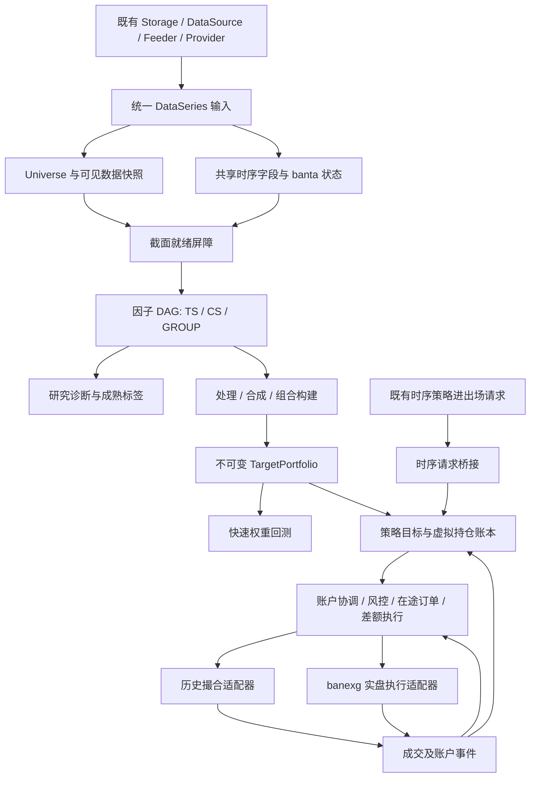

# 截面与多因子引擎架构及实施方案

> 2026-10-06 / v0.6.0-beta.6：组合生命周期、多期限和研究扩展已落地。当前配置见 [组合与持仓指南](factor_portfolio_guide.md)，源码与测试见 [扩展实施记录](factor_opt_implementation.md)。本文保留初版设计快照，早期关于“没有 policy/单 horizon/暂缓基础模型”的描述不代表本版本状态。

> 2026-10-04 校订：本文保留历史设计和测试口径。当前使用见[多因子指南](../bandoc/zh-CN/guide/factor.md)，逐包实施/暂缓与本次实际验证见[重构记录](strategy_engine_refactor.md)。缺失实施文档的链接已修复，历史结果不据此重新验收；真实 venue 与性能承诺仍需独立证据。


日期：2026-10-01。本文保留当时确认的业务需求和设计草案；当前实现与接口以 [better_arch.md](better_arch.md)、[实施记录](strategy_engine_refactor.md) 和 [当前架构](app_arch.md) 为准，不能把下面的伪代码直接当作已提供的 API。

2026-10-03 继续实施：统一 YAML/普通入口、领域内存执行、完整订阅、历史/实时共享决策和 mixed 已落地。本轮补齐归档增量决策读取、动态共享 Session 回收、调用方取消、多账户绑定资源失败清理及独立进程崩溃回归；原始任意字段、NULL、全部修订、PIT/成熟标签与账户归因要求继续有效。默认真实会话仍需 banexg 统一 context/Join/settled cash/完整恢复契约；物理断电和三模式全链路性能门槛仍以实际验收证据为准。

本轮八包完整 race 通过；500 资产×17,520 小时×20 输出的单 CS 计算核规模通过，sampled heap 54.52 MiB、进程峰值 working set 86.777 MiB。三模式 8/32/128 列、1/10 消费者热链路矩阵及性能工具 smoke 有可复用入口；没有优化前 dirty 基线，不能宣称三模式 provider/DB/账户全链路 ≤5% 或硬内存预算已验收。实际命令、日志和范围统一见 [better_arch 实施记录](strategy_engine_refactor.md)。

QuestDB latest/tombstone、可变状态筛选、持久版本和 unfinished bar 时间分离也已补齐；新高水位初始化需停旧 writer 并等待 WAL，跨主机需外部 single-writer。追加完整 ORM race 与最终全仓 test/vet/build 通过；真实数据库、venue 恢复与统计性能验收仍保持独立要求。

## 1. 目标与已确认范围

2026-10-03 本轮继续实现：研究消费者现可通过 `research.labels: []` 关闭，交易回放不维护标签队列/累计器，固定或等权组合无需研究标签；research 与 HistoryIC 保留成熟标签契约。共享 TS 补齐 Relay 类型及入场 OrderType/StopBars/Leverage 默认。启动分页恢复包含已发送/导入终态和冷历史订单，缺历史权威证据即阻断。输入各支路共用页边界校验，保留任意字段类型、NULL 及取消语义。实施及验证范围见 [当前实施记录](strategy_engine_refactor.md)，真实 SDK/venue 与完整性能验收仍不可由本地测试替代。

在保留 banbot 时序策略能力的基础上，增加专门的截面与多因子研究、回测及实盘引擎。全部业务计算和编排使用 Go，时序指标使用 banta，优先复用现有时序读写、历史与实时数据源、运行态、行情接入、交易精度、日志及生命周期能力。允许为合理复用改造底层组件。

首版代表性场景：USDT 本位永续合约，每小时对可投资池计算动量与波动率，合成评分，多头持有最高十名、空头持有最低十名。以策略分配净值为权重分母，多空各 50%，总名义敞口 100%；单策略独占账户时，策略分配净值就是账户净值。这是名义敞口约定，不是保证金占用比例或交易所杠杆设置。

已确认的关键边界：

- 首版交易市场为加密货币；底层仅在成本不高时保留其他市场扩展能力。
- 实盘必须支持时序与截面策略在同账户、同合约交易。内部维护策略持仓及盈亏费用归因，交易所允许持有合并后的净仓位；例如时序多 1 BTC、截面空 0.6 BTC，账户实际多 0.4 BTC。
- 回测首版不强制混合运行两类策略；若复用账户协调器即可实现，可纳入，否则后续完成。
- 首版包含因子 DAG、批量与增量计算、截面处理、等权/固定权重/成熟历史 IC 合成、因子诊断、快速权重回测、事件回测及实盘执行。
- ML 训练、复杂组合优化、分布式计算、其他市场适配和 Web 研究工作台为后续阶段。首版不依赖 Python、C++、外部 ML 进程或新的数据库集群。
- 接口、默认参数及实施阶段由方案确定；以下数值是建议默认值或待验证的性能目标，不是用户已经提出的硬性能承诺。

成功标准是同一份 Go 策略定义贯通研究、回测和实盘，计算与交易语义可解释，重复计算与内存随实际依赖增长，而不是随账户和策略数量重复放大。

## 2. 当前能力与真实复用边界

以本地 banbot `0674129986c50ae378045486956d83a351e4b00f` 为阅读基线；工作区已有 AGENTS.md 修改，本方案不覆盖。依赖为 banta v0.4.1、banexg v0.2.64；同时核对了相邻 banta v0.4.1 源码。文档依据包括 `app_arch.md`、`runtime_context.md`、`custom_data.md`、`series_usage.md`，具体能力以当前源码为准。

| 当前组件 | 已有能力/代码依据 | 本方案复用或改造方式 |
|---|---|---|
| `runtime.Process/Runtime` | `runtime/runtime.go`：显式配置、时钟、Symbols、Storage、订单及交易状态，stop/join | 新引擎使用显式构造与生命周期；账户执行服务可由 Process 持有，策略任务只借用 |
| `orm.DataSeries/DataRecord` | `orm/series.go`：`Values map[string]any`，字段类型、NULL、闭合与预热状态 | 保持统一数据传递模型；不增加 typed OHLCV 数据通路 |
| `SeriesStore/SeriesRepo` | `orm/series_store.go`、`series_repo.go`、`series_access.go`：schema、字段投影、批量读写、覆盖、缺口补齐 | 继续作为事实数据底座；增加快照、发布可见性和必要的多 SID 读取能力 |
| `DataSource/SeriesRuntime` | `data/series_source.go`：历史获取、实时订阅、源版本；`source_catalog.go` | 复用行情之外的数据接入，如资金费率、持仓量、标记价格；消除对 StratJob 的非必要依赖 |
| `Feeder/HistSeriesFeeder` | `data/feeder.go`：多周期、预热、复权；`hist_series_feeder.go`：自定义字段投影与分页 | 复用单流数据处理；为截面增加有界批次、完成通知和迟到语义 |
| `HistProvider` | `data/provider.go`：历史 feeder 堆合并、显式时钟、稳定回放 | 复用确定性归并；增加同时间戳耗尽通知，不在截面回放另造一套时钟 |
| `LiveProvider/SeriesWatcher` | 实时订阅、事件回调、admission/stop/join | 复用接入，回调只做入队与状态更新；重算不能阻塞订单回报 |
| `strat.DataHub` | `strat/datahub.go`：源/周期/SID 字段容器，原始值与 banta Series、`AllReady` | 复用字段到指标的转换思想及 helper；新引擎共享字段状态，避免每个 StratJob 再复制一份 |
| 现有 batch 回调 | `strat/batch_state.go` 的 `batchReadyStatus` 按 `ExecMS` 判断；`biz/biz.go` 调用 `OnBatchJobs` | 保留旧接口；它不是完整的 Universe 就绪屏障，不作为新引擎核心 |
| 时序策略 | `strat/types.go`：逐 symbol/timeframe 的 StratJob、进出场及订单变化 | 接口保持兼容；混合实盘通过桥接到统一账户执行服务 |
| 订单及钱包 | `biz/odmgr*.go`、`wallet.go`、`orm/ormo`：提交、成交、触发、恢复、费用、精度 | 抽取真实订单执行与回报能力；不能把 InOutOrder 直接当账户净持仓账本 |
| 历史市场快照 | `orm/market_snapshot.go` 支持配置型 market snapshot | 复用快照加载能力，但单份快照不等于完整历史成分/PIT 元数据 |
| 数值/配置/CLI | 已有 gonum、YAML、Cobra、性能分析、日志 | 复用；不引入通用 DataFrame 框架或表达式解释平台 |

特别注意：

1. 通用 series 表目前主键/去重键为 SID 与时间。PostgreSQL 为 `PRIMARY KEY(sid, ts)`，QuestDB 为 `DEDUP UPSERT KEYS(sid, ts)`。给 Values 增加 revision 字段不会自动保留多个历史版本。
2. DataHub 的 `AllReady` 检查当前订阅流和周期完成状态；还缺少本次 Universe 版本、晚到截止时间、历史上市/退市、缺失分类与快照冻结语义。
3. `HistSeriesFeeder.CallNext` 当前每流最多读取 20,000 行；证券数量很多时会同时保留大量 map 行。复用时必须把批次与总预取预算可配置化。
4. banta `Series.To/Cached` 在具体 Series/BarEnv 内复用，不会自动跨独立 BarEnv 去重。`BarEnv.Lock` 需要调用者控制；并发读写同一 Series 不能因“只读 Get”而视为安全。
5. 现有 wallet 注释提及资金费率，但本次检索未找到可据以确认完整历史资金费率结算的实现。首版需显式建设并测试结算链路，不能假定它已存在。

## 3. 参考项目：借鉴什么，避免照搬什么

输入研究文档：`D:/quant/research/quant-framework-research-2026-10-01.md`。其日频股票、Python/Polars、Parquet 默认建议需转换为 banbot 的 Go、现有存储和加密永续场景。

| 项目 | 采用的设计思想 | 不直接照搬的部分 |
|---|---|---|
| Qlib | 原始/推理/学习隔离，因子处理与模型、组合、执行分层，实验产物与指标 | 股票撮合、全局对象、专有存储、Python 训练依赖 |
| Hikyuu | FactorSet、编译计划、公共子图归一化、多因子合成；每个执行器独立状态 | C++ 内核、全部历史展开、未经核实的增量能力假设 |
| WonderTrader | CTA/SEL 计算按工作负载分别调度，目标持仓交给共享执行器 | 不据其接口推断已解决本项目策略净仓归因或 exactly-once |
| LEAN | Alpha/Portfolio/Risk/Execution 边界，扣除实际持仓和在途订单的差额执行，先减仓后增仓 | 大型框架、语言运行时、把其账户模型当多策略虚拟账本现成答案 |
| FinRL-X、VeighNa Alpha | 评分到目标组合的简洁契约与研究流水线 | Python/Polars 计算实现 |
| QuantDinger、Vibe-Trading | 可见时间、样本覆盖、注册元信息、NaN 语义、未来扰动及血缘验证 | 产品/AI 功能与未独立核验的性能、生产可靠性结论 |

核验结果：Hikyuu 的 DeepWiki 索引未覆盖最新 CompiledFactorPlan，直接读取 upstream header 后确认 `canonicalizeNode`、`isReusable`、`createExecutor` 及不可复制执行器设计。LEAN 当前源码确认 `GetUnorderedQuantity` 使用目标数量减 `GetProjectedHoldings(...).ProjectedQuantity`，ImmediateExecutionModel 使用 `OrderByMarginImpact`；这些支持“有在途意识的目标差额执行”，不能证明其具备本方案所需的独立策略归因。

## 4. 总体架构

采用模块化单体：新增独立 `factor` 包，不把截面策略伪装成几百个普通 StratJob，也不重新实现数据采集和交易所协议。计算、策略持仓与账户执行分别拥有状态。



四条固定边界：

- 数据底座输出 DataSeries，原始字段仍保留类型、NULL 和缺失语义。
- 因子引擎输出数值因子/评分，不直接下单；连续数组只是显式选择字段的派生计算视图。
- 组合构建输出目标权重；账户协调将其转换为目标数量并执行，权重与数量是不同契约。
- 时序与截面共享账户执行服务。未混合运行的旧时序模式可继续使用兼容路径，混合账户禁止旧管理器绕过协调器直接下单。

建议组织：

```text
factor/                 因子定义、DAG、算子、快照、研究与组合契约
factor/runner/          research / backtest / live 的组装与调度
execution/              策略账本、账户协调、订单意图、成交分配
data/                   既有 provider/feeder/source；增加通用订阅与完成通知
orm/                    快照/版本读写扩展；事实数据仍在既有存储
orm/ormo/               账本与执行意图事务持久化
biz/                    时序桥接，复用/抽取现有提交、回报、撮合 helper
runtime/                引擎依赖与账户执行服务生命周期
entry/                  新命令及显式任务入口
```

`factor` 不导入 `runtime` 或 `entry`；`execution` 不导入 `factor`，通过通用目标数量契约交接。运行器在外围组合。通用请求/事件类型放在最低依赖层，拆 helper 时先验证 import 图，避免 runtime→biz→execution→runtime 循环。

## 5. 数据底座与时间语义

### 5.1 保持任意时序数据能力

所有源继续通过 `DataSeries.Values map[string]any`。读取时合并多个策略真正需要的字段投影，同一行每字段只转换一次；同时保留原始任意字段或可按快照读取的引用。数值计算视图使用 `[]float64 + validity`，显式区别字段缺失、NULL、NaN 和无效类型，不能填 0。标签、缓存、导入导出也必须保留这一契约。

禁止为 OHLCV 单独新增 typed 快路径、把 DataHub 收窄成固定指标字段，或要求扩展字段先转成 float64 才能在系统内传递。数值派生视图适用于任意被选中的数值字段；字符串分类、布尔可交易状态等仍使用原始类型。

### 5.2 时间至少区分四类

| 时间 | 含义 |
|---|---|
| EventTime / EndMS | 数据描述的时间/区间结束，不等于对系统可见时间 |
| AvailableAt | 供应商公开、可用于决策的时间 |
| IngestedAt | 系统真实接收时间 |
| DecisionTime / ExecutableAt | 决策截面时刻与最早允许成交时刻 |

研究访问按 `available_at <= as_of`；重放实盘接收情形时还需 `ingested_at <= replay_time`。不能对所有来源默认 AvailableAt=EndMS；无明确发布时间的来源必须声明推导方式，报告其限制。闭合 K 线的默认可见时间可用 EndMS，但实盘就绪受实际接收时间约束。

每份快照保存 SID 映射、Universe 版本、范围、字段/schema、源版本、数据修订版本、可见性口径、参数与内容摘要。仅保存查询时间或水位不保证结果不可变；旧数据被修改后，应有不可变分区/导出内容或版本数据才能重现。首版对普通行情采用复用既有导出与内容摘要的按需快照，不强制复制所有历史。

### 5.3 版本数据分阶段建设

普通 K 线保留既有主键与写入逻辑。对需要多版本的扩展源新增独立 versioned-series 能力：存储逻辑键 `(sid, event_time, revision)`，同时保存 available_at、ingested_at；查询按 as_of 选择当时可见版本，不能简单选当前最大 revision。

不要全局修改所有 series 的去重键。若 QuestDB 多列去重需要 designated timestamp，可用发布/入库时间作为物理时间列并包含事件时间、版本等去重列；查询层负责映射逻辑事件时间。确认后端支持和唯一性后再实现，不能用在 TimeMS 上加毫秒伪造版本。首版不实现股票财报源，但必须避免在通用接口中固化“时间戳就是发布时间”。

QuestDB 写成功与可读取不是同一状态。快照发布前等待预期 SID/范围/记录及版本可见；超时保留 pending 标记，不启动交易、不清理恢复信息。表替换复用现有 schema/快照验证及 WAL 等待规则，增加专项超时、硬错误和删除前验证测试。

### 5.4 Universe 的四种集合

分别维护可投资池、因子参考池、可交易池及事后评估样本；另保留退出 Universe 但尚有仓位/挂单的跟踪集合。默认采用交易时点已上市且有足够历史的 USDT 永续，使用历史可见成交额进行流动性筛选。

历史上市/退市和交易规则来源需记录；没有历史成分时允许显式静态池，但报告标记幸存者偏差，不能默认为当前交易所列表就是历史全市场。未来标签缺失只影响评估，不改变当时选股排名。合约到期、维护、暂停等通过 banexg 通用能力/元数据扩展，banbot 不按交易所名称加分支。

## 6. Provider 与 Feeder 的复用改造

### 6.1 数据订阅与策略任务解耦

现有 DataSource 使用 `strat.DataSub`，它的订阅描述本身可复用，但包归属不理想。先增加不含 StratJob 的通用 Subscription/SubscriptionPlan：source、SID、timeframe、fields、lookback、可见性与缺失策略。旧 DataSub 转换后调用同一 helper，避免第一阶段大范围更名。

引擎把 DAG 依赖合并为一份订阅计划。同 SID/源/周期的字段与预热取并集/最大值；只创建一份 feeder 和一份被共享的时序计算状态。账户不应影响行情订阅身份，但快照、计算参数或缺失语义不同不能强行共享。

### 6.2 历史回放完成通知

`HistProvider` 已按堆归并事件，保留其确定性顺序。增加外围观察者 `OnTimeDrained(t)`：所有可见时间为 t 的 feeder 事件都处理完且下一个事件大于 t，才通知截面屏障；最后一批和区间末端也必须通知。动态订阅只在明确的截面边界生效。

普通时序 runner 无观察者时行为不变。回放事件仍单线程推进，截面内部的独立 TS 分区可由有界 worker 池处理；等待本批计算结束再推进确定性决策。资金结算、成交、行情、决策等同时间事件的优先级显式定义并测试。

历史 feeder 增加可调 BatchRows/PrefetchBudget，默认按依赖宽度与资产数量缩小批次，不把 500 个流各预读 20,000 个 map 记录。批量研究再按 SID/时间块读取，需要时在 SeriesRepo 增加多 SID 有界扫描；先复用 SQL 和 schema helper，profile 后再优化查询形态。

### 6.3 实盘屏障与慢源

屏障以 `(strategy_plan, universe_version, decision_time)` 为键，持有本轮预期资产和必需数据源。来源声明 StrictClose、AsOfLatest 或允许的最大陈旧时间，不用“所有来源恰好相同时间戳”处理资金费率等稀疏数据。

- 闭合行情：必须满足本轮所需结束时间；非闭合行情不参与默认排名。
- 稀疏源：取 as_of 最近已公开值；没有或过旧则无效，不拿后来记录倒填。
- 缺流与 NULL：分开诊断；NULL 行已经到达，但某因子可能无效。
- 默认迟到等待建议 10 秒，配置可覆盖；超时取消本轮调仓，保留原仓位并继续安全风控，不沿用部分旧截面假装本轮成功。
- 预先定义的池资格筛选可排除历史不足资产；本轮超时后不能为了凑够二十个币再改池。
- 有效评分不足二十个、常数截面无可用排名等情况，默认跳过新调仓并报告原因。

冻结后晚到数据不得修改已发布计划。研究可创建新的修订运行；实盘只能在下一个允许调度点产生新计划。单策略默认至多一个计算任务与一个待处理调度点；旧结果返回时检查计划代次/有效期，过期丢弃。

## 7. 因子 DAG 与 banta 双模式

### 7.1 定义与节点身份

首版采用 Go builder 与 Go 自定义函数，统一编译为 DAG，不先建设字符串 DSL。节点声明输入、参数、算子版本、输出频率、lookback、缺失规则、参考池、批量/增量实现及状态恢复方式。

节点身份对算子、参数和依赖做规范化；编译公共子图去重、拓扑排序、推导字段与预热范围、检测循环与标签依赖。自定义节点必须显式声明依赖，不能分析任意 Go 函数体自动推导。

三种节点：

- TS：lag、收益、均线、波动率等；单资产计算，用 banta cached/tav 实现。
- CS：rank、zscore、winsorize、quantile；使用冻结截面，整个参考池计算。
- GROUP：分类去均值、组内标准化、简单回归残差；分类来自 as_of 原始字段。复杂优化模型延后。

支持 TS→CS→TS 的组合，但必须明确 CS 的输出频率、参考池版本和每资产历史状态。CS 不在不同 worker 分区上分别排名再冒充全局排名。参数未参与缓存身份、自定义代码变更未更新版本等均应在开发诊断中可见。

### 7.2 一个计划，两种执行后端

批量后端调用 `banta/tav`，按资产/时间块计算，再按截面汇总；增量后端使用 `banta.Series/BarEnv`，每个闭合事件更新依赖节点一次。两者共享定义、缺失策略、时间对齐和输出约定。

缓存边界为 Runtime 的计算 session：相同 `(snapshot/source version, SID, timeframe, adjustment, node definition)` 才可共享。多策略消费相同只读结果；一个 owner 更新某个 BarEnv，其他 worker 读取冻结结果。不要让账户数量乘上全部指标状态。

初版可让回测默认走增量确保与实盘同语义，研究支持显式批量/auto；只有通过该节点的批量-增量一致性验收才选择 tav 后端。自定义仅增量节点可回放处理，只有批量实现的节点不能静默用于实盘。

缓存状态包含前值、递归状态、窗口和 warmup。EMA 类递归指标不能在每个块只补固定有限 lookback 后声称精确一致；可复用连续执行状态，或使用从已知起点的完整历史，或提供显式近似误差边界。NaN 跳过规则逐指标核对，不以统一填零掩盖两模式差异。

### 7.3 内存和缓存策略

同一 session 共享字段/节点；DAG 计算槽按最后消费者释放，中间 CS 数组尽早复用。只保留有状态节点的必要历史和正在使用的截面，研究报告按块累计，详细因子面板按需落盘。

`MaxCache` 不应随意固定 512：以依赖计算保留长度，检查 banta 派生 Series、More、Subs 的实际裁剪。banta 现有 TrimOverflow 从部分主字段 Cut，DataHub 对注册字段显式 Cut；新引擎必须验证所有根与派生状态有界，不能只截输出数组。必要时对 banta 增加通用状态裁剪/导出能力，而不是另写指标。

模型内存表达为 `O(N × Σ每节点保留状态 + N × 活跃截面列数 + 有界I/O + 有界标签队列)`；不是 `O(账户 × 策略 × N × 全历史 × 全因子)`。例如 500 资产、10 个保留列、512 值的纯 float64 约 19.5 MiB，这仅是数组估算，不包含 map、派生状态、队列、DB/Go 内存及报告。

持久缓存仅针对昂贵或重复复用结果，key 含定义/依赖/源与数据快照、池、频率、参数、调整和 NULL 语义。更新某资产 TS 只失效依赖区间；涉及 CS 后，该时间截面的其他资产结果也可能失效，再沿图传播。不能把“只更新某 SID”误当全部下游可局部失效。

## 8. 研究流水线与默认策略体验

标准流水线：RawFactor → 可选去极值 → 截面标准化/分组处理 → Combiner → Score → PortfolioBuilder → TargetPortfolio。每步可独立替换和查看，默认不要求用户手写订单循环。

代表性策略建议默认：1h 闭合行情；过去 24 根收益为动量，过去 24 根单小时收益标准差为波动率；winsorize 后各做截面 zscore，`score = z(momentum) - z(volatility)`；top/bottom 各十名，各侧等权。窗口与 ddof 显式记录；常数列 zscore 取 0、无效样本排除，所有列均无区分能力则跳过；排名同分按稳定 SID 处理且多空集合不得重叠。参数均可替换，这不是推荐盈利策略。

最小用户 API 草案：

```go
// 示意 builder：实施时核对并确定具体函数签名。
plan := factor.New("momentum_vol").
    Universe(factor.USDTPerpetuals()).
    TimeFrame("1h").
    Add("momentum", factor.Return("close", 24)).
    Add("volatility", factor.StdDev(factor.Return("close", 1), 24)).
    Transform(factor.WinsorZScore()).
    Combine(factor.FixedWeights(map[string]float64{
        "momentum": 1, "volatility": -1,
    })).
    Portfolio(factor.LongShortTopK(10)).
    Build()
```

默认窗口与规则由 builder 提供；自定义 Go 节点、处理器、池和组合构建器仍可覆盖。YAML 仅提供已注册组件参数，不试图序列化任意函数或新建插件语言。研究、事件回测和实盘使用同一个 plan hash。

因子诊断首版输出 Pearson IC、Spearman RankIC、ICIR、样本数、覆盖/缺失、分位收益与单调性、衰减、换手、相关性、基础风险暴露及费用后组合收益。标签默认按下一可执行时刻到指定未来时刻的收益，另可提供统计型 close-to-close 标签，两种口径不能混称可成交收益。

标签在独立命名空间，推理计划不能依赖；未来标签缺失只改变评估样本。历史 IC 权重必须在标签完整成熟且可见后更新，并对齐权重生效时间；零有效历史默认退回等权并记录原因，不用本时刻未来收益。实验记录标签 horizon、重叠、年化方式和试验参数，首版不对普通 t 检验宣称稳健显著性。

## 9. 目标组合契约与资金分配

TargetPortfolio 是不可变计划，至少包含 StrategyID、AccountID、DecisionTime、ExecutableAt、ExpireAt、PlanSequence/RebalanceID、SnapshotID、PlanHash、UniverseVersion、Targets、资金预算版本及约束诊断。

Targets 使用资产身份到有符号名义权重映射；分母为冻结策略净值预算。多账户的行情/因子可共享，但组合、预算、持仓和订单不共享。混合账户必须显式配置策略预算，预算份额总和不超过账户可分配净值；余额、收益和转账对预算的影响有账本事件。首版采用静态预算权重，不自动为表现好策略加资。

明确 Full 与 Patch：默认 Full 只清空本策略上一次范围内未出现的目标；绝不把同账户其他策略持仓清仓。Patch 仅更新指定资产。池外仍有实际仓位继续进入执行/风险跟踪，不能因取消订阅而消失。

权重转数量使用冻结预算、明确参考价格和 banexg 合约乘数/精度；线性 USDT 永续可理解为 `qty = budget × weight / (price × contractSize)`，准确公式由通用 instrument capability 提供。取整后校验敞口、最小数量/名义额、保证金和流动性；不通过时缩减或拒绝并记录，不能假装完全满足原目标。

跨市场扩展保留 InstrumentSpec、TradingCalendar、Tradability、Settlement/FundingModel 边界，首版实现加密 24×7 和线性永续即可。不提前实现股票 T+1、涨跌停或全部反向合约算法。

## 10. 统一账户执行：时序与截面如何共存

### 10.1 拆开三本账

1. 策略目标账：每个策略希望达到的数量/执行条件及版本。
2. 策略持仓账：已分配成交、虚拟 lot、成本、已实现/未实现 PnL、费用及资金费率。
3. 账户真实账：交易所实际仓位、余额、真实订单和未成交量。

InOutOrder 是时序交易 lot/生命周期视图，可继续保留，不能让它与真实交易所订单一一绑定：多个虚拟 lot 可以共享一个净订单，内部对冲成交可能没有真实订单号。新增 `ExecutionAllocation` 关联虚拟请求、订单意图和成交；旧字段的“一笔 enter/exchange order”假设需逐点审计。

### 10.2 时序桥接而不是全部改写策略

混合账户的 EnterReq/ExitReq 转为有所有者的虚拟交易意图：Enter 增加该策略目标，Exit 只减少指定策略 lot，不关闭他人的仓位。保留限价、有效期、stop、tag 和回调语义，不能把限价入场直接转为当前可执行的市价持仓目标。

StrategyID 包含 policy/job 必要身份，持久化后稳定。策略回调的开仓、部分成交、平仓事件来自归因后的账本；实际成交价/费用使用真实回报，内部成交使用单独类型标记。独占账户继续旧模式；一旦启用混合，参与策略的所有提交、撤单、触发及恢复都进入一个账户 owner。

现有交易所 reduce-only 止损/止盈不能安全表示某个虚拟策略的独立止损。例如 BTC 实际净多 0.4，时序多 1 要退出时，可能需要净仓变为 -0.6；不能仅提交 reduce-only 1。默认在共享账户使用策略级软件触发，触发后修改该策略目标并由协调器执行；账户级紧急净仓保护可使用交易所原生触发，但要取消/调整在途单并向全部策略回传强制减仓事件。首次兼容需覆盖旧 OnCheckExit、止损止盈、分批退出和恢复，不只是 MarketOrder。

### 10.3 合并与在途订单

每账户仅一个写 owner；按 instrument/position-side 维护真实数量与已确认在途数量：

```text
account_target = Σ strategy executable target quantities
projected_position = actual_position + Σ confirmed remaining signed order quantities
unordered_delta = account_target - projected_position
```

未确认提交、撤单未确认、回报缺失单独处于 Unknown，不随意按 0 或假定已撤成功。新目标到达时先比较版本，撤销不兼容旧单、确认状态，再发缺口；减风险优先，增加风险需等释放预算或经风控许可。双向模式分别协调多/空侧，保证策略协议不变；首版主验收使用净仓模式。

相反方向的虚拟需求可以在内部交叉：使用当时可执行报价区间内的确定价格、禁止使用未来价，仅匹配执行条件兼容的请求，记录 InternalFill 和零交易所手续费。有限价条件不满足、不同执行时间/过期或安全约束冲突时不内部成交。内部多空消除后只有剩余净需求发交易所。

真实部分成交按提交时冻结的分配表归因，默认同优先级按待成交量比例、确定性尾差分配；不能看到结果后选获利策略分配。临时计划替换不会修改已发生的归属。手续费按真实成交金额分配，精度尾差归入明确账户调整项。

### 10.4 资金费率与 PnL 守恒

策略虚拟多空按结算时持仓和同一标记价格/资金费率计算内部应计；多空相互抵消，净额与账户真实结算对齐，实际差额通过明确 reconciliation 项分配。真实费率/结算时间由数据源或交易所回报提供，不假设所有平台每八小时结算。

需要验证：各策略持仓数量之和等于账户受管仓位；策略 PnL、现金、费用、资金费率和可解释调整之和等于账户账；内部交叉的 PnL 转移不凭空产生权益。账户实际费率与模拟公式不一致、强平、手工交易或外部仓位不能强行均摊掩盖。

共享实盘必须定义外部仓位隔离：启动未归属仓位进入 External/Unassigned，默认停止该合约新增风险并提示对账，不自动认领/平仓。后续由显式人工归属或配置授权处理。

### 10.5 幂等、持久化及恢复

使用事务型交易存储持久化 Plan、VirtualIntent、Allocation、OrderIntent、Outbox、FillEvent、LedgerEntry 与 Checkpoint，复用 `orm/ormo` 连接与迁移机制。SQLite/既有交易 PostgreSQL 可按现有部署选择；QuestDB 用于事实行情，不作为执行事务 outbox。

OrderIntentID 派生稳定 ClientOrderID，格式/长度及查询能力由 banexg capability 处理。重试“请求结果未知”先按 client/exchange ID 查询与对账，不能换随机 ID 再下一笔。没有可查询能力时进入人工可见 Unknown，禁止盲目重发。

状态机建议 `Prepared → Sending → Acknowledged → Partial/Filled`，同时支持 CancelPending/Canceled/Rejected/Unknown；写发送意图在网络调用之前。成交以交易所 trade ID 或明确的去重组合键持久化；累计成交与增量成交分开，不重复记账。

重启按顺序加载账本/意图，拉取余额、仓位、活动单、最近成交，对账未知状态，恢复分配后才允许新目标。账户 owner 使用进程互斥与数据库租约/fencing；跨进程接管先确认旧 owner 停止及未知单状态，单靠租约过期不能阻止旧进程的网络下单。

长计算与成交处理隔离，后者不能被重算阻塞。账本和 outbox 单写串行，I/O 有界；关闭停止接纳、撤销或持久化未完成任务、等待所有 callback/join，复用 Runtime 生命周期模式。

## 11. 双模式回测与实盘一致性

### 11.1 快速权重回测

消费同一目标组合，按下一可执行时刻的权重/数量模拟收益、换手、费用、滑点和资金费率。持仓随价格自然漂移，不能每根 bar 自动免费恢复目标权重；永续收益按有符号名义仓位和价格变化核算，不能按多空平均收益当现货组合。

默认采用 t 收盘后决策、t 后下一根可执行开盘价及费用/滑点；同时记录数据延迟和理想开盘假设。该模式不模拟完整挂单、部分成交和精确强平，报告简化项。混合净额带来的费用变化不属于单策略快速回测保证。

### 11.2 事件回测

复用 HistProvider、时钟、行情数据、精度及本地撮合 helper，通过 execution 的模拟 adapter 接收真实订单意图。把撮合从“必须拥有 InOutOrder”依赖中拆出，保持现有时序行为的适配层。

同一时间的建议事件序：生效的交易规则/结算与既有订单成交 → 可见行情/侧源 → 数据耗尽屏障 → 冻结因子与计划 → 新意图进入后续可执行区间。结算资格以真正的持仓截止点定义；决策产生的新单不能回头参与刚结束 K 线的成交或资金结算。用小例子固定顺序，不能仅依赖 heap tie-break。

计入真实费率序列、标记价格、保证金/维持保证金能力、最小数量、手续费、配置化滑点与流动性限制；bar 内路径不能证明精确清算时间，报告建模限制。缺少必要资金费率或标记价格时默认拒绝“完整永续事件回测”，允许用户显式选择简化并在报告标记。

两种回测共享因子、组合、成本参数及 manifest，但不要求净值相同；对差异归因为成交价格、部分成交、取整、费用、资金费率与保证金限制。实际 live 还存在数据到达/网络延迟，不能承诺和理想历史 bar 成交完全一致。

## 12. 分阶段实施及依赖

| 阶段 | 工作与主要落点 | 阶段出口 |
|---|---|---|
| P0 基线与契约 | 固定数据/代码/参数；最小未来扰动案例；因子、快照、目标、执行事件类型；审计时序触发/恢复 | 契约与基准可运行，明确哪些 helper 能抽取；旧策略基线已归档 |
| P1 数据与计算 | 通用订阅转换、Provider 耗尽通知、有界 feeder、Universe/snapshot、共享字段、DAG、banta 两后端、CS | 同一案例批量/增量对齐，字段/NULL 保留，内存随块与依赖有界 |
| P2 研究与快速回测 | 合成、成熟标签/IC、诊断、Top-K、快速永续权重回测、manifest/CLI | 一份定义输出评分、计划、报告与可复现净值，资金费率口径明确 |
| P3 账户执行与事件回测 | 策略账本、净额协调、outbox、模拟订单 adapter；抽取精度/撮合/回报 helper | 单策略截面事件回测完成；净额/内部交叉/部分成交守恒案例通过 |
| P4 混合实盘闭环 | 时序 Enter/Exit 与全部触发桥接、banexg adapter、恢复/对账、预算与外部仓位、stop/join | 同账户同合约 paper/dry-run 共存；重复回报/未知提交/重启用例通过，具备上线验收条件 |
| P5 后续扩展 | ML、复杂约束优化、其他市场、Web、分布式 | 单独评审，不进入首版完成条件 |

首版完成是 P0—P4 全部完成，不能以 P2 因子研究可用替代实盘目标。优先单策略/单合约验证，再二策略同合约，再多币池；共享执行先验证小账本，最后才扩大策略规模。

当前统一使用根命令 `research`、`backtest` 和 `trade`，策略配置统一使用 YAML。backtest 按统一 YAML 装配时序、因子或混合引擎，因子 mode 依次取 CLI、execution.mode、默认 events；混合回放必须 events。混合账户显式启用 shared execution 并声明策略预算。原策略格式与回调保持兼容，迁移后的账本格式需要版本和恢复工具，不隐式改写生产历史。

## 13. 验收与性能验证

### 13.1 正确性验收

- 未来行情/资金费率、成员及修订扰动不改变过去因子、排名和计划；同 snapshot/plan 输出稳定。
- 数据到达乱序、重复、永久缺失、显式 NULL、非数值字段、混合周期、稀疏侧源、最后时间批次都有确定小案例。
- 共享节点每资产每闭合时间只执行一次；两个账户不重复因子，但预算/持仓隔离。
- batch/cached 比较 warmup、有效位、NaN、递归/窗口及数值；数值建议 `abs <= 1e-10 + 1e-8*abs(reference)`，逐指标调整有依据，不能扩大误差掩盖语义错误。
- 时间分块与整段结果一致，EMA 等递归节点连续状态不被截断；全部派生状态和预取有界。
- 标签成熟前不可进入 IC 权重；未来标签缺失不影响当期池和排序。
- top/bottom 集合不重叠，目标省略只退出本策略资产；取整后与真实执行差异可核查。
- 时序 +1、截面 -0.6 得到净 +0.4；任一侧部分退出、反手、限价与止损触发都不误关闭其他策略；虚拟 lot 与账户守恒。
- 内部成交、真实部分成交、手续费及资金费率尾差、强平、外部仓位与手工订单有明确归因/拒绝行为。
- 提交超时、撤单未知、计划替换、重复成交、进程崩溃、owner 接管不会盲目重复下单；恢复前禁止新风险。
- Runtime 取消/关闭期间慢重算、慢 socket、执行回报均 stop/join，race 用例无共享 Series 读写竞态。
- 旧时序独占模式的固定输入订单/权益基线保持；混合模式内部净额降低费用属于明确的新语义，不能要求逐真实订单一致。
- QuestDB 针对 WAL 超时/硬错误/替换删除前验证的专项回归必须通过。

### 13.2 性能场景

固定相同机器、Go/banta/banexg revision、线程、数据库后端、字段宽度、源版本与 warmup。建议主场景：500 合约 × 2 年 1h × 20 因子，其中有公共收益/波动率子图；补充 100/1000 合约、1/10 策略、两账户和宽扩展列场景。冷缓存、热缓存、缓存关闭分别测。

分别记录加载耗时、因子吞吐、屏障完成后的重算 P50/P95/P99、计划执行延迟、订单回报延迟、分配数、live heap/RSS 峰值、GC、DB 查询次数、共享节点执行次数及落盘量。数据库、行情 map 和数值核分别 profile，不对“纯指标很快”外推整体性能。

建议初始工程门槛：500 资产代表性双因子在数据齐备后 P95 重算低于 1 秒；同定义从 1 到 10 消费策略时共享 TS 节点次数不增加；历史长度增倍不让常驻计算状态近似增倍；代表性旧时序热路径性能回归不超过 5%。这些是待 P0 实测确认的目标，若不成立，应报告瓶颈与优化计划，不能以削弱任意字段契约换性能。

先跑单元/确定性/race 与必要集成验证，再用现有 profiling 找瓶颈；没有新变化或失败不反复扩大全量测试。首版数据源和交易所联网验收需独立记录环境，静态阅读不作为生产通过证据。

## 14. 主要风险与实施取舍

最大改造成本在混合账户执行及旧时序交易生命周期兼容，而非 rank 算法。不能仅凭订单标签把它估计成小型 adapter。应先把虚拟 lot、触发、部分成交和恢复用例完成，再接真实账户。

默认选择单进程账户 owner、模块化单体、Go builder 和增量事件一致性；只在 profile 证明收益后扩大批量优化。市场兼容通过通用身份/日历/规则/结算边界保留，不实现首版用不到的全市场功能。简单默认策略与严格的时间/账本契约可以并存，复杂配置只在使用相应能力时出现。

## 15. 来源与核验范围

本方案做了文档和源码静态阅读，没有运行全库测试、生产回测、实盘或性能 benchmark。本机 Go 未在 PATH 中，不能把本文的性能目标或兼容判断表述成已验证结果。

本地主要依据：`doc/app_arch.md`、`doc/runtime_context.md`、`doc/custom_data.md`、`doc/series_usage.md`；`runtime/runtime.go`；`orm/series.go`、`series_repo.go`、`series_store.go`、`series_access.go`、`market_snapshot.go`；`data/provider.go`、`feeder.go`、`hist_series_feeder.go`、`series_source.go`、`runtime_deps.go`；`strat/datahub.go`、`batch_state.go`、`types.go`；`biz/biz.go`、`odmgr.go`、`odmgr_live.go`、`odmgr_local.go`、`wallet.go`；`orm/ormo`。banta 核验 `types.go`、`core.go`、`tav/indicators_moving.go`、`tav/indicators_volatility.go` 与 README。

公开参考：

- [banbot DeepWiki](https://deepwiki.com/banbox/banbot)、[banta DeepWiki](https://deepwiki.com/banbox/banta)：架构入口；本地源码用于核对当前行为。
- [LEAN DeepWiki](https://deepwiki.com/QuantConnect/Lean)；核验 revision `41c6e603e5671ca7b5d3de0cbe13b3c4b109bba4` 的 [ImmediateExecutionModel](https://github.com/QuantConnect/Lean/blob/41c6e603e5671ca7b5d3de0cbe13b3c4b109bba4/Algorithm/Execution/ImmediateExecutionModel.cs)、[OrderSizing](https://github.com/QuantConnect/Lean/blob/41c6e603e5671ca7b5d3de0cbe13b3c4b109bba4/Common/Orders/OrderSizing.cs)、[PortfolioTargetCollection](https://github.com/QuantConnect/Lean/blob/41c6e603e5671ca7b5d3de0cbe13b3c4b109bba4/Common/Algorithm/Framework/Portfolio/PortfolioTargetCollection.cs)。
- [Hikyuu DeepWiki](https://deepwiki.com/fasiondog/hikyuu)；直接核验 revision `daeb2c792a2095178fd5af051eda76d1b23e96c6` 的 [CompiledFactorPlan.h](https://github.com/fasiondog/hikyuu/blob/daeb2c792a2095178fd5af051eda76d1b23e96c6/hikyuu_cpp/hikyuu/factor/imp/CompiledFactorPlan.h) 与 FactorSet.h，弥补旧 Wiki 索引缺失。
- [WonderTrader DeepWiki](https://deepwiki.com/wondertrader/wondertrader)；结合输入报告已核验的 revision `08b230dd05facf6d650d949bfe51054115a2ecb1` [SEL 引擎](https://github.com/wondertrader/wondertrader/blob/08b230dd05facf6d650d949bfe51054115a2ecb1/src/WtCore/WtSelEngine.cpp) 与 [执行契约](https://github.com/wondertrader/wondertrader/blob/08b230dd05facf6d650d949bfe51054115a2ecb1/src/Includes/ExecuteDefs.h)。本轮 Wiki 属补充，不作恢复可靠性的认证。
- [Qlib DeepWiki](https://deepwiki.com/microsoft/qlib)，结合输入报告的 [processor.py](https://github.com/microsoft/qlib/blob/be725493eb1a6bbb42bf11b37aa7669f59610ff1/qlib/data/dataset/processor.py) 和 [PIT](https://github.com/microsoft/qlib/blob/be725493eb1a6bbb42bf11b37aa7669f59610ff1/qlib/data/pit.py)。
- 其余项目的 revision 与证据见输入研究文档；本方案引用其设计归纳，不宣称本轮逐个重新执行或核验所有实现。

本文保留原规划与研究依据；当前代码实施状态以 [better_arch 完成表](better_arch.md) 和 [实施记录](strategy_engine_refactor.md) 为准。本次继续实施后全仓测试 1,929 个顶层 PASS，vet/build 通过，七包专项 race 无告警；外部数据库、真实 venue 与完整性能验收仍按未完成项管理。
