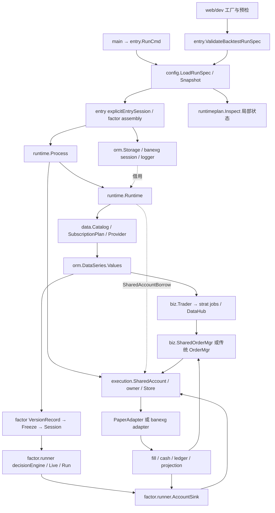
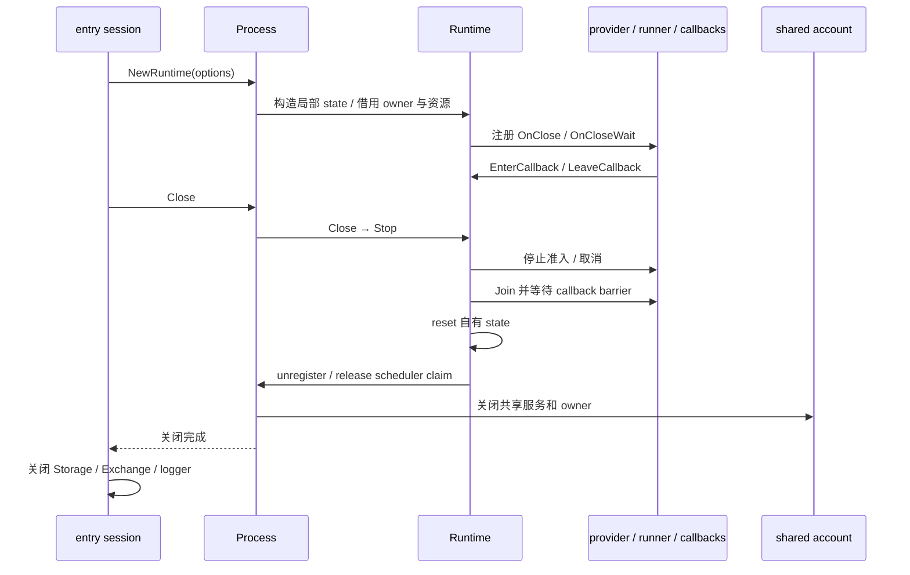
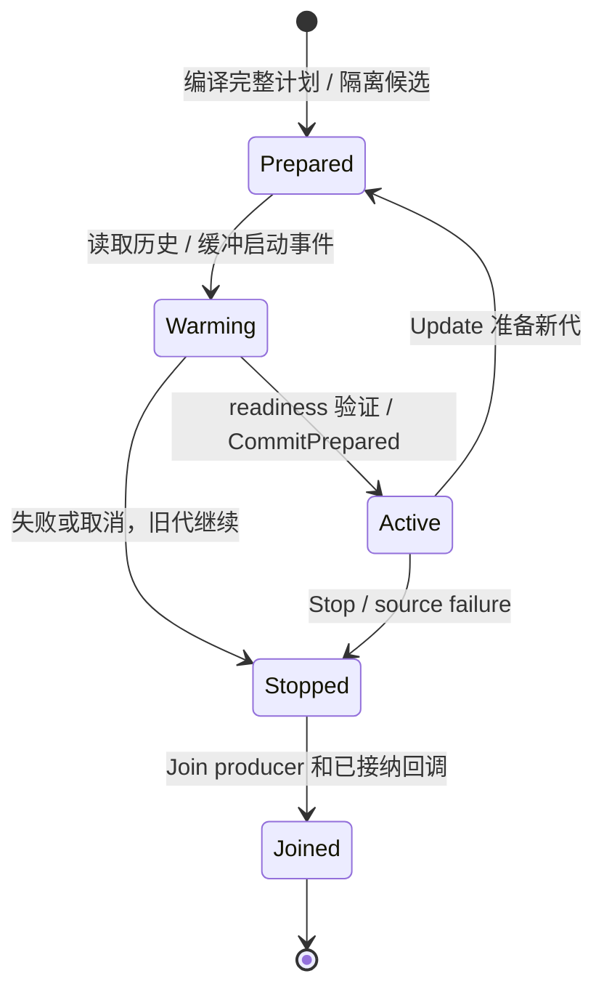

> 配置修订：普通 YAML 加载保持只读并兼容 v0.5，无需版本标记。因子选项提升到 run_policy[]，账户执行覆盖位于根 accounts.<name>；早期嵌套输入仍可读取。此前自动备份和写回版本化 YAML 的记录属于已替代方案。

# 策略引擎逐包审查与重构完成记录

> 2026-10-06 / v0.6.0-beta.6 新增组合层：见 [factor 扩展实施记录](factor_opt_implementation.md) 和 [组合指南](factor_portfolio_guide.md)。包含每 run 的 policy/quantity allocation、owner 原子接纳恢复、实时执行范围保留、multi-horizon、稳健变换与原生研究插件。本文的“无新增版本/发布”、单标签及接口盘点属于 2026-10-04 的历史重构记录。

日期：2026-10-04。初始源码 HEAD e4fb5f73100a350c2bc445ae5c9fbcf4432933c3，以最终工作树符号为准。本文合并因子线、集成线和文档线的实际结果；历史设计见 better_arch.md / factors.md，不再将初始只读建议当作当前实施状态。

## 1. 最终结果与兼容边界

减少现有计算/装配中的冗余，保留 TS、CS、执行账户与 provider 的职责，不再新增万能引擎接口。F1–F4、I1、I2、I4、I5 已实施，I3 核对实际合同后暂缓。所有包均有审查结论，未改动不等于缺少审查。

- 任意时序字段始终通过 orm.DataSeries.Values map[string]any，保留具体类型、NULL、缺失和嵌套容器，不引入 typed OHLCV 传输快速路径。
- 交易所差异仍归 banexg；没有新增生产依赖、版本/tag、发布或真实交易。
- QuestDB WAL 可见性等待、超时恢复标记和替换前验证未改动。本次未涉及表替换修复。
- Full/Patch、严格后续可见价格、预算/策略归属、事件幂等、owner 与 Stop/Join 保持。
- 未使用 banbot/banexg/banta DeepWiki，未向公开服务提交源码。

## 已实施与暂缓

| 项目 | 最终结果 | 行为证明与收益 |
| --- | --- | --- |
| F1 | decision.go 按 shared/private 路径直接取 Session | 去掉共享计算的弃置 Session；共享隔离/失败借用回归 |
| F2 | decisionManifestSpec 统一运行与 live 预检衍生 manifest | 预检不创建资源；manifest 接受范围一致 |
| F3 | 多列表达式校验仅取一次 Plan.Outputs | 完整声明与多列失败校验保留 |
| F4 | runner.CloneConfig；expr/research 暴露既有 typed clone | 替代 JSON decode/句柄恢复，保留一次序列化非法值拒绝 |
| I1 | startup Values 直接复用已有递归 typed clone | 删除临时 DataRecord/单元素 slice，类型/NULL/调整信息回归 |
| I2 | validatedFactorBacktestConfigs 统一预检/执行纯校验 | 模式/装配/history 错误一致；取消优先、资源时机不变 |
| I4 | CN/EN 用户文档、导航、API 与历史断链修正 | 当前运行入口、API/YAML/限制集中说明 |
| I5 | Runtime FactorState 使用 CloneConfig | 嵌套容器隔离、借用句柄身份、sink/output 复制和生命周期回归 |
| I3 | 暂缓 RecordToSeries 统一转换 | live 规范化 Source/SID/浅复制；runtime 保留原 Source/SID/nil 索引，复用需恢复包装，净收益不足 |

## 2. 全项目结构盘点

以下按实际 Go 包目录列出。括号是 Go 文件总数/其中测试文件数，包含生成文件，不能当作复杂度度量。包关系由源码 import、结构体及调用方核实；不把注释中的 import 示例当成依赖。

| 包/目录 | 当前职责与主要消费方 | 审查与实施归属 |
| --- | --- | --- |
| 根 main（1/0） | `main.go` 仅调用 `entry.RunCmd` | 集成线，保持薄入口 |
| `factor`（22/12） | DAG、值类型/哈希、版本快照、Session/Batch、RoundBarrier、目标组合；runner/expr/research 消费 | 因子线 |
| `factor/backtest`（3/2） | 权重数量账本 Book；runner weights 模式消费 | 因子线 |
| `factor/expr`（3/1） | 表达式解析、名称绑定、转原生 Plan；入口与 runner 消费 | 因子线 |
| `factor/research`（5/1） | 标签成熟、ICHistory、组合、诊断、manifest；runner 消费 | 因子线 |
| `factor/runner`（35/19） | replay/live、共享计算、输入、账户 sink、输出 | 因子线 |
| `runtimeplan`（3/1） | 冻结市场上的策略数据需求检查和确定性摘要；entry 内部命令消费 | 集成线 |
| `runtime`（56/45） | Process/Runtime 构造、任务状态、共享账户借用、订阅代际和关闭 | 集成线 |
| `execution`（90/42） | owner、账户服务、ledger、intent、净额/分配、恢复、内存/SQLite、venue adapter、OHLC 撮合 | 集成线 |
| `entry`（52/29） | Cobra 注册、RunSpec、资源装配、TS/CS/mixed 路由、维护命令 | 集成线 |
| `data`（52/30） | catalog、订阅计划、bootstrap、历史/实时 provider、feeder、spider、分页预算 | 集成线 |
| `strat`（38/22） | TS 策略/jobs、DataHub、批处理、订单请求与回调、pair 轮换 | 集成线 |
| `biz`（65/40） | Trader、传统/共享 OrderMgr、钱包、账户投影视图、工具、gRPC 特征服务 | 集成线 |
| `config`（31/14） | YAML/CLI、旧输入兼容、浅层校验、RunSpec、Snapshot、显式配置保存 | 集成线 |
| `opt`（24/17） | TS backtest、优化/滚动/模拟、报告与结果工具 | 集成线 |
| `live`（10/5） | CryptoTrader、实盘启动/关闭、cron、账户检查与平仓工具 | 集成线 |
| `orm`（117/60） | DataSeries、series repo/store、K 线扩展、元数据、SID、存储/恢复 | 集成线 |
| `orm/ormo`（18/6） | TS 订单/任务存储、OrderState、钱包快照；biz/strat/opt 消费 | 集成线 |
| `orm/ormu`（7/0） | Web 任务查询、生成 SQL 接口 | 集成线；不改生成文件 |
| `core`（13/3） | 常量/共享类型、State、准入和性能状态、symbol parser、legacy facade | 集成线 |
| `exg`（14/6） | 构造 banexg、能力探测、订单 ID/事件/价格符号/下载接口 | 集成线 |
| `goods`（4/1） | pair filter/producer、runtime 依赖、冻结静态池 | 集成线 |
| `com`（10/4） | MarketState/PriceState/PairCopiedState、scheduler、legacy facade | 集成线 |
| `internal/testutil`（1/0） | `RequireIntegration` 外部测试开关 | 集成线，保留默认跳过外部服务 |
| `btime`（5/2） | ClockState 与旧时钟接口 | 集成线；任务时钟不能改为全局时间 |
| `rpc`（13/5） | Session、通知渠道、远程命令与 Stop/Join | 集成线 |
| `utils`（29/14） | 文件、网络、BanIO、数学与格式工具 | 集成线；不建设万能工具层 |
| `llm`（3/0） | 模型配置/管理器与模型请求；config 消费 | 集成线，首批不改 |
| `web`（1/0）、`web/base`（11/3） | 服务 facade、API/WS 公用实现 | 集成线 |
| `web/dev`（16/8）、`web/live`（7/4） | 配置/回测开发 API、监控 API；调用 entry 注入的工厂或 typed deps | 集成线 |
| `web/ui`（1/0）及前端源码 | UI 静态资源和前端 | 集成线，当前不改、不重打包 |
| `cmd/orderinspect`（1/0） | 订单检查工具，直接消费 ormo | 集成线，当前不运行 |
| `_testcom`（1/0） | 辅助测试代码 | 不作为生产引擎抽象来源 |
| `doc/change-review/repro`（1/0） | 审查复现程序 | 文档辅助，不作为标准启动路径 |
| `doc`、`bandoc`、README、各包 README | 架构/指南/中英文 API 文档 | 文档线；用户指南/导航/当前说明已更新 |
| `scripts`、`.github`、`docker` | 性能验证、CI、容器部署 | 更新 scripts 性能说明并新增只读文档链接检查；CI/docker 无修改，不据文档假定已执行部署验证 |

没有顶层 `docs/`，实际文档根为 `doc/` 和 `bandoc/`。`.omx/.wardo/.understand-anything/.tmp/tmp` 是运行或辅助产物，未作为引擎包。`go.mod` 使用 Go 1.24.0，banexg 通过 `replace ... => ../banexg` 接入邻目录；本次实际编译器为 Go 1.25.1。

## 3. 各包最终审查结论

| 包 | 结构/组件审查与最终处置 |
| --- | --- |
| factor | DAG identity、Session/Batch、Snapshot/Universe、VersionStore、typed Values、RoundBarrier、TargetPortfolio：保留。getter 复制是所有权边界，Session/Batch 递归历史不同。 |
| factor/expr | Spec/Binding/parser/compile：增加 CloneSpec，仍启动编译并校验未使用声明。 |
| factor/research | ComboSpec/ICHistory/LabelQueue/Manifest：复用并暴露 CloneComboSpec/CloneManifestSpec；成熟历史与推理分离，BuildManifest 的规范化与配置复制分开。 |
| factor/backtest | Book、quotes、funding IDs、Full/Patch：保留，weights 近似账本不可替代真实账户。 |
| factor/runner | definition registry、decisionEngine、ComputationGroup、replay/live、输入、账户 sinks、timeline/artifacts：F1–F4 实施；驱动时钟、admission、funding 错误优先级仍分开。 |
| runtimeplan | Inspect 局部 state、需求合并与 canonical 摘要：保留，selected symbol 顺序不是 canonical 顺序。 |
| runtime | Process/Runtime/FactorState、共享源和 live subscriptions：I5 实施，账户借用、订阅代际、资源关闭 owner 不合并。 |
| execution | SharedAccount/borrow、AccountRegistry、Store、ledger/intent、SQL/memory、venue adapter：保留后端边界与事务/幂等；不是重写账户模型。 |
| entry | RunSpec routing、factor assembly/preflight、storage/mixed/output cleanup：I2 实施，执行资源和完成 artifact 留在执行边界。 |
| data | Catalog、SubscriptionPlan、startup、generation revision、分页：I1 实施；warmup/readiness/revision 协议保留。 |
| strat | TradeStrat/StratJob/State/DataHub/Batch：保留 rawMap NULL 与数值视图；成员快照不等于可任意修改 job 指针。 |
| biz | Trader/RuntimeDeps/TradingState、OrderMgr/wallet/shared bridge：保留 TS 投影和请求语义，不造第二套 execution 账户。 |
| config | UnifiedConfig/RunSpec/Snapshot/Config.Clone/账户 clone：输入只读与执行所有权不同，不能统一成 JSON clone。 |
| opt | BackTest/优化工厂/ReportDeps：保留资源隔离与报告边界，不退回 globals。 |
| live | CryptoTrader.Emit/source converter：I3 暂缓，Source/SID/nil/浅复制合同不同。 |
| orm | DataSeries/RecordToSeries/repo/Storage/SID/QuestDB：转换不代替异步复制；任意字段与 WAL 等待/恢复保持。 |
| orm/ormo | OrderState/tasks/传统钱包与策略订单投影：保留，不能机械合进 execution.Store。 |
| orm/ormu | Web 任务 schema/查询：保留，任务元数据不是交易账本，不改生成 SQL。 |
| core | task CoreState、admission/performance/cancel、legacy facade：保留任务状态；未修改版本号。 |
| exg | NewForRuntime、symbol/price/order/funding capabilities：保留 banexg 能力边界，不添加 venue 名称分支或反射 facade。 |
| goods | RuntimeFilter/Producer、冻结池：保留旧 filter 兼容与排序/强制过滤差异。 |
| com | MarketState/PriceState/PairCopiedState/Scheduler：保留 owned/borrowed Stop 差别，不共享可变价格缓存。 |
| btime/rpc/utils/llm | 实例时钟、通知/远程命令 owner、基础工具、模型配置：无本次有证据的清理候选，保留现有职责。 |
| internal/testutil | RequireIntegration：保留外部测试开关，默认不连接真实数据库/交易所。 |
| web/base、web/dev、web/live、web/ui | typed API 工厂/preflight 与监控：保持共享 entry 装配，UI 源码未改，未重打包 UIVersion。 |
| root/cmd、scripts、docker、.github、辅助代码 | 保留薄入口与现有工具/部署；不把辅助复现程序当标准运行器。文档验证工具只读预检，不启动交易。 |

## 4. 配置复制与所有权合同

CloneConfig 拥有 Chunks、Snapshot 五个 Universe 列表及 SIDMap/Schemas/SourceVersions、Expressions declarations/Combine、Combo、Manifest labels/parameters/snapshot references 及嵌套 maps、Execution.Instruments。列表原顺序、重复项和 nil/empty 区别保留；decimal 保持不可变值语义。

Plan、ComputationGroup、PortfolioBuilder、HistoricalInput、ObserveBatch 和内部 timeline 按身份借用。复制不打开输入、不借用 Session/账户、不调用回调。一次 json.Marshal 保持 NaN/Inf 等非法配置拒绝；不再 unmarshal 或手工恢复 excluded handles。复制不是策略语义校验，仍调用 ValidateReplayConfig/ValidateLiveConfig。

首个候选使用 canonical Snapshot clone，顺序/重复项兼容回归失败后改成纯 typed copy，再通过 final regressions。快照评估自己的规范化仍保留。原始 DataSeries.Values 不受配置复制影响。

## 5. 入口、依赖和状态所有权图

箭头表示构造/调用/数据流，虚线表示借用；不是全仓 import 图。

上图共享账户支路适用于显式 shared/mixed 场景；独立 TS 仍有传统 manager/wallet 路径，并未全部改成 SharedOrderMgr。因子 weights 则走 Book，不借用 execution 账户。

| 状态 | 唯一 owner / 生命周期 | 借用与注意事项 |
| --- | --- | --- |
| 物理账户发送权、SharedAccount、SID 分配器/registry、scheduler claim | Process；`Process.Close` 等待构造与 Runtime 关闭，最后释放共享账户/registry | 不能在某 Runtime 退出时清整个账户服务；backtest RunID/clock 不兼容不能共享 |
| Core、Clock、Market、Symbols、Batch、Strategies、Orders、Trading、Catalog、可选 FactorState | Runtime；构造失败回收、Stop 发取消、Close 等待再 reset | BizDeps/DataDeps 传具体字段，不通过 Context 查服务；外部 scheduler 标明 borrowed |
| Storage、Exchange、logger/profile | entry session 或显式构造它们的外部 owner | Runtime.Exchange 注释明确是依赖，不是所有权声明；entry.close 先 Process，再 Storage/Exchange |
| 策略账户配置及可变 StakePctAmt | Runtime.Accounts + 同一个 AccountsMu | Config Snapshot 是输入；strat、Trader、wallet 必须拿同一执行 map/锁 |
| 可共享增量计算 Session | ComputationGroup.sharedComputation，borrowers 计数 | 仅兼容 data namespace/clock/sampling/plan/snapshot 共享；最后 driver Join 后释放 |
| Live 的 round、rows、quotes、sequence、pending、warmup | 每个 runner.Live | 即使共享 Session，预算、组合、sink、回调输出仍独立 |
| 历史研究 LabelQueue、ICHistory、Accumulator、Book | 每个 Run | 成熟标签不能混入当期 inference；可选研究不得强迫 events 创建状态 |
| 订阅安装/候选代、pending startup 队列、revision ledger | SubscriptionInstallation / FactorLiveSubscription | Prepare/Warmup/Commit 原子切换；失败保留旧代，停止并 Join 候选 |
| DataHub/rawMap、job registry、order requests、BatchState | TS job/strat.State/Runtime.Batch | 原始值与 ta 数值视图并存；不把快照成员关系误当可任意修改的 job 副本 |

`Runtime.Join` 在未请求 Close 时是 no-op；不能把它描述成独立的通用 Stop→Join 终止操作。回调内 Close 可能异步延续以避免等待自身；实际完成边界要由外部 owner 的 Join 等待。相关依据：runtime.go:1203–1402 的符号 `Stop/finishStop/Close/Join/closeOwned`。

上图是订阅生命周期，不是 Runtime.closePhase 的替代实现；optional source 可降级，required source 失败必须关闭准入。

## 6. 实际验证（不混同历史指标）

工具链：D:/ban/tools/go/bin/go.exe，Go 1.25.1 windows/amd64；仓库 go.mod 使用 ../banexg local replace。未开启 BANBOT_TEST_INTEGRATION。

- 新因子回归先在旧实现运行通过（runner 定向 0.487s），F1–F4 后同套 0.539s；最终 CloneConfig 顺序/所有权回归 0.152s。
- 最终 go test ./factor/... -count=1 -timeout=120s 全五包通过：factor 1.706s、backtest 0.051s、expr 0.114s、research 0.057s、runner 37.391s。
- 新 data/entry 回归在修改前通过 0.266s/0.733s；新 Runtime 所有权回归在旧 JSON boundary 上通过 0.068s。
- 最终 go test ./runtime ./entry ./data -run 'Test(FactorComponent.*|Mixed.*|UnifiedBacktest.*|.*Unified.*|.*Preflight.*|SubscriptionStartupClones.*|LiveKlineGeneration.*)' -count=1 -timeout=90s 通过：0.066s/5.647s/0.307s。
- go vet ./factor/... 和 go vet ./data ./entry ./runtime 退出 0。git diff --check 无 whitespace error（有 LF/CRLF 转换通知）。
- 上述是实施线实际证据；独立验证者另对 35 个正式 Go 包执行新鲜 test/vet/build 均退出 0，test 使用 count=1（runtime 135.829s、runner 40.886s、execution 26.260s、entry 7.412s、data 3.352s）。额外对改动包 vet 通过。
- 真实 race 工具链覆盖 factor、expr、research、backtest、runner、runtime、data、entry、execution 九包相关测试，最终实际运行均 PASS、无 DATA RACE；其中 research/backtest 使用已 instrumented 二进制补跑全包小测试。第一轮过宽 Runtime 正则中断不算通过，后四包缩小到对应 lifecycle/mixed/preflight 范围的重跑脚本退出 0。完整命令、失败/补跑过程与日志位于本地工作流证据 `.wardo/code-verification.md`（不随仓库发布）。
- 初次直接 go test ./... 与 go vet ./... 枚举到用户 ignored tmp/legacy-dualma-replay scratch harness，因外部 banstrats 依赖退出 1；不声称字面 ./... 通过。正式包验证使用 go list -e 后仅排除 tmp 树的 35 包名单，未改用户 scratch/go.mod。默认外部集成仍 SKIP，不能据此验收真实 venue、生产数据库或性能门槛。

## 7. 文档更新与验证范围

CN/EN 的 factor guide/API 新增独立入口；start/basic/configuration/strat_custom/backtest/live_trading/bot_usage/custom_data 与相关 API 包页补齐双引擎及 mixed 关系，首页/sidebar/API 菜单可达。根 README 和 data/runner 包说明更新，doc 的当前入口说明与历史架构分开。runtime_context 校正不存在的 runtime/legacy.go/gate 与 Inspect globals 安装描述。

表达式 YAML、Go 注册和 CLI 以源码核对；文档构建、链接扫描与无资源预检的摘要保留于本节；完整本地工作流证据位于 `.wardo/documentation.md`（不随仓库发布）。绝对站点资源、语言根和省略 .md 的 VitePress 路由按站点规则校验，不当作普通文件断链。

初轮文档构建通过（VitePress 1.6.4，12.86s）；当时115 Markdown/336 local 与菜单路由通过。后续 Git 历史全模块修订新增 Runtime/com/rpc/web API，并补齐严格回放、指标与配置模板；最终整合构建和链接数量以 root 的新验证及文档报告为准。检查器自动发现 tracked/untracked 非忽略 Markdown，并按 shared API prefix 模板扩展两语言菜单；未跟踪断链探针实际拒绝后移除。完整 storage/expression YAML 无资源预检均通过。英文 API 的唯一 Go 示例由 root 提取至 .tmp/docs-go-example/main.go，go build -o .tmp/docs-go-example/example.exe ./.tmp/docs-go-example 退出 0，exe 存在；相同代码的中英文示例已按 overview/registration 后置。

FAQ 区分已具备的因子研究、weights/events/mixed 回放与真实 live 会话验证，历史“常用实盘通过”明确限于原时序使用。hyperopt/roll_btopt 说明现有 optimize/bt-opt 的 TS Snapshot/BacktestFactory 范围，不承诺 factor/mixed 已接入同等优化。

全模块修订合并后的最终验证：VitePress 1.6.4 构建退出 0（13.22s），链接检查覆盖 119 Markdown 与 422 本地文件/站点引用；补充扫描核对 463 个简单导出 API 标题，无缺失名称。此扫描不代替参数与行为审查，不验证外部 URL 或 fragment anchor。中英文完整配置模板和 doc/config.yml 副本均经当前 LoadRunSpec 与无资源回测预检通过，因子 storage 模板与文档表达式组装样例也通过。因子注册完整 Go 示例编译通过，数据注册、Bind 读写与 BanIO 示例编译及内存注册校验通过；未执行外部数据库或 socket 示例。全树 git diff --check 退出 0。

### Git 演进与当前模块文档对照

以本地工作流证据 `.wardo/history-doc-audit.md`（不随仓库发布）的修订历史为线索，以当前源码判定有效 API；历史设计与目标不作为已验收能力。

| 模块/演进 | 当前源码证据 | 文档落点 |
| --- | --- | --- |
| Runtime/core/clock，任务状态与 globals 清理 | runtime/runtime.go、core/runtime_state.go、btime/state.go | runtime_context；CN/EN api/runtime、core、btime、com；策略/实盘/回测指南 |
| RunSpec/双引擎入口与配置来源 | config/run_spec.go、unified.go、advanced.go；entry/unified_backtest.go | doc/config.yml；CN/EN configuration、factor、api/config、entry、bot_usage |
| 因子表达式、截面决策、组合执行与 mixed | factor/expr、runner；execution；entry/mixed_factor_backtest.go | CN/EN factor guide/API、backtest、live_trading；factor expression/live 内部记录 |
| 任意时序/schema/订阅与 Values 类型/NULL | orm/series.go、series_repo.go；data/source_catalog.go、subscription_plan.go；strat/datahub.go | data/ORM 专项更新的 CN/EN custom_data、database、api/data、orm；doc custom_data、series_usage、db、banio；包 README |
| 聚合、复权、字段选择及运输 | orm/kdata.go、exsymbol.go；data/series_source.go | 数据专项页面、源码对应聚合/复权说明；contribute 的当前适配层边界 |
| 覆盖授权、禁止隐式下载与本地 Inspect | orm/kline_runtime.go、ohlcv_series.go；config/historical_coverage.go；runtimeplan/inspect.go | CN/EN backtest/configuration、Runtime API；数据专项读写/覆盖说明 |
| WAL 可见性与表替换约束 | orm/questdb_visibility.go、metadata_migration.go | 数据专项 ORM/database 页，超时标记与替换前验证规则；本轮未改相关代码 |
| 日收益 expectancy 与回测指标单位 | utils/metrics.go、web/live/biz.go、opt/reports.go | CN/EN backtest；doc/help 的指标说明，区分每日/每笔样本 |
| Web/RPC 任务与会话、开发/实盘边界 | web/dev/runtime.go、web/live/main.go、rpc/session.go | CN/EN api/web、rpc、live、opt；live/backtest guide；app_arch；help_ui 的 SeriesViewer 与服务隔离 |
| 开发/部署/性能记录 | 当前构建入口、模块替换与 profiler 代码 | contribute 更新采样目录/本地模块标签/UI适配；hft保留历史指标身份，README/usage更新入口 |

## 8. 限制与停止条件

已完成有收益且保持行为的候选、必要回归与相关文档。未改变 QuestDB 表替换或 visibility 代码。没有基准加速百分比、真实 venue/生产 WAL/物理断电/跨主机 owner 验收承诺；JSON serializability 成本刻意保留。未来 Config 增加容器时应同步 CloneConfig ownership 回归。

verified-session 是用户已注册 factory 的示例名称，不是内置已验收 venue。缺真实 transport、revision/funding 或 account 证据时启动失败，不自动降级 paper。历史设计稿和历史测试数字仅保留其原时点身份，不能替代当前结果。
